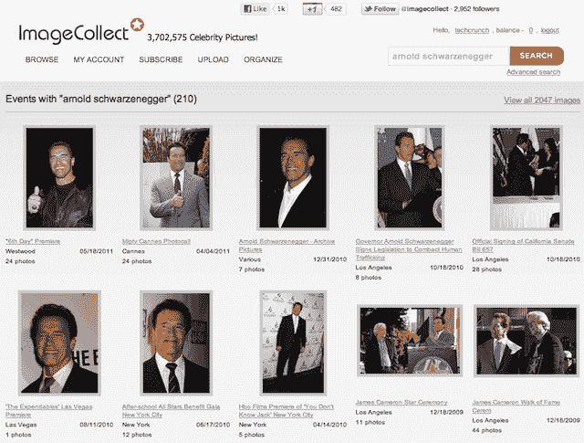

# 推出八个月后，ImageCollect 提供了超过 370 万张名人照片 

> 原文：<https://web.archive.org/web/https://techcrunch.com/2011/11/15/eight-months-after-launch-imagecollect-offers-more-than-3-7-million-celebrity-pictures/>

# 推出八个月后，ImageCollect 提供了超过 370 万张名人照片

今天早上，AudioMicro 宣布其名人图片市场，【ImageCollect.com】的[已经有超过](https://web.archive.org/web/20230203065615/http://imagecollect.com/)[370 万张照片](https://web.archive.org/web/20230203065615/http://imagecollect.com/celebrity-listing)可供下载。

AudioMicro 的 Ryan Born 表示，ImageCollect 正在迅速成为由顶级娱乐摄影师提供的世界上最大的名人照片库之一，仅在首次亮相后 8 个月。

ImageCollect 每天增加大约 40，000 张照片，还有大约 200 万张照片需要添加。

该公司正在庆祝其快速增长，推出了一个完全改版的网站、一个名人照片 API 和一个[新的定价和许可计划](https://web.archive.org/web/20230203065615/https://imagecollect.com/buy)，该计划应用了 iStockphoto 之类的微型股票商业模式。

早期的 ImageCollect 客户包括《人物》杂志、《美国周刊》和《纽约时报》杂志。

ImageCollect 的所有者 AudioMicro 得到了 DFJ 前沿公司和福托利亚公司的支持。

