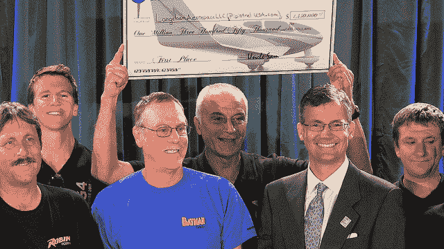

# 电动飞机竞赛结束，超过普锐斯的飞机获得 135 万美元奖金 

> 原文：<https://web.archive.org/web/http://techcrunch.com/2011/10/05/electric-aircraft-competition-wraps-with-1-35m-prize-for-plane-that-out-economizes-a-prius/>

# 电动飞机竞赛结束，比普锐斯更节能的飞机获得 135 万美元奖金

一年多前，我们发布了关于电动飞机的可能性的文章。当时，我们还提到了一个即将到来的比赛，将测试这些飞行电池的勇气:T2 咖啡馆绿色飞行挑战。这是由谷歌赞助的美国国家航空航天局的活动(和钱包)，像 [X 奖](https://web.archive.org/web/20230203141329/https://techcrunch.com/2010/09/16/automotive-x-prize-winners-share-10-million-for-100mpg-car-designs/)一样，旨在通过竞争资助创新。参赛者必须在两小时内飞行 200 英里，同时每位乘客使用不到一加仑的燃料(或同等能量)。

条款很苛刻，但是 10 个团队在一场安静高效的比赛中展开了他们的设计，争夺 135 万美元的奖金。

比赛上周刚刚结束，获胜者将于周一在山景城的一个博览会上揭晓。将大奖带回家的团队是皮皮斯特勒的金牛座 G-4。这款四座车的每加仑汽油行驶里程超过了 100 英里的要求，行驶了 200 英里的测试距离，相当于一加仑多一点的电量，平均速度也超过了 100 英里。在这里，他们举起了他们的“巨额支票”:

亚军是 e-Genius，一辆达到 375 PMPGe 的双座车。它获得了 12 万美元，外加最安静奖的奖金:起飞时，他们只录得大约 60 分贝。这可能和我打字的声音一样大。

美国宇航局代理首席技术官乔·帕里什(Joe Parrish)表示，用于创建比赛的 160 万美元资金已经为团队及其赞助商带来了超过 400 万美元的支出。获胜的队伍来自宾夕法尼亚州立大学(但实际上总部位于斯洛文尼亚)，他们发誓要将 10 万美元的奖金用于未来的超音速电动飞机竞赛。埃隆·马斯克对创造这样一种神奇的交通工具表现出了兴趣，他无疑对这一发展感到高兴。

【via[GizMag](https://web.archive.org/web/20230203141329/http://www.gizmag.com/green-flight-challenge-winner/20060/)；照片:美国宇航局]