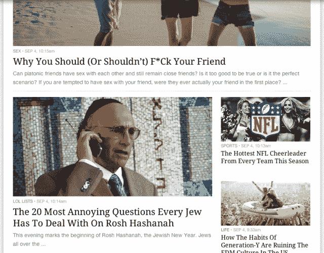
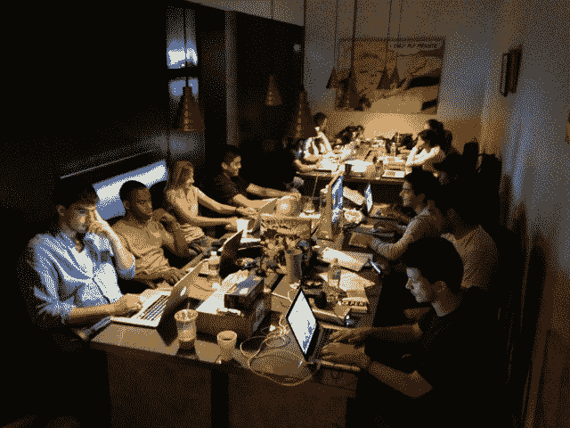
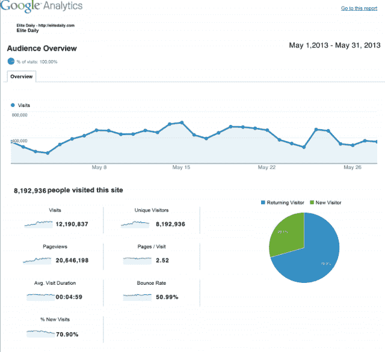

# 精英日报、内容农场还是向上流动的年轻人的开创性网站？你决定 

> 原文：<https://web.archive.org/web/https://techcrunch.com/2013/09/05/elite-daily-take-two/>

究竟什么是[精英日报](https://web.archive.org/web/20221005200958/http://elitedaily.com/)？

该网站将自己描绘成“Y 世代的声音”，但它也给人一种内容农场的感觉，甚至是“一个令人震惊的洞穴”在以下文章的支持下，它声称每月的浏览量已经增长到 850 万次:

你不需要成为百万富翁才能感觉自己是百万富翁

或者

[为什么你应该(或不应该)和你的朋友上床](https://web.archive.org/web/20221005200958/http://elitedaily.com/dating/sex/pros-cons-of-fcking-your-friend/)

或者

[迪士尼公主没有搞我](https://web.archive.org/web/20221005200958/http://elitedaily.com/life/disney-princesses-didn/)

但是其他的报道表明这个数字被夸大了，最近浮出水面的信息表明该公司有说谎的历史。甚至网站上的一些作者似乎不是真实的人，虚构的个人主页上使用的是模特的照片，而不是真实的。

创始人大卫·阿拉波夫据说是雅各布·阿拉波的儿子，或者是嘻哈音乐的海瑞·温斯顿——珠宝商雅各布。2007 年，阿拉博被指控洗钱，并承认向联邦特工撒谎和向联邦政府提交虚假文件。他目前已经出狱，雅各布&公司还活得好好的。

也就是说，雅各布和 Co-centric 的故事出现在 Elite Daily 奢侈品栏目的 4792 个故事中的 40 个，没有披露雅各布是创始人大卫·阿拉博夫的父亲，这是非常糟糕的。

该网站自 2011 年以来一直存在，但经历了重大的重新设计，并于今年 5 月重新推出。我参加了发布会，并在 TechCrunch 上写了相关文章。从那以后，新的细节和问题浮出了水面，促使人们对该网站进行更深入的研究。

### 雅各布公司促销

或许《每日精英》作为一个媒体网站，最令人震惊的不是文章中有时表现出的厌恶女性的语气，而是 Jacob & Co .珠宝的秘密促销。

网站的奢侈品、时计和时尚版块涵盖了大量的奢侈品品牌，而 Jacob & Co 的文章总体上并不比其他任何品牌出现得多。然而，以 Jacob & Co .为中心的文章出现在娱乐版上的次数相当多，而娱乐版是网站访问量最大的地方。确切地说，奢侈品板块的 4028 篇报道中有 18 篇是雅各布公司的。

阿拉博夫称之为“额外津贴”。

“如果你想告诉我，我创办这个网站是为了促进我父亲的营销，那真是太疯狂了，”阿拉博夫说。“是我父亲。当那里有好事发生时，我会把文章放在那里。是啊，为什么不呢？”

从阿拉博夫的角度来看，他有权发布关于他父亲公司的故事，而不必提及他与该公司的关系。这不一定是光明正大的。但是我们，媒体，越来越接近推广的付费内容和不带偏见的新闻之间的灰色界限。

Cnet 现在有了[评论重播](https://web.archive.org/web/20221005200958/http://www.businessinsider.com/samsung-paid-cnet-to-repost-galaxy-s4-review-2013-8)，在那里他们付费重新展示一个小工具的旧的、正面的评论。BuzzFeed 和 Gawker 已经玩弄原生广告和推广故事有一段时间了，尽管这样做的时候有一个更明显(和存在)的免责声明。

让事情更加扑朔迷离的是，许多关于 Jacob & Co 的故事(以及网站上的许多其他帖子)都是用假名写的。

### 笔名新闻？

像[普雷斯顿·沃特斯](https://web.archive.org/web/20221005200958/http://elitedaily.com/author/jsp/)、[保罗·哈德森](https://web.archive.org/web/20221005200958/http://elitedaily.com/author/paul-hudson/)、[阿什顿·泰勒](https://web.archive.org/web/20221005200958/http://elitedaily.com/author/ashtontyler/)、[威廉·肯特](https://web.archive.org/web/20221005200958/http://elitedaily.com/author/robertelite/)和[埃迪·库芬](https://web.archive.org/web/20221005200958/http://elitedaily.com/author/eddie/)这样的作家都是非常真实的(我和他们每个人都聊过)。但他们的名字不是。

普雷斯顿·沃特斯其实就是大卫·阿拉博夫本人；保罗·哈德森就是保罗·尤尔奇克；埃迪·卡芬是艾丁·维尔乔维奇，阿什顿·泰勒是马克斯·格鲁纳，威廉·肯特是罗伯特·圣特洛特。

他们的一些传记完全是讽刺性的——阿什顿·泰勒(Ashton Tyler)(Max Grunner)[从未与林赛·罗汉(Lindsey Lohan)](https://web.archive.org/web/20221005200958/http://elitedaily.com/author/ashtontyler/)合作过——其中一些是真实的。例如，保罗·尤尔奇克声称保罗·哈德森传记的每一部分都是对他自身经历的准确描述。

主编凯特琳·考利解释说，她不怎么写作(而是选择编辑)，但她通常用笔名 [Kgasm](https://web.archive.org/web/20221005200958/http://elitedaily.com/author/kgasm/) 发帖。

许多这些笔名作家认为，只要文章本身准确无误，他们就没有责任在署名或简历上说实话。

“如果人们知道你的背景，你不会希望他们对你的作品看得太深，”马克斯·格鲁纳(阿什顿·泰勒饰)说。"你应该实事求是地看待这篇文章，不要担心署名."

其他作家只是使用笔名来保护自己，因为精英每日内容通常站在讨论的一个极端，并严重依赖意见。例如，看看这个帖子，[从‘不同性恋’到‘耶，兄弟’:Y 一代如何变得对他们的同性恋朋友如此冷淡](https://web.archive.org/web/20221005200958/http://elitedaily.com/life/from-no-homo-to-yeah-bro-how-gen-y-became-so-cool-with-their-gay-friends/)。这篇文章记录了我们对同性恋者越来越多的安慰，有些傲慢，而且几乎只用自己的观点。

这个也是([混球和混蛋](https://web.archive.org/web/20221005200958/http://elitedaily.com/dating/sex/the-douchebag-v-the-asshole/)的区别)。

“我写的很多东西都是基于观点的，是为了激发人们的兴趣，”埃迪·卡芬(艾丁·维尔乔维奇饰)说。“这就是 Y 世代的意义所在:我有自己的观点，我希望人们能听到它们，这样人们就能注意到它们的存在。”

其他作家，如凯特琳·考利，只是不想让他们 20 多岁的精英阶层日常生活中的过度亵渎在晚年困扰他们。(或者让父母失望。)然而，作者和编辑都坚持认为，用假名发表的文章无论如何都不是伪造的，因为它们都是笔名。

幽默编辑泰勒·吉尔丁(Tyler Gildin)正在努力成为一名单口相声演员，并且总是用真名发帖。“我想让自己出名，所以笔名对我来说实在没什么意义。”

根据阿拉博夫的说法，是否使用笔名是作者的选择，笔名是他为自己选择的普雷斯顿·沃特斯。

新闻业中使用假名的做法也和珠宝冲突一样，并不完全光明正大。记者被期望说出真相。如果读者不能相信署名或作者简介，他们怎么能相信文章呢？与此同时，作为一名媒体网站的作者，创建一个子品牌是记者的一部分。人们根据风格、声音和观点被他们最喜欢的作者所吸引。在精英日报，同样的事情是真实的，除了那些作者是基于真实人物的角色，他们写的是真实的观点。

阿拉博夫说，有计划使假名策略对读者更加透明。

### 精英每日流量

5 月，Elite Daily 告诉我，他们每天在主页上发布 120-150 条帖子，该网站每月有大约 850 万次独立页面浏览量。

7 月 25 日，《锥子》报道称，《精英日报》7 月份平均每天发布 46 条帖子。文章还援引 comScore 的话说:“6 月份，Elite Daily 收到了 102.4 万来自美国的独立访客，略低于 3 月份的 110 万，但高于 2012 年 7 月我们首次在该网站上报道时的 25.6 万。"

阿拉博夫在采访中说，他给我的每日发帖量的原始数字是一个目标，而不是实际产出，该网站目前的目标是每天 80 到 100 个帖子。他还说，这还不包括周末，这个时候网站每天发布 8 到 10 个帖子。

昨天，截至美国东部时间晚上 7 点，精英日报共发布了 74 篇文章。今天，截至美国东部时间下午 3 点，已有 66 个帖子被转发。这一内容是由 17 名受薪作家和 500 多名全球贡献者创造的。

该工厂共有 25 名员工。

这是其中一些的照片:

尽管如此，为什么阿拉博夫声称的每月 uniques 和 comScore 的点击率相差 700 万？

阿拉博夫向我展示了谷歌分析和 Alexa 评级，这两个评级在 6 月份为 Elite Daily 提供了 810 万个 unique，在 5 月份为 810 万个 unique，当时我第一次发布我的故事，报告每月有 850 万个 unique。该网站目前在美国的 Alexa 排名为 1，783。

然而，comScore 向我们证实，他们的跟踪显示，在夏季的几个月里，每月有 100 万到 300 万个 uniques。

阿拉博夫声称，这种差异的部分原因在于《精英日报》最近才成为 comScore 的订户。他向我提供了一份合同，显示《精英日报》在 8 月份订阅了 comScore，在 7 月 25 日《锥子故事》上线之后。

非订户使用相同的产品进行跟踪，但他们不能像订户一样访问数据或客户服务。对于非订阅发布者来说，他们有责任在网站的所有角落添加适当的标签，包括手机，以及其他应该被跟踪的 URL 或页面。

comScore 首席研究官 Josh Chasin 说，这里的差异“可能是他们如何实现标签的问题。”

“我们给他们如何做到这一点的指示和信息，但对于出版商来说，实现标签有多困难，这是一个完整的范围，”Chasin 说。“有些开发人员说‘半小时后我会把标签贴上来’，因为他们的网站就是为了扔进一行代码而建的。然后我们有开发者告诉我们‘你知道这对我们来说是什么样的工程项目吗？’这真的取决于网站。"

不足为奇的是，Arabov 说，事实上，Elite Daily 在整个网站上实现这些标签时遇到了麻烦。

“手机没有被追踪，我们大约 50%的流量来自手机。”他还表示，该公司目前正在与 comScore now 合作，清理字典，并在 8 月份注册订阅后给网站加上正确的标签。

Chasin 提出了另一个可能的原因，即重复数据删除。它是这样工作的:如果 TechCrunch 从桌面上看到 100 万次页面浏览，从移动设备上看到 100 万次页面浏览，ComScore 认为这相当于大约 150 万次浏览，因为有一些重叠。

此外，comScore 只跟踪美国的数据，而不是国际数据，并过滤掉任何可能不是人类的可疑流量。comScore 还使用一种叫做“字典”的东西来过滤掉任何充当后端调用的 URL。

另一方面，正如 Chasin 所说，Google Analytics 测量 cookies，而“comScore 测量人”。“我们可能会在全球看到 130 亿个 cookies，但这并不意味着互联网上有 130 亿人，”Chasin 说。

谷歌分析目标高，comScore 目标低。

### 提供资金

今年 5 月，在投资者奥利弗·里普利(Oliver Ripley)位于黑海办公室屋顶的一次聚会上，大卫·阿拉波(David Arabo)告诉我，公司没有资金。我直接问雷普利是否投资了这家公司，他亲口告诉我我们在他的地产上。“不，我们是自举，”阿拉波夫说。

事实上，Elite Daily 在 2012 年 2 月总共获得了 62，650 美元的种子资金(以及杰拉德·亚当斯之前的 2 万美元运营费用)，由[黑海](https://web.archive.org/web/20221005200958/http://www.blackocean.com/)和[杰拉德·亚当斯](https://web.archive.org/web/20221005200958/http://gerardadams.com/)平分，后者是一位连续创业者和天使投资人。《黑海》的合伙人包括奥利弗·里普利和安德鲁·里斯，他们已经分手。两家公司仍持有合资企业的股权。赖斯现在经营着一家名为萨姆·斯特拉的公司，这就是为什么萨姆·斯特拉在精英日报刊头上被列为黑海的合伙人。

据 Arabov 称，62，650 美元的种子资金已经用完，但该网站现在产生了足够的收入，现金流为正。足以驱动 25 名员工的创业公司。

精英的日常活动在同一栋建筑黑海里进行，阿拉博夫说他向里普利支付了空间租金。

当我问阿拉博夫，他为什么在资金问题上撒谎时，这是他通过电子邮件的回复:

> 老实说，从技术上讲，我们从未把它视为一轮融资，也从未去那里获得融资。注册公司那天，我们有的不仅仅是钱。这是给我们的钱，让我们开始滚动，这只能维持我们最初的 4 个月，因为我们当时没有收入来源。
> 
> 当公司获得数百万美元的资金时，我们并不认为这是一种融资的方式或任何只是让我们稍微起步的方式。

《锥子》的布伦丹·奥康纳(Brendan O'Connor)采访了一位未透露姓名的前作家和一位投资者，这位投资者私下里说，Elite Daily 已经从“鲸鱼大小的投资者”那里获得了资金，并暗示(尽管从未明确表示)阿拉博夫的父亲雅各布·阿拉博(Jacob Arabo，已被证实是珠宝商雅各布)也在资助这家企业。

根据 Arabov，Black Ocean 和我看到的资本表，大约 6 万美元的投资是该公司收到的唯一资金。Arabov 表示，Arabo 在该公司没有任何股份，无论是财务上的还是其他方面的。

更新(美国东部时间上午 10:10):杰拉德·亚当斯刚刚回复了我的电子邮件，要求确认 3 万美元的数字，他说他实际上投资了大约 5 万美元，而不是阿拉博夫所说的 3 万美元。

这是邮件:

> 我不能这么快给你确切数字的原因是，当我、David 和 JSP 想到 Elite Daily 的想法时，是在 David 为我实习的时候，他们一起在我的会议室里，我没有把它看作是我的典型投资之一，我把一些投资作为一个想法的资金。这一次，我和我的合伙人是这个想法的基础，所以当我们开始一起建立公司时，我开始支付运营费用。我不仅真的相信我们的每日精英理念，我还相信大卫，他是一个勤奋的实习生，具有领导者的许多特征，我还相信黄邦贤，他同样勤奋，精通技术，非常坚定。我知道我们最初花在启动 Elite 上的钱大约是 David 给你的数字，加上支付我们摄像师的工资和其他一些运营费用，所以我认为准确的数字是 50，000 美元。我很抱歉没有很快给你准确的数字，但事实是，这是一个不同的投资，然后我的大多数其他公司。我们决定一起启动这个项目，筹集资金甚至不是一个想法，因为我们对我们的想法“每日精英”充满信心和热情。我们抓住了它，它很快就抓住了势头，并在短短几个月内将现金流转为正数。对我们所有人来说，这是一个令人惊叹的旅程，我们感到很幸运能够对 y 世代的如此多的人产生如此积极的影响。当人们从各地给我们发电子邮件或走过来告诉我们《精英》是他们每天都在阅读的东西，并激励着他们时，这真是太棒了。我们计划在这里呆一段时间，这样反对者就可以试图打倒我们，但我们永远不会让它阻止我们实现我们的目标。

奥康纳还暗示大卫的哥哥本杰明可能与《精英日报》有关联，因为本·阿拉博在《精英日报》和黑海洋中城办公室隔壁的大楼里的 Elite SEM(一家搜索引擎营销公司)工作。

为了澄清事实，Elite SEM 早在 Elite Daily 之前就已经存在了，Arabov 坚持认为，名称相似只是巧合，地点也是如此。此外，Ben 是 Elite SEM 的一名低级员工，该公司专注于广告词，以帮助电子商务网站，而不是媒体品牌建立流量。

### 救赎还是故态复萌？

《精英日报》是否提供低俗的、受消费者驱动的、厌恶女性的内容是毫无疑问的。

阿拉博夫认为，对于每一篇厌恶女性的文章，都有一篇女权主义者的反驳文章。这还有待观察。

网站上一些最受欢迎的帖子并不特别厌恶女性。[这里。](https://web.archive.org/web/20221005200958/http://elitedaily.com/news/world/abercrombie-fitch-ceo-explains-why-he-hates-fat-chicks/) [有](https://web.archive.org/web/20221005200958/http://elitedaily.com/life/the-20-mistakes-you-dont-want-to-make-in-your-20s/) [有](https://web.archive.org/web/20221005200958/http://elitedaily.com/life/culture/why-men-arent-really-men-anymore/) [快](https://web.archive.org/web/20221005200958/http://elitedaily.com/news/world/that-awkward-moment-when-the-woman-you-try-robbing-knows-systema-video/) [快](https://web.archive.org/web/20221005200958/http://elitedaily.com/news/world/that-awkward-moment-when-the-woman-you-try-robbing-knows-systema-video/)。

对我来说，我希望得到救赎。我在《精英日报》上的原始帖子(被我的编辑撤下)遗漏了一些重要的观点，与其他人的观点也不准确。读者们，我为没有深入挖掘我最初得到的信息而道歉。就内容和媒体而言，页面浏览量、内容量和资金都是决定资产价值的重要因素。我认为这是一个教训。

在 Arabov 和 Elite Daily 的案例中，这个问题仍然悬而未决。

在没有向读者提及的情况下推广 Jacob & Co 珠宝是否有黑幕？根据大多数记者，包括我自己，是的。

阿拉博夫有权利在自己的网站上推行原生广告吗？他自称是新媒体一代的一员。我想是的。这是他的网站。

假名是给 Y 世代一个骄傲的声音的最好方式吗？Y 世代是这个网站宣称的目标。这是重点吗？《精英日报》是由 Y 世代创办的，是为 Y 世代服务的，所以去他妈的现状？

还是这种基于字符的策略降低了网站内容的可信度？

更重要的是，《精英日报》会做出什么改变，成为一个更透明的媒体机构吗？

我们没有纠正记录，因为我们特别喜欢《精英日报》或该组织的任何人。我们被愚弄的感觉很难改变，我回去澄清事实。像所有初创公司一样，Elite Daily 是骗局、谎言(或彻头彻尾的谎言)和管理不善的混合体。我们已经看到每一个最好的创业公司都展示了这些特质。

尽管如此，阿拉博夫似乎很认真地努力创建自己的年轻媒体网站品牌，并承认在前进的道路上犯了错误。

那份精英日报被锥子叫到如此极端的程度，有点吃不到葡萄说葡萄酸的味道。由于我们的传统，我们支持企业家——但不能以牺牲事实为代价。我的第一篇帖子最多也只是掩盖了《每日精英》。

要听我对大卫·阿拉博夫和几位精英日报作家的完整采访，请查看下面的 SoundCloud 嵌入:

[soundcloud URL = " http://API . soundcloud . com/tracks/108799605% 3f secret _ token % 3Ds-kdzb 1 " params = " " width = " 100% " height = " 166 " iframe = " true "/]

*编者按:这次采访被打断了两次。第一次是因为一个电话打到我手机上，被忽略了，马上重启录音。第二次休息是在我对大卫的采访结束后，我们在等待其他作家加入我们。*

*编者按:这篇报道的早期版本错误地将投稿作者的人数定为 200 人。据该公司称，事实上《精英日报》有 500 名撰稿人。*