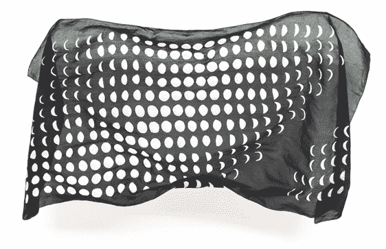
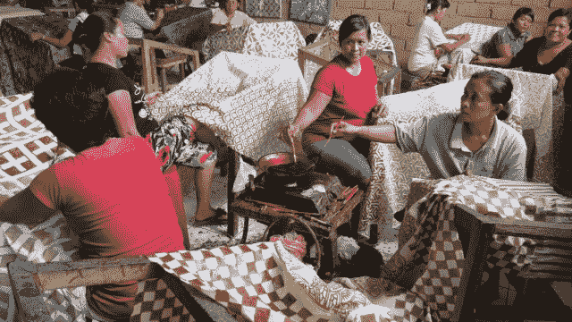

# 艺术与技术在前邮箱设计师的新纺织项目中相遇

> 原文：<https://web.archive.org/web/https://techcrunch.com/2014/01/07/elle-luna-bulan/>

有时候，当生活似乎太过注定，你会放下一切，朝相反的方向逃离。

当设计师 Elle Luna 在 Ideo 的图片完美职业生涯不再像以前那样引起共鸣时，她就是这么做的。在[她以前的创业邮箱被 Dropbox 收购后不久，她又这么做了。](https://web.archive.org/web/20221226011746/https://techcrunch.com/2013/03/15/mailbox-cost-dropbox-around-100-million/)

她从科技界消失，投身艺术。拥有芝加哥艺术学院美术硕士学位的卢娜开始了令人作呕的绘画。一幅又一幅油画变成了[的个展](https://web.archive.org/web/20221226011746/http://www.ianrossgallery.com/project-category/elle-luna/)。她作品的 Instagram 照片推动了销售。但不清楚她以前和现在的生活会在哪里相遇。

在几个月前的一次忏悔采访中，她说:

> “现在我正在制造一个巨大的混乱。我处在我去过的地方和我要去的地方之间的界限，这有点不舒服，也有点可怕，但我会坚持下去，直到我确切地知道我接下来要去的方向。”

今天，她发布了几个艺术与技术交叉的项目中的第一个。[布兰项目](https://web.archive.org/web/20221226011746/http://bulanproject.com/)是一个纺织品电子商务平台。

“我不断想起的一句话是宜居艺术，”她说。"这些画你也可以扔进洗衣机。"

她最初卖的是一块 6 英尺乘 3 英尺多一点的手绘布料，上面印有一年中所有的月相。对于一年中的每一天，都有一个月亮在那一天看起来的图像。

“月相说明了生-死-生的循环，”她说。“随着月球的增长、扩张和膨胀，万物开始形成。然后然后发挥他们的全部潜力，就像吃饱了肚子或者想法实现了。然后随着月亮开始消退，你会看到它越来越小。它的成熟几乎就像生命的终结。逐渐消逝的生命也有一些真正美丽的东西。它几乎在蒸馏自己。它变得越来越老练，越来越丰富，越来越有力。这让我想到了事物的尽头，当它们到达自然的尽头时，那种美丽的忧郁。”

她接着说，“月亮是不变的，也是不断变化的。它既坚定又短暂。这很神秘，但又不稳定。”

Luna 在巴厘岛工匠的帮助下组装了这些纺织品，他们帮助完善了不含化学物质的打蜡和染色工艺。

这个想法是为 Bulan 项目的每个“版本”提供一种布料。Luna 的灵感来自纽约的一家商店，该商店每六周更换一次整个零售店面，围绕一个特定主题策划不同的作品。

她还从其他艺术与技术相结合的项目中获得了一些灵感，比如 Jen Bekman 的 20×200 项目，该项目制作价格实惠的限量版艺术版画。第一款布兰布零售价为 185 美元。

她从科技界请来其他艺术家进行合作。摄影师迈克尔·奥尼尔(Michael O'Neal)曾在苹果内部平面设计团队工作，并帮助推出了苹果的许多标志性产品，他为露娜拍摄了最初的照片。设计师[莱克·巴克利](https://web.archive.org/web/20221226011746/http://about.me/lakebuckley)和采购员[珍妮·威特](https://web.archive.org/web/20221226011746/http://instagram.com/jenniakemi)去巴厘岛组装布兰的生产系统，而[负责 Lift 设计的贾里德·埃隆杜](//web.archive.org/web/20221226011746/http://jarederondu.com/)和 Disqus 设计师[约书亚·索蒂诺](https://web.archive.org/web/20221226011746/http://joshuasortino.com/)组装布兰的网上商店。

然后，她通过 Instagram 上的艺术家和摄影师朋友营销这些纺织品。一个朋友，劳拉·普里切特，今天早上留下了这个。

“我真的很好奇，当我们让不同的制造商、设计师和艺术家组合来实现这些想法时，会发生什么，”她说。“我们在这个艺术项目上投入了所有的技术力量。这个项目对我来说很神秘，我不确定它将如何展开。但我知道我希望它来自一个玩耍和实验的地方。”