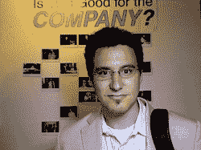

# 埃隆·马斯克、达斯汀·莫斯科维茨和埃里克·里斯准备在 Disrupt SF TechCrunch 上掀起轩然大波

> 原文：<https://web.archive.org/web/https://techcrunch.com/2011/08/05/elon-musk-dustin-moskovitz-and-eric-ries-are-ready-to-shake-things-up-at-disrupt-sf/>

如你所知，Disrupt 将于今年 9 月来到旧金山，我们将宣布一些令人惊叹的演讲者和评委。《扰乱旧金山》的门票在这里出售[。](https://web.archive.org/web/20230203131728/http://disrupt.beta.techcrunch.com/SF2011/tickets/)

我们[已经宣布了](https://web.archive.org/web/20230203131728/https://techcrunch.com/2011/07/26/thiel-conway-mayer-mccue-khosla-disrupt/)几位主要发言人:彼得·泰尔、罗恩·康韦、玛丽莎·梅耶尔、迈克·麦库埃和维诺德·科斯拉。还有谁会去那里？今天，我们将宣布更多的主要发言人。我们不仅有上面列出的四位，我们还非常高兴有埃隆·马斯克、达斯汀·莫斯科维茨、埃里克·里斯和马修·普林斯加入我们。马斯克是贝宝、特斯拉汽车和太空探索技术公司的联合创始人。他现在是特斯拉汽车和 SpaceX 的首席执行官，也是 SolarCity 的董事长。莫斯科维茨当然是脸书的联合创始人，最近是 Asana 的联合创始人，Asana 是一家解决工作场所协作问题的初创公司。里斯帮助发起了精益创业运动，并出版了同名书籍。普林斯在 7 岁时编写了他的第一个计算机程序，现在是 CloudFlare 的联合创始人兼首席执行官，cloud flare 在我们上次的 Disrupt SF 上推出，现在[帮助加快了网络上每月数十亿的页面浏览量](https://web.archive.org/web/20230203131728/https://techcrunch.com/2011/05/25/with-3-5-billion-page-views-a-month-cloudflares-speed-and-security-hit-your-apps/)。

可以肯定的是，Disrupt SF 将是一场众星云集的活动，充满了全新的创业公司、嘉宾演讲者和评委、才华横溢的黑客、派对、惊喜等等。随着活动的临近，我们将公布更多的嘉宾、评委和其他惊喜。Disrupt SF 将于 9 月 12 日至 14 日举行，从 9 月 10 日和 11 日的黑客马拉松开始。它在美丽的[旧金山设计中心广场](https://web.archive.org/web/20230203131728/http://disrupt.beta.techcrunch.com/SF2011/venue/)举行，为我们提供了 125，000 平方英尺的破坏空间。

这是一个你不想错过的活动。如果您想参与 Disrupt 体验并了解赞助机会，请联系 [Jeanne Logozzo](https://web.archive.org/web/20230203131728/mailto:jeanne@beta.techcrunch.com) 或 [Heather Harde](https://web.archive.org/web/20230203131728/mailto:heather@beta.techcrunch.com) 了解更多信息。

 [埃隆·马斯克](https://web.archive.org/web/20230203131728/http://www.crunchbase.com/person/elon-musk)
首席执行官&太空探索技术公司首席技术官，特斯拉汽车公司联合创始人&首席执行官

埃隆·马斯克是一名企业家，也是贝宝、特斯拉汽车和太空探索技术公司的联合创始人。他是特斯拉汽车和 SpaceX 的董事长/首席执行官，也是 SolarCity 的董事长。马斯克在南非出生并长大，他的父亲是一名南非工程师，母亲出生在加拿大，曾是纽约市的营养师，并以做模特为乐。他的父亲激发了他对技术的热爱，马斯克在 10 岁时买了他的第一台电脑，并自学了编程；12 岁时，他出售了自己的第一个商业软件，一款名为 Blaster 的太空游戏。1999 年 3 月，马斯克联合创立了在线金融服务和电子邮件支付公司 X.com。一年后，X.com 收购了 Confinity，这原本是一家在 Palm Pilots 之间传输资金的公司，合并后的实体专注于通过 PayPal 域进行电子邮件支付，作为 Confinity 的一部分被收购。2001 年 2 月，X.com 将法定名称改为 PayPal。2002 年 10 月，易贝以 15 亿美元的股票价格收购了 PayPal。在出售之前，该公司最大的股东马斯克持有 PayPal 11.7%的股份。

联合创始人，Asana

达斯汀·莫斯科维茨是脸书的联合创始人，最近又是解决职场协作问题的初创公司 Asana 的联合创始人。在脸书，他是技术团队的领导者，负责监督网站的主要架构。他还负责公司的移动战略和发展。达斯汀和创始人马克·扎克伯格在宿舍一起创办了脸书，自网站成立以来，达斯汀一直在网站的成长和发展中发挥着重要作用。达斯汀在搬到加州帕洛阿尔托的脸书全职工作之前，在哈佛大学主修经济学两年。

 [埃里克·里斯](https://web.archive.org/web/20230203131728/http://www.crunchbase.com/person/eric-ries)
作者、演讲人、&顾问、精益创业

Eric Ries 是《精益创业》的作者、演讲者和顾问。此前，他是 IMVU 的联合创始人，并担任首席技术官。他是几本书的合著者，包括《Java 游戏编程的黑色艺术》(韦特集团出版社，1996)。当他还是耶鲁大学的本科生时，他参与创立了 Catalyst Recruiting。尽管 Catalyst 随着网络公司的崩溃而倒闭，Ries 继续他的创业生涯，在 There.com 担任高级软件工程师，领导敏捷软件开发和用户生成内容方面的工作。2007 年,《商业周刊》将里斯评为最佳年轻科技企业家之一。他在许多科技创业公司和风险投资公司的顾问委员会任职。2008 年，他在凯鹏华盈担任风险投资顾问

 [马修王子](https://web.archive.org/web/20230203131728/http://www.crunchbase.com/person/matthew-prince)
联合创始人& CEO，CloudFlare

Matthew 是 CloudFlare，Inc .的联合创始人兼首席执行官。Matthew 在 7 岁时编写了他的第一个计算机程序，此后一直未能摆脱这个问题。在进入芝加哥大学法学院后，他做了一天的律师，然后抓住机会成为一家科技初创公司的创始成员。他没有回头。CloudFlare 是 Matthew 的第三个创业项目。Matthew 拥有三一学院的英语和计算机科学学位。他以最优异的成绩毕业于哈佛商学院，在那里他获得了乔治·贝克奖学金，并被授予杜伯林创业奖。他获得了芝加哥大学的法学博士学位，是伊利诺伊州律师协会的成员。他在约翰·马歇尔法学院担任兼职教授，教授技术法，并担任信息技术和隐私法中心的顾问委员会成员。他也是蜜罐项目的联合创始人。