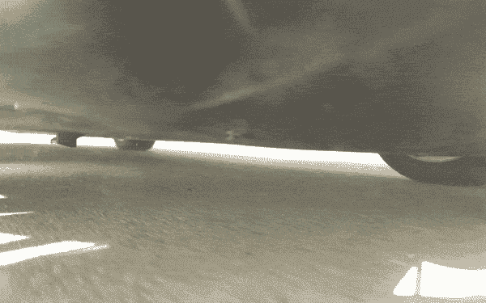

# Elon Musk 转向媒体和 gif 展示新车型的消防安全功能 

> 原文：<https://web.archive.org/web/https://techcrunch.com/2014/03/28/elon-musk-turns-to-medium-and-gifs-to-reveal-new-model-s-fire-safety-feature/>

# Elon Musk 转向媒体和 gif 展示新车型的消防安全功能

公司博客死了吗？Elon Musk [没有在特斯拉博客上发布，而是在个人博客网站 Medium 上宣布了 Model S 的一个重要新功能](https://web.archive.org/web/20221206083800/https://medium.com/p/544f35965a0d)。

继两起导致火灾的[事件](https://web.archive.org/web/20221206083800/https://beta.techcrunch.com/2013/10/04/elon-musk-details-cause-of-tesla-model-s-fire-says-would-have-been-worse-with-gas/)之后，特斯拉正在为 Model S 增加一个钛车身底部护板。这种三重车身底部护板被添加到 3 月 6 日之后生产的所有车辆上，特斯拉服务部门将免费将其添加到现有车辆上。

特斯拉表示，它对新的车身底部护板进行了 152 次测试，护板防止了任何可能导致火灾或穿透电池组的损坏。

它使用 gif 来强化这一事实。

显示在中等职位是一个模型 S 配备了新的盾牌运行三球拖车钩，一个讨厌的混凝土块和交流发电机。都是 gif 格式的。

简单来说，很难忽略一张 GIF。对于视频，读者必须按下播放键，但对于 gif 则不然，特斯拉希望确保他们的观点得到表达。这两起 Model S 汽车起火事件对特斯拉来说是一场公关噩梦，因为特斯拉已经在打一场多战线战争。

