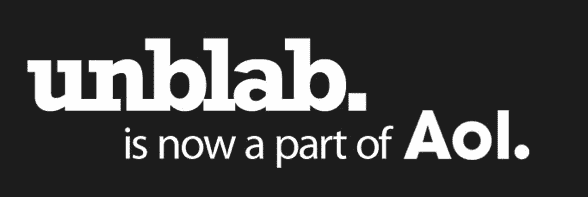

# AOL 收购电子邮件优先级应用 Unblab，推动凤凰计划 

> 原文：<https://web.archive.org/web/http://techcrunch.com/2010/12/01/email-prioritization-app-unblab-acquired-by-aol/>

# AOL 收购电子邮件优先级应用 Unblab 以推动凤凰计划

根据 un Bab 创始人伊莱·霍尔德发送的一封电子邮件，看起来美国在线刚刚收购了电子邮件优先应用程序[un Bab](https://web.archive.org/web/20230203013523/http://unblab.com/)。un Bab 的网站上也宣布了这项收购。交易条款没有披露(美国在线也拥有 TechCrunch)。

Unblab 建立了一个基于云的 Gmail 应用程序，名为 Gtriage，使用通用和用户特定的规则来识别和优先处理重要的电子邮件。可以把它想象成从反垃圾邮件供应商的对立面解决电子邮件过载问题，但是使用类似的技术。它在理论上类似于 Gmail 的优先收件箱。

在 Launchbox Digital 的基础上，Unblab 还提供了一款名为 iTriage 的移动应用，试图了解当你在移动设备上使用有限的空间时，与使用基于 pc 的网络邮件体验时，什么是“重要”的区别。

根据发给用户的电子邮件，霍尔德将加入美国在线邮件团队，为该公司的[新电子邮件客户端](https://web.archive.org/web/20230203013523/http://invite.aol.com/invite/mail/request_invite?campaign=mail_beta&site=www.phoenix.aol.com&next=http://phoenix.aol.com/login) [项目 Phoenix 工作。](https://web.archive.org/web/20230203013523/http://corp.aol.com/2010/11/14/aol-disrupts-the-inbox-with-project-phoenix-by-aol-mail/)这次收购似乎是 acq 雇佣的，因为霍尔德将是唯一一名加入 AOL 的 Unblab 员工。

因此，这里的假设是，看起来凤凰计划将很快获得类似收件箱的优先功能。美国在线邮件占美国在线网络页面浏览量的 5 %,因此像优先收件箱这样的优先功能只能帮助公司留住电子邮件用户，防止他们加入 Gmail 这样的竞争客户。

以下是 Unblab 电子邮件的部分内容:

> Unblab 故事中的下一个传奇将会更大、更好、更精彩；Unblab 现在是 AOL 的一部分，我将加入位于帕洛阿尔托的 AOL 邮件团队，参与凤凰计划(新的 AOL 邮件)。
> 
> 这对你(Gtriage 用户)意味着什么？Gtriage 服务于昨晚关闭，由于你们都是 Gmail 用户，你们现在只能使用优先收件箱。哎哟！但是不要担心，凤凰计划会让你大吃一惊！

霍尔德似乎对 TechCrunch 编辑迈克尔·阿灵顿也有一种奇怪的迷恋，他在 Unblab 网站上写道:

> 这和优先收件箱有关系吗？
> 
> 有一点……但实际上我只是跟着阿林顿到处走。是 Techcrunch50 和他的一篇帖子让我们开始了，所以跟着他去 AOL 是完全有意义的。基本上，我们是灵魂伴侣。

