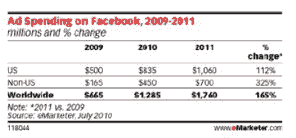

# eMarketer:2010 年脸书的广告销售额将达到 13 亿美元；MySpace 销量暴跌 

> 原文：<https://web.archive.org/web/https://techcrunch.com/2010/08/12/emarketer-ad-sales-on-facebook-to-reach-1-3b-in-2010-myspace-sales-to-plummet/>

# eMarketer:2010 年脸书的广告销售额将达到 13 亿美元；MySpace 销售额直线下降

根据来自 [eMarketer](https://web.archive.org/web/20221209060542/http://www.emarketer.com/) 的最新研究，相比 2009 年 6.65 亿美元的广告收入，广告商将在全球花费 12.8 亿美元来接触脸书[的 5 亿用户](https://web.archive.org/web/20221209060542/https://beta.techcrunch.com/2010/07/21/facebook-500-million/)。美国今年在脸书的广告支出估计为 8.35 亿美元，高于 2009 年的 5 亿美元。

MySpace 的广告支出前景并不乐观。MySpace 今年的收入预计只有 3.47 亿美元(低于 2009 年的 4 亿美元)，2011 年的广告收入预计将下降 14%，至 2.97 亿美元。2011 年，脸书全球广告支出预计将达到 18 亿美元。

这些数字并不一定令人惊讶。脸书已经成长为世界上最大的社交网络，而 MySpace 一直在流失流量。有许多报道称，脸书今年的广告销售额有望超过 10 亿美元。该公司最近透露，尽管费率保持不变，但今年的广告收入已经增长了 10 倍。