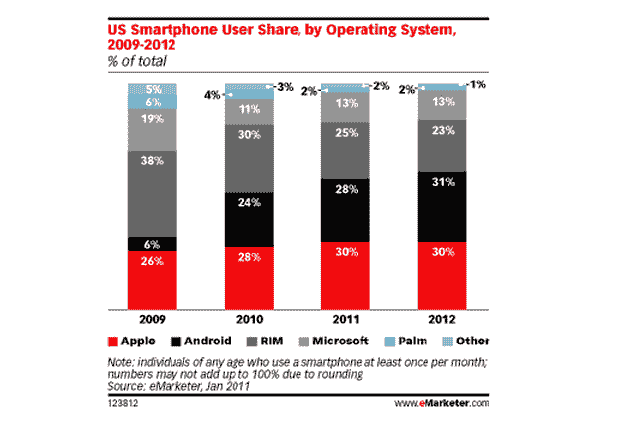
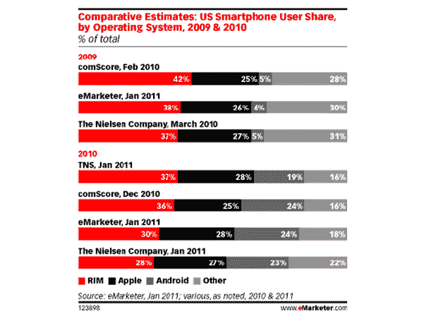

# eMarketer:苹果将很快引领美国智能手机市场——但不会太久

> 原文：<https://web.archive.org/web/https://techcrunch.com/2011/01/27/emarketer-apple-will-soon-lead-the-us-smartphone-market-but-not-for-long/>

# eMarketer:苹果将很快引领美国智能手机市场——但不会太久

据 [eMarketer](https://web.archive.org/web/20230203052640/http://www.emarketer.com/Article.aspx?R=1008200) 报道，[苹果](https://web.archive.org/web/20230203052640/http://crunchgear.com/tag/Apple)今年将超过 [Research In Motion](https://web.archive.org/web/20230203052640/http://www.crunchbase.com/company/research-in-motion) 成为美国智能手机市场的领导者，但在 2012 年将被[安卓](https://web.archive.org/web/20230203052640/http://www.crunchbase.com/company/android)超越。

eMarketer 的预测是基于对多家监控智能手机市场的公司的研究估计和方法的分析。该公司估计，2010 年，苹果在美国智能手机用户市场占据了 28%的份额，略高于使用安卓设备的用户的 24%。

RIM 的市场份额预计将从 2010 年的 30%下降到 2011 年的 25%。

eMarketer 预测，谷歌的安卓平台将在 2012 年继续扩大市场份额，31%的智能手机用户拥有安卓手机(高于 2009 年的 6%)。

届时，苹果的市场份额预计将降至 30%，仅比 2009 年略有上升。

eMarketer 首席分析师、即将发布的一份移动设备报告的作者诺亚·埃尔金(Noah Elkin)说:

> “随着每个主要市场和细分市场的制造商和运营商合作伙伴越来越多，Android 在设备、市场份额、应用程序和广告收入方面的规模正在迅速扩大。”

