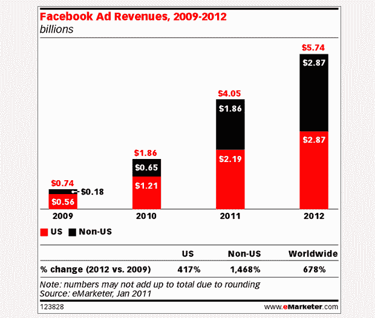
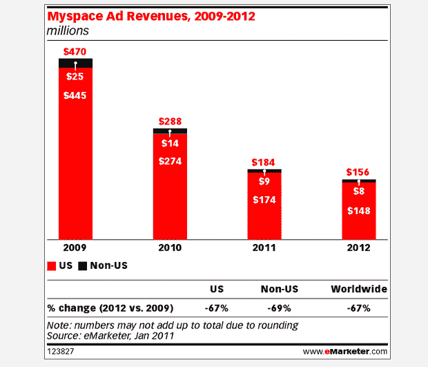

# eMarketer:脸书的全球广告支出将在年底达到 40 亿美元 

> 原文：<https://web.archive.org/web/https://techcrunch.com/2011/01/18/emarketer-global-ad-spending-on-facebook-will-reach-4b-by-years-end/>

# eMarketer:全球在脸书的广告支出将在年底达到 40 亿美元

eMarketer [预测](https://web.archive.org/web/20230202233135/http://www.emarketer.com/Article.aspx?R=1008180)到今年年底，社交网络广告将占美国所有在线广告支出的近 11%。根据该研究公司的数据，美国营销人员今年将在社交网站上花费略高于 30 亿美元的广告，比 2010 年 19.9 亿美元的社交网络广告费用增长了 55%。

eMarketer 预计这一数字明年将进一步增长 27.7%，达到近 40 亿美元。

2011 年美国在线广告支出的预测比 eMarketer 在 2010 年 8 月对美国社交网络广告支出的最新估计高出 10 亿美元。

该公司表示，预计支出变化的主要驱动力是在——你猜对了——脸书的广告支出增加。

eMarketer 预测，今年美国在脸书的广告支出将上升至 21.9 亿美元，全球将超过 40 亿美元——都是去年的两倍多。

正如我们昨天提到的，eMarketer 预计曾经的竞争对手 Myspace 的广告收入将从 2010 年的 2 . 88 亿美元和 2009 年的 4 . 7 亿美元下降到 2011 年的 1 . 84 亿美元。

