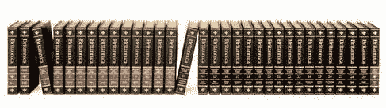

# 大英百科全书让印刷版成为历史 

> 原文：<https://web.archive.org/web/https://techcrunch.com/2012/03/13/encyclopedia-britannica-ends-print-edition-for-good/>

1768 年，启蒙运动正如火如荼地进行着，印刷术作为一种在(当时相对较少的)有文化和有学问的人群中传播知识的方法被广泛使用。几乎没有通用的参考书存在(最早的几年前才出现)，然而，许多基本知识分散在许多更小、更具体的卷中。关于光学，或者水蛭的使用，或者在新世界的野蛮人中旅行，诸如此类的事情。那一年，《大英百科全书》印刷了第一版:三卷，包含了压缩但有用的人类知识的几乎全部。

对于伴随着参考书长大的我们来说，这是难以想象的，对于伴随着互联网及其迅速获取几乎任何著作或知识的承诺长大的新一代来说，这就更难了。因此，试图将 2010 年的大英百科全书[将是最后印刷的](https://web.archive.org/web/20230204105756/http://www.britannica.com/blogs/2012/03/change/)这一事实联系起来也是很奇怪的。有些人会摸摸下巴，有些人会痛哭流涕，有些人会欢呼雀跃。但大多数人，或许最能说明问题的是，不会在意——事实上永远不会注意到。

任何像这家公司这样历史悠久的机构的去世，即使它没有完全消失(他们积极维护一个基于订阅的参考网站)，也是一个值得反思的时刻。尤其是在印刷和知识如此剧变的时候。

当你不谈论廉价的平装书和电子书，或者新闻杂志和博客时，印刷和网络的问题就不同了。这本百科全书售价 1395 美元，32 卷，除了最大的图书馆之外，它不适合任何地方。2010 年版仅售出 8000 份；4000 个正在入库。就在网络出现之前的 1990 年，他们卖出了 12 万台。

对该公司来说，这是显而易见的:他们 99%的收入来自其他业务。像柯达和宝丽来这样的公司可以证明，标志性的产品并不等同于成功的产品。

印刷版的辩护有什么可说的吗？关于保留数据硬拷贝的价值，有一些高层次的争论，当然也有一些人口统计数据由书籍提供比互联网更好的服务。但是就实际产品而言，百科全书几乎是没有朋友的。一些教授或老派人士可能会看重这套书，但众所周知，如果你的目标是存储和分发有价值的知识，那么一套笨重、昂贵、包含 32 本书的书就不合适。

他们建立了一个持续了两个半世纪的公司，基于“事实很重要”的假设当面临继续制造他们 244 年前提供的同样的*产品*和继续他们 244 年前开始的*使命*的选择时，大英百科全书选择了后者。这是许多公司都引以为豪的选择，但很少有人会有这样的机会。不是每天都有人能做出能持续 25 年的东西。

**更新**:百科全书最后几千册[热销](https://web.archive.org/web/20230204105756/http://www.usatoday.com/news/nation/story/2012-04-05/encyclopaedia-britannica-sales/54058626/1)。