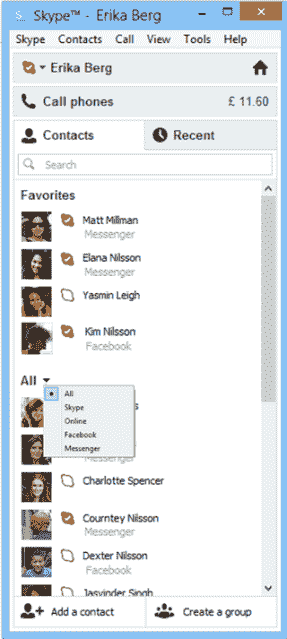

# 一个时代的终结:Windows Live Messenger 即将退役，用户转向 Skype 

> 原文：<https://web.archive.org/web/http://techcrunch.com/2012/11/06/end-of-an-era-windows-live-messenger-to-be-retired-users-transitioned-to-skype/>

# 一个时代的终结:Windows Live Messenger 将被淘汰，用户转向 Skype

微软官方[今天宣布](https://web.archive.org/web/20230209124836/http://blogs.skype.com/en/2012/11/skypewlm.html)将退出 Windows Live Messenger 即时通讯服务，转而支持 Skype，这证实了早先[的报道](https://web.archive.org/web/20230209124836/http://www.liveside.net/2012/11/05/microsoft-to-retire-messenger-says-the-verge/)。在 Skype 博客上的一篇文章中，微软 Skype 部门总裁 Tony Bates 解释说，Windows Live Messenger 将在 2013 年第一季度对所有用户停止使用，唯一的例外是 mainland China。

Windows Live Messenger 将继续在中国运行，没有宣布服务终止日期。微软指出，将用户从 Windows Live Messenger 迁移到 Skype 的行动始于几周前发布的用于 Mac 和 Windows 的 Skype 6.0[版本](https://web.archive.org/web/20230209124836/http://blogs.skype.com/garage/2012/10/skype_60_for_mac_and_windows_d.html)。在该版本中，用户可以开始使用微软账户登录 Skype。这样做之后，Messenger 联系人也会被带过来。适用于 Windows Surface/Windows 8 电脑的 Skype 应用程序也强制执行这一更改——一旦登录，系统会提示您将 Microsoft 帐户与 Skype 帐户合并。

 今天的博文带领用户完成了切换过程，并承诺将在今年晚些时候为进行切换的 Messenger 用户提供一些“特别优惠”。这可能包括免费通话点数或 Skype 某些高级功能的其他折扣。

与此同时，布莱恩·霍尔在 Windows Live 博客的[最后一篇文章中分享了关于 Messenger 结束的相同信息。在这篇文章中，他谈到了 Messenger 的 12 年历史和用户随后从即时消息向短信的转变，以及脸书和 Twitter 等社交网站。霍尔说:“Skype 成了进行视频和语音通话的最佳方式(此外还能让你发即时消息)。”霍尔还调侃了一些即将到来的 Outlook.com 整合，他说，“我们将使 Skype 与 Outlook.com 的合作比 Messenger 更好。”](https://web.archive.org/web/20230209124836/http://blogs.windows.com/windows_live/b/windowslive/archive/2012/11/06/the-next-chapter-for-the-windows-live-messenger-network.aspx)

对于那些在前脸书时代、前智能手机时代长大的人来说，这个消息是苦乐参半。我们最初的一些在线社交活动是使用即时通讯程序进行的，比如 AIM、ICQ 和 Windows Live，也就是曾经的 MSN Messenger。但是结束运营是有意义的，因为正如微软承认的那样，这个世界已经在很大程度上转向了其他平台和服务。

尽管两篇博文都没有提及，但 Windows Live Messenger iOS 应用程序和 Windows Live Messenge for Xbox 应用程序很可能也会在未来被淘汰。[纽约时报 4 月份的一份早期报道](https://web.archive.org/web/20230209124836/http://www.nytimes.com/2012/05/29/technology/microsoft-at-work-on-meshing-its-products-with-skype.html?_r=3&pagewanted=all&)推测 Skype for Xbox 不会在 2012 年准备好，因为微软会专注于其他优先事项，比如将 Skype 整合到其商业产品 Lync 中。

这些年来，Windows Live Messenger 用户数量一直在减少。2010 年，它[拥有](https://web.archive.org/web/20230209124836/http://blogs.windows.com/windows_live/b/windowslive/archive/2010/02/09/windows-live-messenger-a-short-history.aspx) 3 亿用户。今天，微软在其博客帖子中说“数百万”。(~~我们已经问过微软是否愿意给我们一个确切的数字。更新:微软确认“1 亿+”正确。)与此同时，根据来自微软最新收益报告的数据，Skype 的用户数量已经达到了 2 . 8 亿。Skype 目前宣称在高峰时段拥有 4000 万在线用户。~~