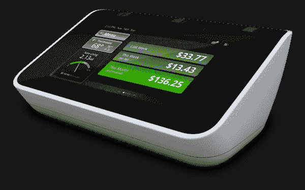
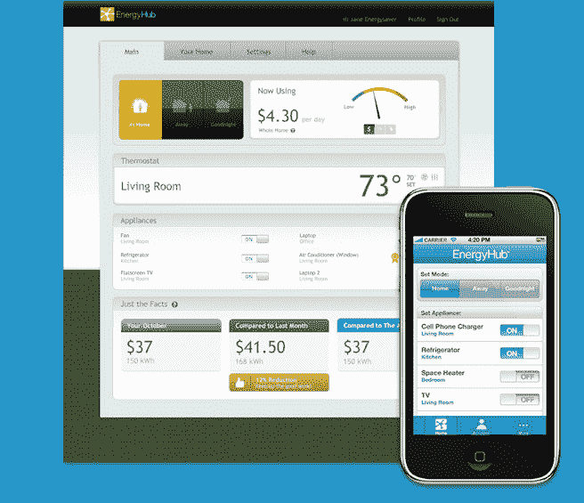

# EnergyHub 为消费者推出能源管理系统 

> 原文：<https://web.archive.org/web/http://techcrunch.com/2011/08/30/energyhub-launches-energy-management-system-for-consumers/>

今天， [EnergyHub](https://web.archive.org/web/20230205012841/http://www.energyhub.com/) 为美国消费者推出了全新、全面的家用能源管理系统。该系统包括用于集中管理家庭用电的 [EnergyHub Home Base](https://web.archive.org/web/20230205012841/http://www.energyhub.com/utilities/our-solution/home-base) ，以及 [EnergyHub 恒温器](https://web.archive.org/web/20230205012841/http://www.energyhub.com/utilities/our-solution/wireless-thermostat/)、[插座](https://web.archive.org/web/20230205012841/http://www.energyhub.com/utilities/our-solution/socket/)和[插排](https://web.archive.org/web/20230205012841/http://www.energyhub.com/utilities/our-solution/strip/)。

Home Base 还通过 Wi-Fi 连接到网络，允许用户通过运行在 iOS 和 Android 设备上的基于网络的应用程序或移动应用程序远程管理各个组件。

这个新系统值得注意的不仅是它的易用性——只需插入你的设备，你就可以开始了——还因为它现在可以在公共事业赞助的计划之外使用。

以前，该公司将其硬件出售给公用事业提供商，然后由他们将设备安装到客户家中。今天推出的直接面向消费者的产品使这些相同的能源监控系统和工具的使用更加大众化。

[EnergyHub Home Base](https://web.archive.org/web/20230205012841/http://www.energyhub.com/our-products/home-base/) 是与家中连接设备进行交互的中心站，它在彩色触摸屏上显示您当前和预计的能源使用情况。在这里，数据被实时跟踪，您可以编程各种使用参数，以便自动控制能源使用。

还有一些模式被称为“在家”、“晚安”和“离开”，让您只需一次触摸就可以对各种配置进行编程。

该系统的[无线恒温器](https://web.archive.org/web/20230205012841/http://www.energyhub.com/utilities/our-solution/wireless-thermostat/)可以让你跟踪和管理你家的供暖和制冷系统，而[能源集线器插座](https://web.archive.org/web/20230205012841/http://www.energyhub.com/utilities/our-solution/socket/)、[条形控制器](https://web.archive.org/web/20230205012841/http://www.energyhub.com/utilities/our-solution/strip/)和[重型控制器](https://web.archive.org/web/20230205012841/http://www.energyhub.com/utilities/our-solution/heavy-duty-controller)可以让你监控单个电器。

家庭基站有两种版本:ZigBee 和 ERT 兼容，这是指智能电表使用的两种常见无线电类型。 *(* *[本视频](https://web.archive.org/web/20230205012841/http://www.youtube.com/watch?v=Bl0n3AUa3zw&feature=player_embedded)帮助说明哪一款适合你)。*

当你出门在外时， [EnergyHub 基于网络的移动应用程序](https://web.archive.org/web/20230205012841/http://www.energyhub.com/our-products/web-and-mobile-apps/)可以帮助你在各种模式之间切换，并远程控制电器。

EnergyHub 定价如下:

*   家用底座+恒温器–ZigBee 版本:299.99 美元/ ERT 版本:389.99 美元
*   入门套件(家用底座+插座+插排)–ZigBee 版本 324.99 美元/ ERT 版本 414.99 美元
*   入门套件+恒温器–ZigBee 版本 399.99 美元/ ERT 版本 499.99 美元
*   插座、灯条和恒温器也分别以 39.99 美元、89.99 美元和 99.99 美元的价格出售

EnergyHub 上周在 B 轮融资中筹集了 1450 万美元，两名新投资者 Acadia Woods 和纽约市投资基金加入了现有投资者 406 Ventures 和 Physic Ventures。这笔资金将用于支持商业部署和推出新的水星无线恒温器软件服务。

[维梅奥·http://www.vimeo.com/20882933 w = 400 & h = 225]