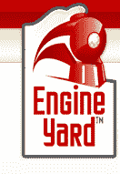

# Engine Yard 在 C 轮融资中筹集了 1900 万美元用于托管 Ruby-On-Rails 

> 原文：<https://web.archive.org/web/https://techcrunch.com/2009/10/07/engine-yard-raises-19-million-in-series-c-for-ruby-on-rails-hosting/>

# Engine Yard 在 C 轮融资中为 Ruby-On-Rails 主机筹集了 1900 万美元

开发者喜欢[引擎场](https://web.archive.org/web/20221210060933/http://www.engineyard.com/)，Ruby on Rails 的红帽。投资者也是如此，他们刚刚向这家托管 Ruby-on-Rails 部署的初创公司投入了 1900 万美元。

新投资者包括 [DAG Ventures](https://web.archive.org/web/20221210060933/http://www.crunchbase.com/financial-organization/dag-ventures) 、 [Bay Partners](https://web.archive.org/web/20221210060933/http://www.crunchbase.com/financial-organization/bay-ventures) 和 [Presidio Ventures](https://web.archive.org/web/20221210060933/http://www.crunchbase.com/financial-organization/presidio-ventures) 。现有投资者 Benchmark Capital、New Enterprise Associates 和亚马逊也参与其中。2008 年 7 月，该公司从亚马逊和 NEA 融资 1500 万美元，前一年 1 月从 Benchmark 融资 350 万美元。

Ruby on Rails 是一个快速且易于部署的 Web 应用程序编程框架。Engine Yard 为 Rails 应用程序提供了一个稳定且最新的托管环境。