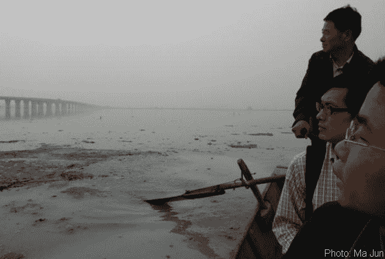
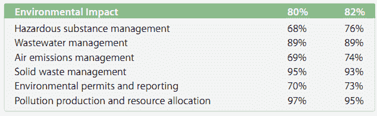

# 环境监管机构报告指责苹果违规 

> 原文：<https://web.archive.org/web/http://techcrunch.com/2011/08/31/environmental-watchdog-report-calls-apple-to-task-for-suppliers-violations/>

随着一份关于苹果中国供应商的严厉批评报告曝光，围绕全球化制造的成本这一不断波动的问题似乎再次隐现。这份由环保非政府组织公共与环境事务研究所(Institute of Public and Environmental Affairs)发布的报告是他们在一月份发布的另一份名为“苹果的另一面”的报告的续集有了这个不祥的标题，他们的意图就很明显了，虽然陈述有一定的倾向性，但强调的事实太突出了，不容忽视。

我已经写了关于*我们*有意识地放弃对我们购买的道德责任([我们的大罪](https://web.archive.org/web/20230205041134/https://techcrunch.com/2011/02/01/our-great-sin/))，但是 IPE 的报告在一个日益透明的时代复活了企业责任的问题。

我们应该、也能够让苹果和其他类似的公司为那些与它做生意的人的违法行为负责吗？

* * *

您可以在此下载英文或中文的报告[；我还把它嵌入了帖子的底部。](https://web.archive.org/web/20230205041134/http://www.ipe.org.cn/En/about/notice_de.aspx?id=10282)

首先，必须承认一个显而易见的事实:这份报告旨在通过公布任何一方都不太可能披露的信息，如某些工厂附近学童的健康问题，来揭露(甚至诽谤)苹果公司及其供应商。还必须指出的是，被强调的侵权行为并不仅限于苹果、富士康或中国。这份报告对此很坦诚，并给出了他们挑出苹果的原因。

这并不是说我们自己想不出加强审查的好理由:作为可能是世界上最大和最有影响力的电子公司，苹果是行业监管机构和改革者的天然目标。此外，它的有限披露政策不适应信息想要自由的时代，即使它必须被追踪、捕获并释放到野外。

对这个话题感兴趣的人，或者对中国工厂周围的环境状况感兴趣的人，这份报告值得一读。我不认为有多少人会想象一个闪亮的天堂，那里有闪闪发光的干净工厂，生产出合乎道德的 iPhones，并将废料回收成鼓舞人心的雕塑，但不管怎样，偶尔检查一下现实也是不错的。如果你赶时间，就看一下“执行摘要”，我引用其中的一段话(有选择地):

> 苹果系统地未能回应所有关于其供应链环境违规的询问。
> 
> 我们从此次调查中发现，可疑的苹果公司供应商产生的危险废物量特别大，一些供应商未能正确处理他们的危险废物。
> 
> 从这两项调查中，该联盟发现了超过 27 家涉嫌存在环境问题的苹果供应商。然而，在苹果公司(Apple Inc .)发布的《2011 年供应商责任报告》(2011 Supplier respons ibility Report)中，36 项审计发现了核心违规行为，但没有一项违规行为是基于环境污染。公众无从知晓苹果是否意识到了这些问题。

该报告继续记录了他们和其他人对监管和信息披露不足所导致的环境问题的调查。工业的总成本(即污染、伤害等)。)当然已经为人所知几个世纪了，但一项严格的现场调查发现了人们期望在苹果审计中发现的东西。有些数据是轶事，但大部分与报道的内容、实际发生的情况以及实际上正在寻找的内容之间的差异有关。同行的还有中国著名的环境保护主义者[马军](https://web.archive.org/web/20230205041134/http://en.wikipedia.org/wiki/Ma_Jun_%28environmentalist%29)。

熟悉的策略就在眼前:夜间排放最危险的化学物质，监管机构完全不检查名义上的合规性，地方政府的决议无疾而终，工人和当地人的健康问题可能但不一定与工厂有关。这些东西你几乎在每个国家都能找到，但它们似乎在中国的大型原始设备制造商中非常猖獗。

* * *

或许正是这一事实，工业废物的普遍存在及其破坏的光环，导致了苹果公司的不平衡监管。在一连串自杀事件和大量关于苹果供应商工厂工人状况的报告之后，苹果小心翼翼地公布了其[供应商责任报告](https://web.archive.org/web/20230205041134/http://images.apple.com/supplierresponsibility/pdf/Apple_SR_2011_Progress_Report.pdf) (PDF)，其中详细描述了他们的审计和回应。你可以自己阅读，“核心违规”几乎完全是劳工问题。从环境角度来看，与苹果签约的公司似乎都是合规的典范:

(左栏数字表示实际合规，右栏表示政策合规)

这份报告似乎直接反驳了这一点。然而，应该指出的是，所遵守的规则并没有被准确披露，这一高数字可能更多地与中国法律法规的不完善有关，而不是苹果方面的松懈。毕竟，如果深圳法规允许多少吨废弃氰化物和重金属径流，尽管可能对环境或周围人口造成危害，它们也是合法的。美国的许多工厂也是如此。

然而，我们并不经常听说英特尔工厂导致附近幼儿园的孩子胸痛。他们的化学废物量在一年内增加了 27%的消息不是来自监督机构，而是来自他们自己的报告。

事实上，IPE 的报告在一定程度上确定，尽管苹果的责任可能不会延伸到从海鸟身上清除有毒碱，但他们似乎没有效仿其他一些大型科技公司，这些公司已经采取措施提高环境违规和纠正行动的可见性。例如，西门子已经开始要求供应商公开披露针对违规行为的解决方案。然而，该行业的其他公司并不是希望的灯塔，因为许多这些可疑的制造业务都与摩托罗拉、三星、松下和其他通常的嫌疑人签订了合同。几乎每个电子产品制造商的多层供应链都非常难以监控，但这种难度与该公司参与的规模和程度成正比。但是苹果故意不披露，或者说得好听点，选择性披露的政策，往坏里说是犯罪和逃避，往好里说是为行业设定的糟糕标准。

我们能做些什么来改善这种情况呢？对全球化的环境影响以及经济和人道主义影响给予同等的重视是一个开端。几十年来，这种做法一直是杂乱无章的，但这个世界对小玩意的胃口所导致的可怕现实很难面对，更难解决，至少缺乏富士康工人在管理层训斥后跳楼自杀的那种闪光和即时吸引力。这很容易理解，也很容易谴责，但成千上万人死于癌症和人为荒漠化的更广泛的悲剧不太适合写在博客帖子或当地报纸的简短国际新闻部分。

但也许这份报告的时机是好的。虽然史蒂夫·乔布斯可能会也可能不会以一种超然而强大的方式继续留任，但苹果的新面孔是蒂姆·库克，他可能会被说服做出乔布斯不会或不能做出的改变。或者，随着公众的目光厌倦了伴随工业化而来的对人性的诋毁，转向像苹果这样的大公司对环境的影响，或许苹果的目光也会转移。下一年的供应商责任报告能否加强和实施有关环境责任的规则？还是苹果和其他公司又一次未能对这些问题采取行动，这些问题很难解决，很容易传递给其他人，并具有降低制造成本的令人愉快的副作用？

环保组织可以发布像这样的报告，我很幸运能够至少帮助我们的读者了解这些信息，无论他们选择如何解读。苹果生产世界上最受欢迎的设备，并有望成为世界上最有价值的公司。他们理应在不仅仅是界面和工业设计方面引领行业。我们可能没有勇气选择退出他们的产品，或犯类似错误的其他公司的产品，但让我们青睐的公司为如此普遍且解决不力的问题负责，这与我们不可侵犯的品牌忠诚度是一致的。

[scribd id = 63681015 key = key-gnivfn 9j 4 zarko 7 JD 9 mode = list]