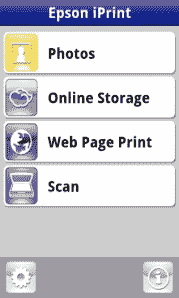

# 爱普生将其 iPrint 应用程序引入 Android TechCrunch

> 原文：<https://web.archive.org/web/http://techcrunch.com/2011/08/30/epson-brings-its-iprint-app-to-android/>

# 爱普生将其 iPrint 应用程序引入安卓系统

尽管数字世界似乎正在生吞活剥印刷品，但仍有一些文件你只想拿在手里。但是，随着我们今天分享信息的速度和方便，印刷很难跟上便利的步伐。爱普生试图通过其 iPrint 应用程序找到一种使打印尽可能快速和无痛的方法，该应用程序今天已经扩展到 Android 平台。

iPrint 可让您自动打印到任何无线多功能一体爱普生打印机，无论是照片、文档还是网页。它也可以反过来工作:你可以从打印机扫描并保存到你的设备上，或者用电子邮件发送文档。此外，该应用程序支持 Box.net、Dropbox 和 Evernote。

 爱普生的 iPrint 将手机的大部分功能都集成到了应用程序中。例如，爱普生在 iPrint 中内置了一个浏览器，这样当你想打印网页时，就不必在手机浏览器和应用程序之间来回切换。然而，如果你使用 iPrint 作为你的默认浏览器，这只会节省时间。不过，如果你知道你要打印的页面，这是一个聪明的举动，而且肯定会使事情变得更容易。

该应用程序可以让你做任何你站在打印机前可以做的事情:检查状态和墨水量，选择纸张大小和类型，配置份数和页面范围等。此外，如果您的打印工作碰巧有点复杂，还有一些高级功能。用户可以从他们的设备中选择和打印多张照片，选择有边框或无边框打印，在彩色和黑白之间切换，你甚至可以直接从应用程序中购买墨水或其他打印用品。

这款应用现在可以从安卓市场和 T2 苹果应用商店免费下载。