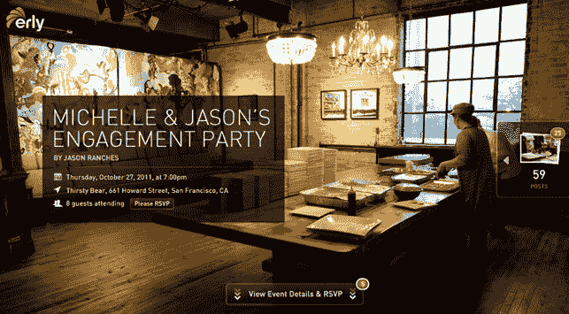
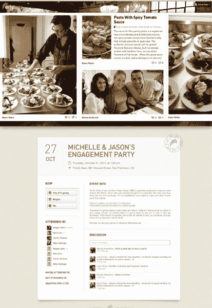

# Erly's Collections 成为一站式商店，为各种活动打造在线形象 TechCrunch

> 原文：<https://web.archive.org/web/https://techcrunch.com/2011/11/29/erlys-collections-becomes-a-one-stop-shop-to-create-an-online-presence-for-events/>

# Erly's Collections 成为一站式商店，为各种活动提供在线展示

由 Hulu 首席技术官和前凯鹏华盈合伙人 Eric Feng 联合创办的社交“体验”领域初创公司凯鹏华盈(Kleiner Perkins)支持的 Erly T1 正在将其首批产品系列(类似于 events 的 About.me)更名为 Events。

正如我们在[中对集合的初始覆盖](https://web.archive.org/web/20221206114008/https://beta.techcrunch.com/2011/09/14/kleiner-backed-erly-intelligently-captures-all-of-your-social-experiences-with-visual-collections/)所解释的，应用程序是一个存放给定体验所有内容的地方。这有点像下一代相册，但不仅仅是照片。

用户可以聚合和共享内容，建立一个包含照片、链接、更新等内容的相册。您可以从其他社交服务导入内容，包括脸书、谷歌、雅虎、Picasa、Flickr 和 Instagram。

10 月，Erly [更新了 Collections](https://web.archive.org/web/20221206114008/https://beta.techcrunch.com/2011/10/17/kleiner-backed-erly-refocuses-shared-visual-collections-on-capturing-memories-from-events/) 以更加关注事件，允许用户为他们想要记住的任何事件创建永久的登录页面。有了今天的更新；Erly 允许用户创建一个活动邀请，建立一个活动微型网站，并在活动结束后在一个地方收集来自客人的照片、视频和故事。

用户可以通过发送电子邮件或在脸书、Twitter 或其他地方发布活动页面链接来邀请人们参加活动。然后，客人可以点击链接，查看活动详情和回复信息。Erly 可以通过电子邮件向特定的来宾名单发送定制邀请。

客人可以随时为活动添加照片、视频、文本和相册链接。Erly 的新活动口号是“为你的活动建立一个美丽网页的最简单方法”，这家初创公司表示，该产品最新版本的灵感是创建一个你可以重新访问和“居住”的 Evite(而不是纯粹使用“交易”)。

