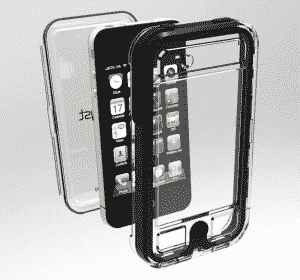

# EscapeCapsule 可以让你在水、沙、泥、雪和其他粗糙的东西上使用你的 iPhone 4

> 原文：<https://web.archive.org/web/http://techcrunch.com/2011/08/24/escapecapsule-lets-you-use-your-iphone-4-in-water-sand-mud-snow-and-other-gross-stuff/>

# EscapeCapsule 可以让你在水、沙、泥、雪和其他恶心的东西上使用你的 iPhone 4

当我说你的 iPhone 4(T1)的外壳是绝对必要的时候，真的不应该有任何争议。除非你有花不完的钱，否则 iPhone 太贵了，不能不加保护。唯一的问题是，它们中的大多数都让你的手机相当笨重，这很糟糕，因为苹果努力让 iPhone 尽可能地纤薄。不幸的是，所有重量的唯一权衡是保护免受冲击。但是如果你把 iPhone 掉到马桶里怎么办？

Catalyst 公司的人给你一个答案:逃生舱。

这东西不仅仅是一个坚韧的外骨骼。表壳由高强度透明聚碳酸酯制成，可防水、防雨、防雪、防沙、防泥、防撞击、防刮擦……无所不包。我提到水了吗？您还可以通过透明外壳仔细检查外壳是否牢固地密封在手机周围。

 Catalyst 表示，手机的硬件按键通过一种特殊设计的薄膜来保护，触摸屏也是如此。这款相机在盖上盖子的情况下工作得非常好，可以在该项目的 Kickstarter 页面上的视频中找到证据。这款保护套还配有一根挂绳，当你拿着 iPhone 在海里玩耍时，它可以挂在你的手腕上。因为有了 EscapeCapsule，你就可以用 iPhone 在海洋里玩了。疯狂。

这款保护套有多种颜色，但如果你在 Kickstarter 上进行抵押，你将获得 Catalyst 的 Kickstarter 专用版胶囊——一个绿色保护套，带有白色夜光橡胶保险杠和夜光挂绳。预订你自己的 EscapeCapsule 需要 50 美元的承诺，考虑到 Catalyst 计划在正式成为现实时以 70 美元的价格出售这款产品，这是一笔不错的交易。

到目前为止，Catalyst 还有 28 天的时间来达到 3 万美元的筹资目标。迄今已收到 3 780 美元。前往 [Kickstarter](https://web.archive.org/web/20230205044118/http://www.kickstarter.com/projects/1060514964/escapecapsule-waterproof-iphone-4-case) 查看逃生舱的运行视频。