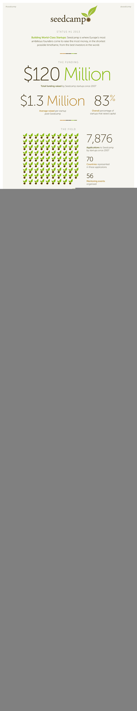

# 欧洲加速器数据— Seedcamp 发布其过去 6 年的数据

> 原文：<https://web.archive.org/web/http://techcrunch.com/2013/09/02/european-accelerator-numbers-seedcamp-releases-its-data-for-the-last-6-years/>

TechCrunch Europe 于 2007 年 9 月推出，同一周，[seed camp](https://web.archive.org/web/20230405020514/http://seedcamp.com/)——欧洲科技创业加速器——也推出了。所以我们一起踏上了一段旅程。那一年以及至少在接下来的 2-3 年里，它基本上是欧洲加速器新浪潮中唯一的游戏。从那以后， [TechStars London](https://web.archive.org/web/20230405020514/http://www.techstars.com/program/locations/london/) (前身为跳板) [StartupBootCamp](https://web.archive.org/web/20230405020514/http://www.startupbootcamp.org/) 以及 [Wayra](https://web.archive.org/web/20230405020514/http://wayra.org/en) 等公司网络也加入了进来，这只是其中的几个例子。似乎欧洲现在充斥着加速器。

但是，尽管许多这些举措仍在摸索中，Seedcamp 仍然吸引了许多顶级玩家。例如，尼可拉斯·曾斯特罗姆在它的第一次活动中发言，并且是那些定期返回 Seedcamp 活动的超级明星之一。

今天，在 [Seedcamp Week](https://web.archive.org/web/20230405020514/http://www.seedcamp.com/seedcamp-week) 开幕之际，当投资者涌入伦敦接受新 Seedcamp 公司的推介时，它在 TechCrunch 上独家发布了一些关于其六年历程的数据。信息显示，虽然 Seedcamp 可能不是最大的(其他人正在通过他们的系统推动更多的公司)，但进入 Seedcamp 的门槛仍然很高。

自 2007 年开始以来，已经有 93 家 Seedcamp 公司。其中，76 家仍在运营，6 家被收购，11 家关闭。自 2007 年以来，Seedcamp 初创公司总共筹集了 1.2 亿美元，平均每个初创公司在经历 Seedcamp 流程后筹集的后续资金为 130 万美元。了解这一点很重要，因为最糟糕的加速器是公司在项目结束后就枯萎死亡。加速器需要加速。

以下是 Seedcamp 发布的更多数字:

2007 年，Seedcamp 支持了 6 家初创公司。迄今为止，他们总共投资了 93 家公司，2013 年上半年投资了 10 家。

这些年来，他们总共收到了 7，876 份申请，2013 年已经超过 2，000 份。

这些申请来自 70 个不同的国家，Seedcamp 在过去六年里为 EMEA 地区 36 个不同国家的创业者提供了支持。

迄今为止，近 100 家被接受的初创公司已经获得了 1.2 亿美元的资本，从 Seedcamp 筹集了 550 万美元。从投资角度来看，这相当于“22 倍”,平均每家公司可获得 130 万美元的后续资金。

Seedcamp 公司通常会在 Seedcamp 计划后立即筹集 33 万至 200 万美元的资金。这一般发生在入职 3-6 个月内。

Seedcamp 初创公司已经从欧洲、美国和亚洲的 354 名投资者那里筹集了资金。

2012 年，约 80%的公司(去年在不同阶段加入该计划)继续筹集后续资金。

在 2013 年的公司中，大约 60%已经获得了后续资金。

关闭的公司有:Kublax、Tablefinder、Lookk、tldr、Trebax、Ineze、Efficient Cloud、Publisha 和其他三家“正在关闭中的公司”。

在被收购的公司中，这些公司是:RentMineOnline(被 RealPage 以 950 万美元收购)、Mobclix(被伦敦移动营销机构 Velti 以 5000 万美元收购)、Jeeran(被 Talasim 收购)、Crashpadder(被 Airbnb 收购)、Toksta(被 Mainseek 收购)和 Kukunu(被 Rundavoo 收购)。

现在，我们可以从中得出的结论是，后续融资和最终退出仍然远远不能与美国的数字相匹配。平均 130 万美元的后续融资使建立一个重要的新公司变得非常困难，特别是当你的国际竞争对手可能已经在首轮融资中筹集了 3-5 倍的资金

欧洲的风险资本只有美国的 20 %,而美国的风险资本只有欧洲的 25%。因此，加速器在欧洲有着更重要的地位——它们解决了欧洲最大的问题之一，即把创业公司聚集在一起，以便他们更快地学习。

然而，欧洲是它自己的游戏，坦率地说，你不应该把欧洲的一切都与美国相比。

Seedcamp 的方法是环游世界——主要是西欧和东欧——在当地活动中吸引初创公司，然后鼓励它们聚集在一个大中心，主要是伦敦。这是欧洲最大的投资者和最有经验的投资者居住的地方。

欧洲的其他加速器似乎想在城市的基础上建立许多地方分部，而不是像 Seedcamp 那样集中在一个地方。这意味着质量可能因项目而异，取决于当地参与的人员。例如，你会听说 X 加速器“在 X 城市很棒，但在 Y 城市很糟糕”。

相比之下，StartupBootcamp 对数字的追求相当迅速。它于 2010 年推出，现在有 95 家校友公司:77 家活跃(81%)，两家已经退出，平均每个初创公司筹集 35 万€，相当于€6500 万。它在七个城市有一个方案。

Wayra 于 2011 年在拉丁美洲成立，但现在已遍布欧洲各地，拥有约 264 家公司(遍布 12 个国家的 14 所学院)。其中，48%的人已经“毕业”还没有 Wayra 公司被收购，19 家已经关闭。

除此之外，Seedcamp 采取的方法与其说是“堆得高高的”，不如说是追求最高端的投资者和投资策略，并将火力集中在伦敦一年中的一个大周。

他们说，这种方法让他们的初创公司“在 3 到 6 个月内筹集到足够的资金”，这与美国相当。

Reshma Sohoni 在接受 TechCrunch 采访时表示，它的方法绝对不是针对很多很多公司。

“我们的方法是为我们的初创公司带来最好的质量和帮助，尤其是让他们进入下一轮融资。我们的数量反映了这一点；我们每年只做 20-25 笔投资。

“我们每年进入 20 个城市的每个地方，然后把初创公司带回‘中心’，帮助它们加速发展。对我们来说，那就是伦敦、柏林和美国，东海岸和西海岸。

“我们不需要办公空间来做这件事。它更多的是关于桥梁和联系，以及导师来自哪里，我们可以联系多少人来创业。这与其他(基于城市的)加速器的方式截然不同。”

谈到平均提高，她说，这可能会增加。“例如，我们看到美国的 TechStars 平均投资 140 万美元。从这个意义上说，我们正在达到那个水平。我总是说，美国公司似乎在一半的时间内筹集了两倍的资金，指出这一点是公平的。但这就是为什么我们每年如此关注 20-25 家公司，并寻求后续融资。找到真正优秀的投资者。例如，我们已经在 Transferwise、Grabcad、Editd 和 Erply 中看到了这一点。如果你没有筹集到足够的资金，你就不能雇佣足够的人，所以你倾向于保持小规模。”

Seedcamp 三分之一的初创公司已经从美国的 103 位投资者那里筹集了资金，包括红点、USV、SV Angel、Betaworks、Atlas Ventures、Index Ventures、500 Startups、Lerer Ventures、Matrix、NextView、彼得·泰尔(梵拉)、Felicis Ventures、IA Ventures 和 Horizons Ventures。坦率地说，这是美国投资者的名人录，也是 Seedcamp 对希望尽早被介绍给美国投资者的初创公司的吸引力的一部分。

换句话说，Seedcamp 的观点是，如果你的加速器在美国有很深的人脉，你不必在美国创办公司来从美国投资者那里融资。这也是为什么去年跳板项目变成了 TechStars London 项目的部分原因——这是与美国的有益联系。

所以这是忙碌的六年，看看这一切会如何发展会很有趣。

