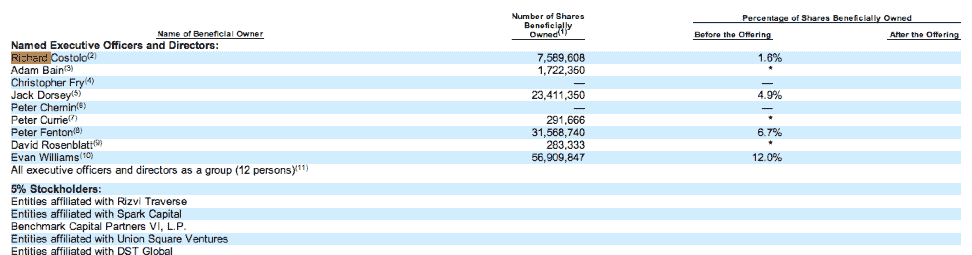

# Rizvi/Sacca、伊万·威廉姆斯、Spark Capital、USV、Benchmark、DST 位列 Twitter 最大股东 

> 原文：<https://web.archive.org/web/https://techcrunch.com/2013/10/03/evan-williams-rizvisacca-spark-capital-usv-benchmark-dst-among-twitters-largest-shareholders/>

# Rizvi/Sacca、伊万·威廉姆斯、Spark Capital、USV、Benchmark、DST 都是 Twitter 的最大股东

正如预期的那样，Twitter 的 [S-1 刚刚发布](https://web.archive.org/web/20221209231229/https://beta.techcrunch.com/2013/10/03/twitter-files-for-1-billion-ipo-will-list-as-twtr/)，声明该公司正在寻求通过公开募股筹集多达 10 亿美元的资金。与每一份 S-1 文件一样，公司会报告哪些个人/公司持有公司最多的股份。根据这张[表](https://web.archive.org/web/20221209231229/http://www.sec.gov/Archives/edgar/data/1418091/000119312513390321/d564001ds1.htm)，创始人伊万·威廉姆斯在上市前拥有公司 12%的股份。该公司的合伙人兼董事会成员彼得·芬顿持有 6.7%的股份。创始人之一杰克·多西拥有 4.9%的股份，首席执行官迪克·科斯特罗拥有 1.6%的股份。

其他持有该公司 5%或以上股份的股东包括 Rizvi Traverse(据报道由[克里斯·萨卡](https://web.archive.org/web/20221209231229/http://www.reuters.com/article/2013/10/03/us-twitter-ipo-rizvi-insight-idUSBRE9920VW20131003?feedType=RSS&feedName=everything&virtualBrandChannel=11563)支持)、Spark Capital、Union Square Ventures 和 DST。不清楚每个投资者具体拥有多少。

Union Square Ventures 和 Spark Capital [是 Twitter 最早的机构投资者(USV 领导了该公司的第一轮主要投资，Spark Capital 领导了 Twitter 的第二轮投资)，Charles River Ventures 也是如此，后者没有列在表格中，在早期投资了大约 25 万美元。Benchmark 获得了 Twitter 的 C 轮融资。](https://web.archive.org/web/20221209231229/http://www.crunchbase.com/company/twitter)

我们从一个消息来源获悉，里兹维可能拥有该公司多达 15%的股份。我们还听说，在里兹维之后，威廉姆斯是下一个最大的单一股东，其次是 Benchmark、Spark、USV，然后是 DST。Spark 最初也拥有约 15%的股份，但将部分股份卖给了 Rizvi。其他没有列在表中的大员工(或前员工)股东包括创始人比兹·斯通、首席运营官·阿里·罗加尼和前法律总顾问亚历克斯·麦克吉利夫雷。

图表中需要注意的其他事项:收入主管亚当·贝恩持有公司不到 1%的股份，董事会成员彼得·居里和大卫·罗森布拉特也是如此。似乎另一名董事会成员彼得·切宁的股份还没有归属。

薪酬方面，科斯特洛年薪 20 万美元(但这在今年 8 月降到了 1.4 万美元)；贝恩的年薪为 20 万美元，工程公司的 SVP·克里斯托弗·弗莱的年薪为 145513 美元。包括股票在内，科斯特洛的总薪酬为 1150 万美元左右，弗莱为 1030 万美元左右，贝恩为 670 万美元。

