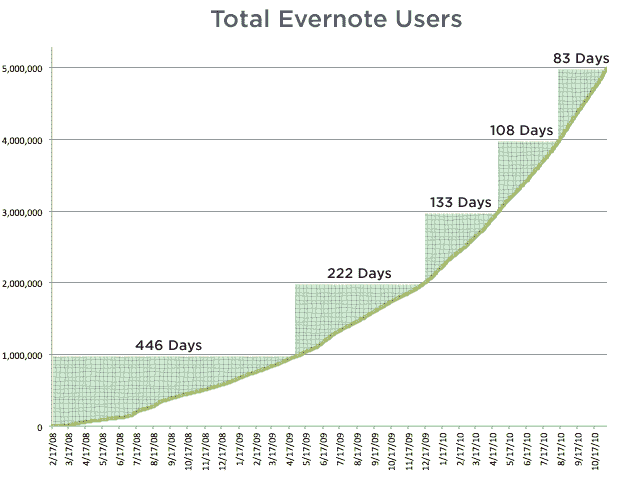
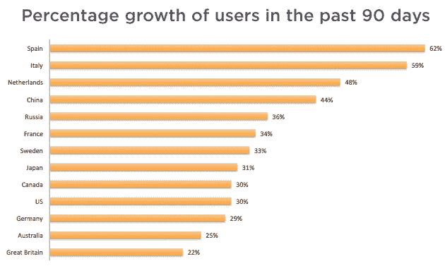

# 有了新的资金，Evernote 的用户达到了 500 万

> 原文：<https://web.archive.org/web/http://techcrunch.com/2010/11/10/evernote-5-million/>

# 有了新的资金，Evernote 的用户达到了 500 万

在从红杉资本(Sequoia Capital)和摩根塔勒风险投资公司[等公司筹集了](https://web.archive.org/web/20230202212512/http://www.crunchbase.com/financial-organization/morgenthaler-ventures)[2000 万美元的资金](https://web.archive.org/web/20230202212512/https://techcrunch.com/2010/10/19/evernote-funding/)仅仅几周之后，记忆增强服务 [Evernote](https://web.archive.org/web/20230202212512/http://evernote.com/) 今天宣布他们已经拥有了[500 万用户](https://web.archive.org/web/20230202212512/http://blog.evernote.com/2010/11/10/5-million-evernote-users/)。

Evernote 刚刚在其博客上宣布了这一消息，距离这家初创公司达到 400 万用户里程碑还不到三个月。

换句话说，Evernote 增加 100 万用户的时间越来越短(该公司声称，昨天有 22，130 名用户注册)。

他们需要 446 天达到第一个 100 万用户，222 天达到第二个 100 万用户，133 天达到第三个 100 万用户，108 天达到 400 万用户。

从上图可以看出，他们的用户在短短 83 天内从 400 万增加到了 500 万。

Evernote 在博客中表示，他们在过去几周也创下了更多记录，包括 Evernote Premium 订阅的最高日收入。

如果你是安卓用户，你可能会想看看最新版本的 [Evernote 的安卓应用](https://web.archive.org/web/20230202212512/http://www.mobilecrunch.com/2010/11/08/evernote-2-0-for-android-packs-many-punches/)，这是刚刚由[发布的](https://web.archive.org/web/20230202212512/http://blog.evernote.com/2010/11/08/evernote-for-android-takes-a-huge-leap-forward-with-version-2-0/)。

该公司还为 PC、MAC 以及 iOS、黑莓、Palm Pre & Pixi 和 Windows Mobile 手机提供应用程序。

该公司承诺将很快更新其 Mac、iPhone 和 iPad 应用程序。

