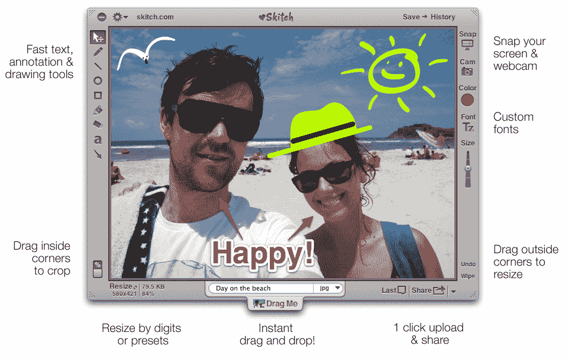

# Evernote 收购图片分享应用 Skitch，计划免费提供 

> 原文：<https://web.archive.org/web/http://techcrunch.com/2011/08/18/evernote-acquires-image-sharing-site-skitch/>

# Evernote 收购图片分享应用 Skitch，计划免费提供

今天在 Evernote Trunk 大会上，Evernote 首席执行官[菲尔·利宾](https://web.archive.org/web/20230203083607/http://www.crunchbase.com/person/phil-libin) [宣布](Evernote%20Snaps%20Up%20Image%20Sharing%20App%20Skitch)该公司已经收购了 [Skitch](https://web.archive.org/web/20230203083607/http://www.skitch.com/) ，这是 Mac App Store 上最畅销的应用之一。这款应用目前在 app store 售价 20 美元，但 Evernote 将免费提供。“我们真的希望这将成为 Evernote 未来的基本组成部分。”

大会上还宣布了 Skitch for Android 的推出，今天可以免费使用。iPhone 和 iPhone 的版本已经在开发中。“我们将把 Skitch 放在任何地方，”利宾说。

“多年来，我们最需要的功能领域之一一直与改进图像处理和注释能力有关，”Libin 在一篇关于收购背后动机的博客文章[中写道。“我们的用户已经拍摄并分享了数百万张照片和截图，但体验并没有想象中的那么好。我们讨论了是将改进的功能添加到 Evernote 中，还是建立一个单独的应用程序来处理它。最后，我们决定双管齐下。”](https://web.archive.org/web/20230203083607/http://blog.evernote.com/2011/08/18/evernote-acquires-skitch-evernote_etc/)

利宾在今天早上的演讲中首先给出了一些关于 Evernote 与一年前相比的增长数据；Evernote 的注册用户目前为 1250 万，而一年前为 390 万，增长了两倍多，达到 213%，Evernote 30 天活跃用户目前为 450 万，而一年前为 120 万，增长了 271%。

该公司还每天新增 4.2 万人，而一年前只有 1.1 万人，增长了 277%。Evernote 使用免费增值模式，根据 Libin 的数据，其付费用户为 56.8 万，而一年前为 9.2 万，增长了 513%。

利宾表示，人们使用 Evernote 的时间越长，他们就越有可能付费——虽然 1%的人在一个月后使用该产品的付费版本，8%的人在一年后付费，3 年后 25%的用户转化为付费客户。“我们希望成为百年公司，”李斌说。“我们致力于创造简单、优雅、令人愉快的新型工具，它们将永远改变你的大脑。”

利宾表示，Evernote 仍有收购更多房产的计划。公司[最近获得了由](https://web.archive.org/web/20230203083607/https://techcrunch.com/2011/06/17/sequoia-capital-evernote-venture-capital/)[红杉资本](https://web.archive.org/web/20230203083607/http://www.sequoiacap.com/)牵头的5000 万美元的融资，这意味着它可能有空间进行几笔小规模收购。显然，李斌没有透露今天购买的价格。

