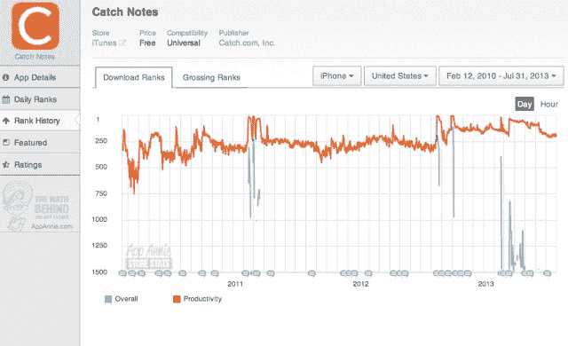

# Evernote 的竞争对手 Catch.com 关闭了它的笔记应用，公司走向“不同的方向”

> 原文：<https://web.archive.org/web/https://techcrunch.com/2013/07/31/evernote-competitor-catch-com-shuts-down-its-note-taking-apps-company-heading-in-different-direction/>

Catch(原名 Snaptic)正在关闭其 Evernote 的竞争对手 Catch Notes，该公司允许用户在 iOS 和 Android 上捕捉和保存笔记，并通过 Chrome、Firefox 和 IE 的浏览器扩展，甚至通过电子邮件在网络上保存笔记。

该公司在发布到其[网站](https://web.archive.org/web/20230315095316/https://catch.com/)的消息中以及昨天发送给前 Catch.com 用户的电子邮件(见下文)中宣布关闭该服务，并解释说该服务将于 8 月 30 日关闭。在此之前，用户必须通过[提供的导出工具](https://web.archive.org/web/20230315095316/http://support.catch.com/customer/portal/articles/988949-how-can-i-export-notes-on-the-web-interface-)从 Catch.com 导出数据。根据 Catch 的进一步[指令](https://web.archive.org/web/20230315095316/http://support.catch.com/customer/portal/articles/1243609-importing)，该工具可以生成您的数据的 CSV 或 ZIP 存档，可以导入到 OneNote、Springpad 或 Simplenote 中。

这家初创公司之前已经筹集了 930 万美元的种子资金和由波士顿 Excel Venture Management 牵头的首轮融资，它在声明中暗示，在 Catch.com 关闭后，该团队正在将公司带到“一个不同的方向”，但没有提供任何其他关于他们目前计划的细节。

目前还不清楚在 Catch 关闭的消息传出后，Catch 的其他应用程序，如 [AK Notepad](https://web.archive.org/web/20230315095316/https://play.google.com/store/apps/details?id=com.akproduction.notepad) 和 [Compass](https://web.archive.org/web/20230315095316/https://play.google.com/store/apps/details?id=com.apksoftware.compass) 会发生什么，因为该公司尚未回应我们要求提供更多信息的请求。

虽然奇怪的是，在简短的声明中没有提到这些应用程序，但新闻发布的时间更奇怪，因为[仅在一个月前](https://web.archive.org/web/20230315095316/http://blog.catch.com/post/53355603518/announcing-catch-team)，该公司宣布推出一项名为 [Catch Team](https://web.archive.org/web/20230315095316/https://catch.com/catch-team/) 的商业级协作服务。有趣的是，该产品的主页今天仍然是活的，而不是重定向到关于 Catch 关闭的通知。这可能表明，这确实是该公司选择追求的新方向。与个人笔记服务不同，团队产品更侧重于项目管理，并提供企业级功能。

该公司面向消费者的移动应用在过去几个月相当受欢迎。例如，根据 Google Play 的说法，Android 应用程序的安装量已经达到了 500 万到 1000 万之间，在 T4，更有限的竞争使得该应用程序的坚实设计比在 iOS 上更加突出。那里的用户已经在哀叹损失，恳求 Catch.com 重新考虑，或者发布一个付费版本。

iOS 应用程序的受欢迎程度一般，在全球 14 个国家的生产力应用程序中排名前 100，在美国的生产力排名为 198

在过去的几年里，许多[新闻](https://web.archive.org/web/20230315095316/http://techland.time.com/2012/11/01/25-free-android-apps-to-get-you-started/slide/catch-notes/) [媒体](https://web.archive.org/web/20230315095316/http://www.businessinsider.com/best-productivity-apps-2012-2012-12#catch-lets-you-take-notes-offline-and-online-too-4)和[评论员](https://web.archive.org/web/20230315095316/http://www.makeuseof.com/tag/catch-notes-fullfeatured-app-portable-notetaking-android/)已经将 Catch 的应用程序列为移动设备的“顶级”生产力工具。而且，正如 TechCrunch 的一位读者刚刚指出的那样，该应用还受益于苹果自己零售店的促销活动，以及在 Apple.com 主页上的专题报道。

但 Evernote 早已超过 Catch，成为 PC、web 和移动设备的首选笔记工具，拥有桌面、手机和平板电脑的原生应用程序，以及独立的 web 应用程序。(哦，还有大约 2 . 51 亿美元的外部资金。)

我们联系了 Catch.com，看看它的创始人是否能分享他们如何做出这一决定的更多细节，或者公司的未来计划现在包括什么。我们还没有得到回复，但如果有机会的话，我们会在对话后更新细节。与此同时，Catch 的当前用户应该开始从服务中获取数据，以免为时过晚。

以下是公告全文:

> Catch 做出了一个艰难的决定，让公司朝着不同的方向发展。因此，我们将在下个月终止服务。我们重视我们的用户，在过去几年里，我们非常享受为数百万人提供 Catch，但现在是我们继续前进的时候了。
> 
> 2013 年 8 月 30 日之后，将不再提供渔获量。请按照这些指示在此之前下载您的数据。
> 
> 我们感谢你的支持。如果您有任何问题或顾虑，请发电子邮件至 support@catch.com 联系我们。如果我们不能回复所有的邮件，我们深表歉意。
> 
> –抓捕小组