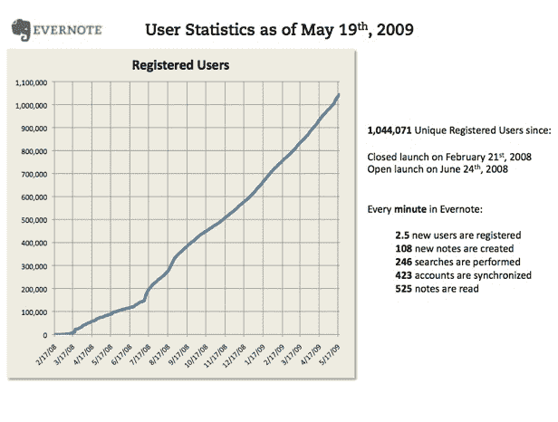
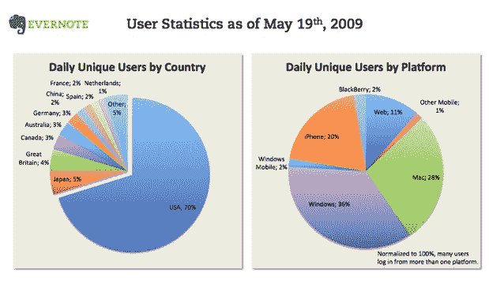
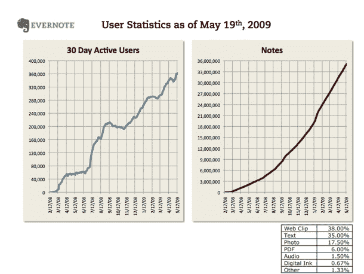
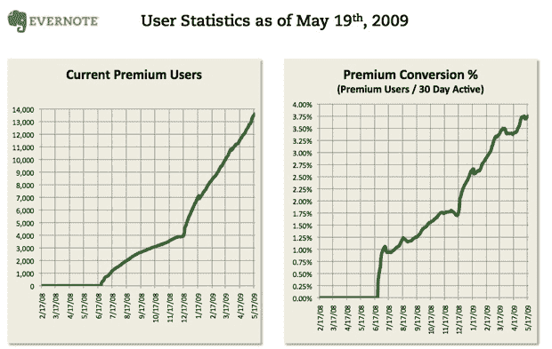

# Evernote 统计数据:100 万注册用户，36 万活跃用户，13755 付费用户

> 原文：<https://web.archive.org/web/https://techcrunch.com/2009/05/21/evernote-stats-one-million-registered-users-360000-active-13500-paid/>

对于任何初创公司来说，注册用户达到一百万都是一个重要的里程碑。至少，这表明它指向了正确的方向。 [Evernote](https://web.archive.org/web/20230316161016/http://www.evernote.com/) ，这个应用[帮助你记住你在网上找到的东西](https://web.archive.org/web/20230316161016/https://techcrunch.com/2008/02/21/extend-your-brain-with-evernote-private-beta-invites/)或者用你的手机拍下的照片，几天前刚刚达到 100 万注册用户，大约在 2008 年 6 月公开发布后一年，六个月后达到 [50 万注册用户](https://web.archive.org/web/20230316161016/https://techcrunch.com/2008/11/21/evernote-passes-500000-registered-users-most-of-them-on-the-iphone/)。该公司去年年底筹集了 450 万美元。

Evernote 的增长无论如何都不是火箭般的增长，但它是稳定和持续的。首席执行官 Phil Libin 分享了一些 Evernote 进展的详细数据。你可能会从 Evernote 的 iPhone 应用程序中知道它，该应用程序赢得了一个 Crunchie 奖，已经被下载了大约 100 万次。但该公司也有 Windows 和 Mac 客户端，以及网络浏览器版本。按用户细分，Windows 客户端(Evernote 首先推出的产品)占 36%，Mac 占 28%，iPhone 占 20%，网络占 11%，黑莓占 2%，其他移动设备占 1%。

桌面客户端已经被下载了大约 170 万次，可以与 iPhone 应用程序配合使用。这些数字很有启发性，因为下载量(所有平台总计 270 万)并不等于注册用户数(100 万)。所以下一次一家创业公司吹嘘它有多少下载量时，把这个数字减少一半到三分之一，仅仅是为了注册。

然后你必须再削减三分之一。注册用户很棒，但真正活跃的有多少？那些才是一个公司真正的用户。在过去 30 天里，Evernote 追踪到约 36 万活跃用户，略高于注册用户的三分之一。Evernote 的活跃用户可能相对较少，但他们非常活跃。在过去一年左右的时间里，他们创造了 3600 万张纸币，也就是每张约 100 张纸币。笔记的形式可以是 Web 剪辑(38%)、文本笔记(35%)、照片(17.5%)、PDF 文档(6%)、语音笔记(1.5%)、数字墨水(0.67%)等等。

Evernote 的活跃用户越多，它就越能转化为付费用户。[高级用户](https://web.archive.org/web/20230316161016/http://www.evernote.com/about/premium/)以每月 5 美元或每年 45 美元的价格获得更大的存储空间、更多的支持、更高的安全性，并且没有广告。Evernote 有 13755 名付费高级用户，转化率约为 3.75%。高级账户的数量和转化率都在增长。令人惊讶的是，82%的高级用户选择了年度账户。这意味着年收入约为 65 万美元，这并不多，但 Evernote 有其他收入来源，利宾表示，他已经提前实现了盈利。他只需要把那些付费用户的数量提高一点。如果他可以获得高达 50，000 的高级用户，这将转化为大约 220 万美元的收入，100，000 名高级用户将带来 450 万美元的收入，等等(我只是使用 45 美元的年费来计算这些数字。在每月订户中工作使总数增加了一点)。

现在，如果 Evernote 的付费用户能够达到 100 万*，那将是一笔不错的生意。*

 **