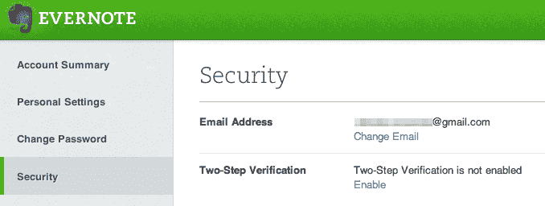
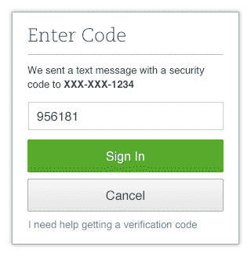

# Evernote 开启了三项新的安全功能，包括双因素认证，在 2 月份的重大违规事件后

> 原文：<https://web.archive.org/web/https://techcrunch.com/2013/05/30/evernote-turns-on-three-new-security-features-including-2-factor-authentication-after-a-malicious-hack-forced-it-to-reset-all-50m-user-passwords-this-year/>

拥有 6000 多万用户的个人笔记应用 Evernote 在 2013 年 2 月因安全漏洞受到猛烈抨击后，今天该公司开启了 T2 的三项新功能，让用户更好地控制他们的账户:两步验证、访问历史和授权应用程序列表。两步认证最终将向所有用户推出，但一位发言人告诉 TC，首先只会向高级(付费)用户推出，以确保体验是正确的。

“Evernote Premium 用户参与度最高，因此从那里开始是有意义的，”她说。“随着我们继续向更大的用户群推广，有了高级用户的反馈，我们将为解决问题和顾虑做好最充分的准备。”

与双因素身份认证的逐步推出不同，从今天起，每个人都可以访问历史记录和授权应用程序列表。

增加更多安全和访问控制的举措是在一次严重的违规事件之后，该事件迫使 Evernote 要求其 5000 万用户(现在人数超过[6000 万](https://web.archive.org/web/20230324200057/https://techcrunch.com/2013/05/07/evernote-launches-yinxiang-biji-business-taking-its-premium-business-service-to-china/))更改密码，但根据首席执行官菲尔·利宾的说法，还没有严重到用户的数据和支付细节被访问的程度。

Evernote 的两步验证——今天推出的三项新服务中最重要的一项——已经在进行中，但在 2 月份的事件后，推出该服务的计划得到了加速。

就像 Twitter 上周推出的其他两步用户认证系统[一样，Evernote 的服务将基于短信，并且对所有用户都是可选的。也就是说，如果你是 Evernote 用户，并且不想在每次需要登录时额外证明你是谁，你就不需要这么做。](https://web.archive.org/web/20230324200057/https://techcrunch.com/2013/05/22/twitter-ups-account-security-with-optional-two-factor-authentication-via-sms/)

这是在您的[设置](https://web.archive.org/web/20230324200057/https://www.evernote.com/SecuritySettings.action)中打开新功能的屏幕外观:

一旦你启用了双因素验证，无论何时你注销了你的帐户或需要为其他目的重新输入你的密码，你都会收到一个通过短信发送给你的六位数字的代码-它在 iPhone 上的外观示例如上图所示。新的登录屏幕又需要该代码:

用户不应该经常需要重新输入密码:当你在桌面上登录 Evernote 或者在新设备上安装 Evernote 时，通常需要重新输入密码。Evernote 在一篇[博客文章](https://web.archive.org/web/20230324200057/http://blog.evernote.com/)中说，代码本身是由谷歌认证应用程序生成的，或者用户可以通过短信获得。

缺点:对于那些容易忘记密码和提醒的人来说，两步认证可能不是你的安全解决方案。Evernote 表示，它将为开启该功能的用户提供一套一次性的备份代码，“供你旅行时使用”，但它也指出，“如果你失去了第二种访问方法，你就有可能永远被锁定在账户之外。”

实际上，对于一些用户来说，两步可能会变成很多步。Evernote 还指出，其平台上的一些应用程序将直接停止工作，直到你为这些应用程序中的每一个创建特定的应用程序密码。这些也可以在 Evernote 的安全设置页面设置，以及双因素认证。

**另外两个安全特征**。虽然今天 Evernote 等云服务的安全性主要集中在双因素认证上，但其他两个功能的开启也是该公司帮助用户更好地控制 Evernote 平台上的数据的重要步骤——随着 Evernote 继续增长，并在人们如何使用该服务来组织和管理他们的生活方面寻求越来越重要的地位，这对用户来说是一个重要的信心助推器。

授权应用列表——让用户可以看到所有链接到他们 Evernote 账户的应用，如果他们愿意，可以撤销访问权限——老实说，这可能是 Evernote 到目前为止应该向用户提供的东西，因为这是 Twitter 和脸书等其他服务的一项功能。它强调的是 Evernote 如何开始明显更加关注自己作为其他服务平台的地位，以及人们使用 Evernote 自己开发的功能存储笔记和其他信息的地方。

与此同时，访问历史可以让用户检查过去 30 天 Evernote 的每次使用情况(可以把它看作 Evernote 的“银行对账单”)，对于那些怀疑自己的账户被他人访问过的人来说，这是一个有用的功能。它涵盖了 Evernote 的所有版本，不考虑平台，并通过位置和 IP 地址进行跟踪。