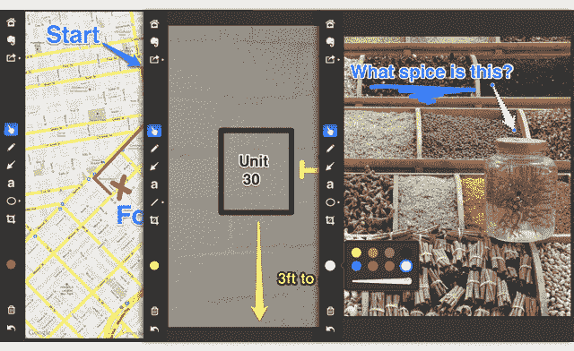

# Evernote 的 Skitch 登陆 iPad...iPhone 版本仍在开发中

> 原文：<https://web.archive.org/web/http://techcrunch.com/2011/12/22/evernotes-skitch-arrives-on-ipad-iphone-version-still-in-the-works/>

# Evernote 的 Skitch 登陆 iPad……iPhone 版本仍在“开发中”

8 月 Evernote 收购的广受欢迎的照片编辑 Mac 应用[Skitch](https://web.archive.org/web/20230209124840/https://techcrunch.com/2011/08/18/evernote-acquires-image-sharing-site-skitch/)，现在[可以在 iPad](https://web.archive.org/web/20230209124840/http://itunes.apple.com/us/app/skitch-for-ipad/id490505997?mt=8) 上使用。此次发布是继今年早些时候推出 Android 应用程序的 [Skitch 之后，也是第一个 iOS 兼容版本。使用这个新的应用程序，你可以对任何东西进行注释——一张新照片，一张来自你相机胶卷的照片，一张截图，一张地图，或者你可以在空白画布上画画。](https://web.archive.org/web/20230209124840/https://techcrunch.com/2011/12/12/evernotes-skitch-sees-3-million-downloads-on-android/)

当然，当你完成创作后，你可以将照片保存到 Evernote[进行保管。](https://web.archive.org/web/20230209124840/http://www.evernote.com/)

选择好你的起点后(一张照片，截图等。)，您可以使用许多内置工具来编辑您的创作，这些工具利用了 iPad 的触摸屏界面。您在屏幕上绘制的对象可以用手指四处移动，也可以被拖入垃圾桶。铅笔工具可以让你徒手画。您可以添加文本。你可以拖动、拉动和调整其他对象，如箭头、圆圈、正方形和线条。

这些都不是完全突破性的东西，但 Skitch 做得很好。使用起来很愉快。

除了集成 Evernote 之外，你的作品还可以通过 AirPlay 发布到推特上，甚至可以镜像到任何 Apple TV 连接的屏幕上，这也很酷。是用免费工具 DIY 的 Powerpoint。很好。

但我知道你在想什么:IPHONE 的 SKITCH 在哪里？

Evernote 称其“正在工作中”，这是他们自八月以来一直在说的话。根据公司博客[的帖子](https://web.archive.org/web/20230209124840/http://blog.evernote.com/2011/12/21/skitch-for-ipad-is-here/)，他们首先在 iPad 上推出，因为它是“触觉注释的理想形式”那么近四个月的 Android 应用程序呢？

你可以从这里[抓取新版 iOS 版 Skitch](https://web.archive.org/web/20230209124840/http://itunes.apple.com/us/app/skitch-for-ipad/id490505997?mt=8)。

