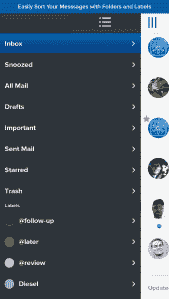
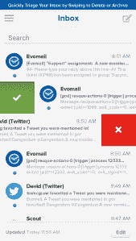

# Evomail 基于手势的电子邮件应用程序登陆 Android 

> 原文：<https://web.archive.org/web/https://techcrunch.com/2013/09/05/evomails-gesture-based-email-app-arrives-android/>

Evomail 是许多试图重新思考移动电子邮件收件箱的新兴公司之一，[现在已经登陆 Android](https://web.archive.org/web/20220930110727/https://play.google.com/store/apps/details?id=io.evomail.android) 。这项服务最初是为 iPad 设计的 Gmail 客户端，似乎受到了许多知名应用程序和电子邮件客户端的启发，包括现在谷歌拥有的[麻雀](https://web.archive.org/web/20220930110727/http://sprw.me/)，以及 Dropbox 收购的[邮箱](https://web.archive.org/web/20220930110727/http://www.mailboxapp.com/)，后者普及了手势作为与电子邮件互动的方式。

Evomail 的 iOS 版本，现在是 iPhone——也进行了优化，引入了各种功能，包括新消息、文件夹和标签的推送通知，打盹功能，以及让你滑动以删除或存档、摇动以按住以标记、加星、回复、转发或标记为已读等手势。这些相同的功能现在在 Android 上也可以使用。

 当该公司在 5 月份首次推出其应用程序时，[评测人员](https://web.archive.org/web/20220930110727/http://www.macstories.net/reviews/evomail-review-a-gmail-client-for-ipad-with-a-clean-design-and-push-notifications/)通常认为界面干净整洁，应用程序[简单易用](https://web.archive.org/web/20220930110727/http://lifehacker.com/evomail-is-a-gesture-based-easy-to-use-email-client-fo-496011581)，但也遇到了一些问题。联合创始人兼首席执行官 Jonathan George 解释说，今天，由于 Evomail 的快速每周发布周期，主要问题已经得到解决。

乔治之前联合创立了 Boxcar，这是一款为开发者提供推送通知服务的软件，于 2012 年 7 月被 Kwaga 收购。他说，他在签署收购文件的当天晚上就想出了 Evomail 这个主意。“这些年来，Email 收到了许多新的油漆涂层，但没有人真正进去翻修过整栋房子，”他解释道。“我们通过构建 EvoCloud 做到了这一点，Evo cloud 是电子邮件的一个顶层。”

EvoCloud 旨在解决电子邮件以前因邮件服务器分散而面临的问题，也就是说，如果您需要构建一个需要服务器支持的功能，您必须让所有提供商也为其构建支持，并升级他们自己的系统。相反，EvoCloud 将邮件提供商集中到一个层，允许该公司建立自己的服务器功能，如 Gmail 的优先收件箱，或他们的新标签界面，然后向任何人提供这些功能，甚至是那些不使用 Gmail 的人。

 如今，Evomail 支持多种邮件系统，当然包括 Gmail，还有雅虎、iCloud 和其他支持 IMAP 的服务。该公司计划很快开始销售免费增值订阅，为用户提供他们的邮件提供商可能没有提供的功能。

截至上个月，该公司报告称，iOS 端的周环比增长率为 25%，但拒绝透露该应用目前的下载或活跃数量。然而，该应用在美国应用商店中落后于知名提供商 Gmail(排名第 2)、雅虎(排名第 6)、Hotmail(排名第 47)以及邮箱(排名第 60)。iPhone 和 iPad 版本在推出时曾跻身前 100 名，但现在它们很难在商务类别中保持前 500 名的排名(根据 App Annie 的统计。)

对 iOS 版本的评价中等，反映了该公司仍然非常早期的性质。用户继续报告错误和崩溃，但其他人说这是“到达那里。”这款应用的设计对推销其概念大有帮助，但如果没有稳定性和速度，将很难阻止用户从手机上删除它。

在安卓系统上，Evomail 希望至少有一个先发优势，通过击败其他流行的电子邮件客户端，如邮箱，进入这个平台。在更早的预发布测试版中，该应用程序的功能与预期一致，但与原生 Gmail 应用程序和其他应用程序相比，似乎仍然非常落后。

然而，该公司表示，在今天发布之前，他们一直在消除错误，所以目前不可能进行深入的审查。很可能，它仍然和 iOS 版本在同一条船上，尽管:“到达那里。”取决于许多因素——你的电子邮件提供商、收件箱大小、你收到多少邮件(当然，我可能是个局外人)，以及更多——正如他们所说，你的里程可能会有所不同。

但考虑到 Evomail 所处的阶段，该公司在短短几个月的时间里取得的进步是值得注意的。同样由大卫·麦格劳和多米尼克·弗拉斯克共同创立的这家位于威奇塔的初创公司，本质上是靠自己创业的，只有一个四人的小团队和仅仅 10 万美元的种子基金[T4。在这种情况下处理像电子邮件这样大规模的问题是疯狂和冒险的…坦白地说，很高兴看到这一点。](https://web.archive.org/web/20220930110727/http://www.crunchbase.com/company/evomail)

Evomail for Android 在 Google Play 上是[。](https://web.archive.org/web/20220930110727/https://play.google.com/store/apps/details?id=io.evomail.android)