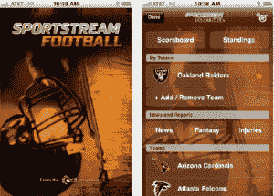

# Evri 推出 SportStream 应用程序，为您的移动设备带来实时的社交体育新闻 

> 原文：<https://web.archive.org/web/https://techcrunch.com/2011/09/07/evri-launches-sportstream-apps-to-bring-realtime-personalized-sports-news-to-your-mobile-devices/>

# Evri 推出 SportStream 应用程序，将实时的社会体育新闻带到您的移动设备上

实时内容发现引擎 Evri ，[去年年初收购了 Radar Networks】，将这家初创公司的语义索引技术整合到其产品中。此举为 Evri 向移动领域的转移奠定了基础，因为它已经使用实时语义匹配算法开始在目标类别中提供新闻，Twine 团队也开始向移动领域扩张。](https://web.archive.org/web/20230203095251/https://techcrunch.com/2010/03/11/evri-acquires-radar-networks/)[去年，这家初创公司推出了 EvriThing Tech](https://web.archive.org/web/20230203095251/https://techcrunch.com/2010/05/14/evri-android-iphone/) ，允许读者就任何科技话题以及预定义话题创建和添加自己的频道。([类似于 FLUD 和其他人在移动内容领域所做的](https://web.archive.org/web/20230203095251/https://techcrunch.com/2011/09/07/social-news-reader-flud-strikes-a-deal-with-aol-launches-android-app/)。)

如今，Evri 正在扩展其移动功能，推出了一套适用于 iOS 和 Android 设备的体育应用程序，名为 SportStream，将由其同名平台提供支持。随着 NFL 赛季的临近，Evri 推出了一套体育应用程序，名为[sports stream Football](https://web.archive.org/web/20230203095251/http://apps.evri.com/football/)，这款应用程序旨在通过社交渠道为读者提供实时推送通知和比赛中的评论，让你的周日观看体验更具互动性，更具 Web 2.0 风格。

 通过 SportStream Football，Evri 希望为球迷提供身临其境的体验，使他们能够访问来自数千个来源的实时新闻内容，整合来自球迷社交媒体的个性化和最新信息，使读者能够在比赛发生时实时发布精彩内容。观众可以看到游戏中的比分更新和比赛摘要，以及特定球队的个性化选项，例如关键的伤病和交易新闻。

[就像 Taptu 为 iPad 用户](https://web.archive.org/web/20230203095251/https://techcrunch.com/2011/08/12/just-in-time-for-the-new-nfl-season-taptu-brings-fantasy-football-to-mobile-readers/)创建了一个梦幻足球流一样，Evri 希望其有针对性的个性化内容流不仅成为球迷的重要资源，也成为梦幻足球运动员的重要资源。

Evri 首席执行官威尔·亨辛格说，这里的目标不是“超越 ESPN·ESPN”，而是利用 ESPN 实时体育报道所缺乏的优势。不仅仅是在网上搜索博主的信息和 ESPN 领域之外的其他体育内容，还允许乔治敦体育的粉丝为他们母校的球队创建有针对性的新闻源。虽然 ESPN 显然是一个强大的内容来源(真的，体育内容的死星)，但对于初创公司来说，在体育内容阅读和观看体验方面还有很大的空间。

凭借 Evri 完善的语义索引数据，SportStream 应用程序是个性化体育信息的绝佳资源。Evri 很聪明地去追逐这些热情的、服务不足的利基市场。或者，即使体育内容不是很少，但通过实时功能，给体育迷提供更容易、更少“噪音”的阅读体验，增加了这家初创公司的价值主张。是的， [Pulse 最近与 ESPN](https://web.archive.org/web/20230203095251/https://techcrunch.com/2011/08/02/pulse-espn-5-million/) 达成了一项协议，Taptu 正在提供一个很棒的平板电脑应用程序，但市场还有很大的空间，Evri 通过社交图和实时推文吸引粉丝的做法是一个良好的开端。

我们将期待这家初创公司的下一步行动。