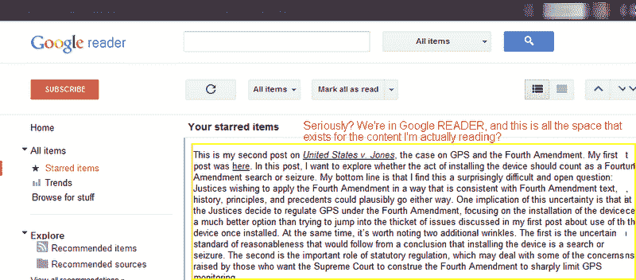

# 前谷歌阅读器产品经理发布了对阅读器重新设计的严厉评论 

> 原文：<https://web.archive.org/web/http://techcrunch.com/2011/11/02/ex-google-reader-product-manager-posts-scathing-review-of-reader-redesign/>

前谷歌阅读器产品经理 Brian Shih 向谷歌阅读器发布了[更新](https://web.archive.org/web/20230203162000/https://techcrunch.com/2011/10/31/and-here-it-is-the-new-google-reader-revealed/)的评论[。这次更新，](https://web.archive.org/web/20230203162000/http://brianshih.com/78073742)[移除了 Reader 自己的社交分享功能](https://web.archive.org/web/20230203162000/https://techcrunch.com/2011/10/20/google-reader-getting-overhauled-removing-your-friends/)以支持 Google+，这在 Google Reader 最活跃的用户中并不受欢迎，因为它摧毁了他们多年来建立的利基社区。但在施看来，这只是问题之一。

他说，同样糟糕的是新的视觉风格，指的是谷歌最近几周在所有产品中推出的黑白用户界面。Shih 说:“就好像不管是谁做了更新，都没有真正使用产品来阅读一些东西，”

谷歌阅读器的普通用户可能会在读到施的评论时欢呼，他的评论一针见血:

> Reader 是一款快速消费信息的产品。我们把它设计得非常擅长那一件事。G+是一种围绕浏览(类似于脸书)和社交的体验。采用 G+的 UI 范例，并将其混搭到 Reader 上，而不考虑底层功能，这是非常糟糕的，这一点显而易见。
> 
> 第二个也是更明显的变化是，有人拿起神奇的去色魔杖，将整页纸涂成灰色。难以置信的荒凉，很难想象还有比这更荒凉的经历。甚至 G+也有帖子标题的蓝色链接。蓝色标题对于谷歌搜索来说已经足够好了。Reader 完全围绕标题为的帖子构建，以全能的灰色上帝的名义废除了这一点。

垃圾话不止于此。

除了可怕的视觉风格，施提出的另一个令人挠头的问题是，为什么谷歌选择移除谷歌阅读器的内部共享机制，而不是建立一个更周到的集成。正如另一位前谷歌阅读器工程师凯文·福克斯(Kevin Fox)之前在[中提到的](https://web.archive.org/web/20230203162000/http://fury.com/2011/10/changing-google-reader-for-the-better/)，谷歌本可以通过 Google+的 API 推送分享，而 Reader 中的“你关注的人”则成为一个特定于读者的圈子。

谷歌*似乎根本不关心读者或其社区会发生什么，尽管这可能是一个小众市场。([伊朗](https://web.archive.org/web/20230203162000/https://techcrunch.com/2011/10/25/iranians-upset-over-google-reader-changes/)除外，就是这样)。事实上，有传言称，就谷歌而言，如果可能的话，它会喜欢完全消灭 Reader。*恐怖！**

可悲的是，如今谷歌阅读器的替代品少之又少，而且大多数都不能满足重度 RSS 用户的需求。其他读者试图通过吸引主流读者的功能来区分自己，他们的界面不太好用，或者只作为桌面应用程序运行。值得一提的是，我已经尝试过 [Feedly](https://web.archive.org/web/20230203162000/http://www.feedly.com/) 、 [NewsBlur](https://web.archive.org/web/20230203162000/http://www.newsblur.com/) 、 [NetVibes](https://web.archive.org/web/20230203162000/http://www.netvibes.com/en) 、 [Fever](https://web.archive.org/web/20230203162000/http://feedafever.com/) 、 [NetNewsWire](https://web.archive.org/web/20230203162000/http://netnewswireapp.com/) 、 [Pulse](https://web.archive.org/web/20230203162000/http://www.pulse.me/) ，甚至是新推出的 [Intigi](https://web.archive.org/web/20230203162000/http://intigi.com/) ，但没有一款能复制谷歌阅读器的体验——它们都是自己的、非常个性化的新闻消费产品。Fever 可能是“自带主机”人群中最好的，Feedly 的设计是个人最喜欢的，但这些都不是谷歌阅读器的真正替代品，它们是对它的补充。

最有趣的替代产品， [HiveMind](https://web.archive.org/web/20230203162000/http://hivemined.org/) ，目前正由虔诚的谷歌阅读器用户 Francis Cleary 开发[，但尚未推出。希望 Cleary 能理解谷歌阅读器做对了什么，其他人还缺少什么。时间会证明一切。](https://web.archive.org/web/20230203162000/http://www.theatlanticwire.com/technology/2011/10/sharebros-are-building-google-reader-replacement/44307/)

目前，你能做的最好的事情就是留在谷歌阅读器中，用谷歌阅读器整流器 Chrome 扩展来装饰，这至少有助于解决空白问题。(然而，Reader 安装后似乎变慢了。)

归根结底，谷歌现在对阅读器和其他方面做出的改变表明，它有一个不惜一切代价追求社交的明确议程。它甚至关闭了许多表现不佳的服务，它的实验室产品，以及来自收购的[产品](https://web.archive.org/web/20230203162000/https://techcrunch.com/2011/09/02/google-kills-aardvark/)，因此它可以专注于它的核心产品，现在包括社交网站。从长远来看，这对公司来说可能是正确的，但这是以谷歌一些最热情的用户为代价的。

*图片鸣谢:顶级谷歌；第二个布莱恩·施*