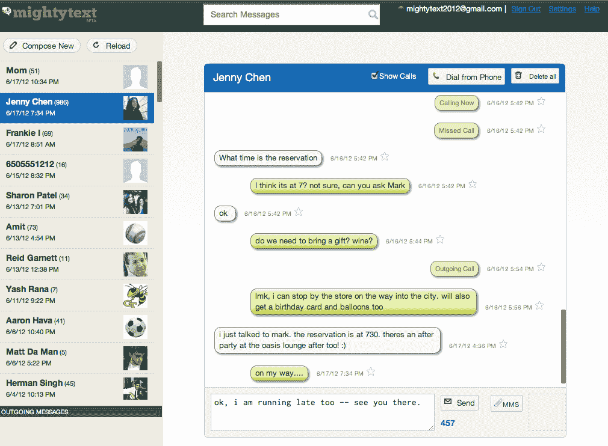

# 前谷歌员工推出面向安卓用户的 iMessage mighty text

> 原文：<https://web.archive.org/web/https://techcrunch.com/2012/06/19/ex-googlers-launch-mightytext-an-imessage-for-android-users/>

在他们漫长的谷歌高级技术和产品管理职业生涯中，Maneesh Arora 和 Amit Sangani 能够开发出 AdSense、AdWords 和现已倒闭的 Google Health 等产品。阿罗拉告诉我们，虽然他在谷歌的时间是由聪明人和雄心勃勃的想法定义的，但在开发中，往往有一种不考虑“普通用户”的“过度工程化”的趋势。他说，虽然谷歌员工总是打开 Gchat 并使用谷歌语音(或在它还活着的时候使用 Wave)，但这些产品都无法有效地解决主流受众通信工具的真正价值支柱:同步。尤其是发短信的时候。

阿罗拉简单地说:“对我来说，我不得不把手机放在面前进行交流是没有意义的……如果我把它放在另一个房间、车里或家里，我基本上必须把它拿回来，看看是谁打来的电话或接收收到的短信。”因此，Arora 和 Sangani 开始着手一项任务，让 Android 用户能够查看和回复短信，无论他们碰巧使用的是什么设备。经过几个月的测试，这两人今天正式推出了[MightyText](https://web.archive.org/web/20221207064621/http://mightytext.net/)——一款旨在为安卓用户提供他们自己版本的苹果 iMessage 的应用。

在 2011 年 3 月以 Texty 的名字推出后，这家初创公司[在 6 月](https://web.archive.org/web/20221207064621/http://blog.louisgray.com/2011/06/texty-rebrands-as-mightytext-adds-call.html)更名为 MightyText。从那以后，它或多或少处于测试阶段，只能作为 Chrome 的扩展来使用。然而，Chrome 扩展已经找到了一些非常可靠的早期采用，吸引了超过 25 万用户，他们每天发送超过 200 万条消息。此外，Arora 表示，按照目前的运行速度，他们的目标是达到 10 亿条消息。

去年秋天，联合创始人利用这一早期验证从一系列知名人士那里筹集了 65 万美元的种子资金，其中包括首轮资本、Charles River Ventures、500 Startups、AngelList 的 Naval Ravikant、Scott 和 Cyan Banister、前谷歌项目管理总监 Rich Chen、吉他英雄创始人、Chegg 创始人 Aayush Phumbra 以及其他一些人。

但是，作为 Chrome 的扩展，MightyText 的使用案例相当有限，所以今天，联合创始人推出了他们的新网络应用[，这让任何 Android 用户都可以从几乎任何设备发送和接收短信。虽然联合创始人一直将他们的应用程序描述为“Gmail 遇到 iMessage”，但阿罗拉认为 MightyText 有可能比 iMessage 更“开放”和强大，iMessage 实际上只在苹果用户之间有效。相反，MightyText 允许 Android 用户向他们通常会发短信的任何人发送短信，无论他们是在 Android、iPhone、黑莓，甚至是功能手机上。](https://web.archive.org/web/20221207064621/https://play.google.com/store/apps/details?id=com.texty.sms)

因此，在允许用户随时随地发送短信、彩信和打电话的过程中，不难看出 MightyText 最初的价值主张。但需要注意的是，该应用程序与您现有的 Android 号码同步，这意味着您不必再购买新的号码，这与谷歌语音不同。(Huzzah！)由于 MightyText 存在于云中(和你的浏览器中)，它可以组织你所有的文本、图片信息和电话，让你可以根据需要安全地搜索和存储它们。就像 Gmail (et al)组织(不严格地使用这个术语)，分类，并允许你搜索你的电子邮件一样。

因为它与你的手机号码挂钩，本质上允许你从任何设备远程访问你的手机，MightyText 的好处是它不必承担短信本身的任何成本，这对短信应用程序来说可能是一个很大的负担。

阿罗拉说，这种情况的另一面是对无数使用安卓系统的不同运营商有利。如果用户在第三方应用程序中通过数据或 WiFi 发送短信，运营商就无法从你的短信服务中赚钱，但由于 MightyText 将短信限制在自己的网络内，这些公司可能会更倾向于与这家初创公司合作。(特别是如果一个 API 出现在路上，提示，提示。)

Arora 告诉我们，另一件需要考虑的事情是，今天大约有 3 亿台 Android 设备在使用，每年总共发送超过 7 万亿条短信。虽然人们越来越多地在家里和工作中花时间在电脑和平板电脑上，但他们仍然无法在这些设备上发送或接收短信。

但是，使用 MightyText，用户不必改变他们的行为或让他们的朋友安装应用程序来获得价值。他们可以像往常一样从手机上发送短信，还可以将这些信息发送到任何电脑、平板电脑或手机上，无论是在美国还是在世界各地。

这里的另一个用例，人们最初可能不会挑选出来，它既显示了 MightyText 应用程序的价值，又非常有趣。仅举几个例子，雇主和老师听到这些可能不会很兴奋，但阿罗拉说，他们收到了许多来自学生和员工的电子邮件和信息，感谢他们最终开发了一个允许他们从电脑上发短信的应用程序。为什么？嗯，一般来说，被人发现——在课堂上或办公室开会时——徘徊在你的手机上，不停地发短信，好像你对这个世界漠不关心，这不是一个好主意。

但是，因为 MightyText 允许你使用自己的 Android 号码从笔记本电脑或 iPad 上发送短信(你知道有多少 Android 用户也拥有 iPad 吗？)，你的托词更容易被人忽略。事实上，Arora 甚至向我展示了一个律师给团队的信息，他说，多亏了 MightyText，他才能够坐在法庭上(！)并在不拿出手机或激怒法官的情况下，与检察官来回发送认罪协商短信。这就是效用！(如果 MightyText 的一个意想不到的后果是加速了法律程序，那么很难给 MightyText 贴上不涉及“数十亿”这个词的价格标签。更不用说，这家初创公司还会收到我的律师的来信。但是是好的方面。)

因此，当苹果今年夏天将 iMessage——以及同样的功能——引入 MAC 电脑时，Android 用户可能不得不默默忍受，因为他们的朋友会幸灾乐祸地看着跨苹果设备的消息，并兴高采烈地问 Siri 如何在 iPads 上系鞋带。但是，谢天谢地，MightyText 给了 Android 用户一个回归的机会，我们都知道他们已经在 TechCrunch 的评论区尝试了几个月了。

更多信息，请点击这里。

