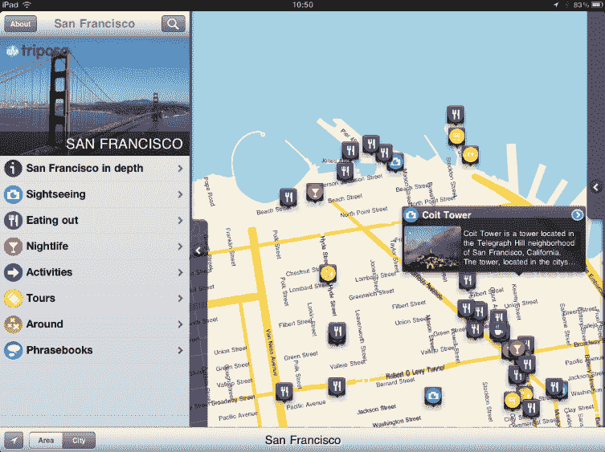

# 前谷歌人推出手机旅行指南杀死孤独星球；从 Chris Sacca & More TechCrunch 筹集资金

> 原文：<https://web.archive.org/web/https://techcrunch.com/2011/09/08/ex-googlers-launch-mobile-travel-guide-to-kill-lonely-planet-raise-seed-round-from-chris-sacca-more/>

在过去的日子里，旅游指南是由勇敢的旅行者写的，他们花几个月的时间在日记和野外日志上潦草地写着，或者是由冒险精神的团队竭尽全力地将他们的旅行经历记录到世界上的[孤独星球](https://web.archive.org/web/20230205014651/http://en.wikipedia.org/wiki/Lonely_Planet)上。然而，在过去的十年里，网络产生了不计其数的个人旅游博客、数字相册、社区构建的旅游指南，如 [Tripadvisor](https://web.archive.org/web/20230205014651/http://www.tripadvisor.com/) 和 [Wikitravel](https://web.archive.org/web/20230205014651/http://wikitravel.org/en/Main_Page#b) ，以及酷酷的旅游资源，如 Gogobot 。

今天，两位前谷歌员工 Jon Tirsen 和 Douwe Osinga 正式发布了他们的新移动旅游指南, [Triposo](https://web.archive.org/web/20230205014651/http://www.triposo.com/) ,它不仅仅想抛弃旧的模式，它还想做谷歌为世界信息所做的事情:将这些垃圾信息聚合起来，使其易于搜索。简而言之，Triposo 基于一个简单的想法，即旅游指南的设计方式可以与谷歌基于一些牛逼算法的聚合和搜索方式相同。此外还有一点索引和语义糖衣。

为此，像 Triposo 这样的旅游指南在今天是可能的，因为内容就在那里。像维基百科、Wikitravel 和 Openstreetmap 这样的网站有大量与旅游相关的内容，而 Triposo 希望成为一个对这些内容进行良好排名的网站，这样你就再也不用使用另一本说教式的纸质旅游书籍了。环境会感谢你的。

因此，Triposo 算法从七个最大的开源聚合器(以及几个封闭的资源)获取旅游信息，并为用户提供相关内容。Triposo 首席运营官公司的 Richard Osinga 告诉我，在没有任何人工干预的情况下，这家初创公司制作了旅游指南，其中包含观光、夜生活和餐馆的信息，所有这些都是根据 Triposo 的算法排序的，并配有一张易于使用(且支持离线)的地图。这种非常离线的功能本身使得 Triposo 的免费移动应用程序值得下载。

除了其网络应用程序，Triposo 还使用相同的方法为 iOS 提供 30 个免费的目的地指南。这家初创公司计划下个月发布一份 iOS 世界指南，用户可以在其中下载世界上任何目的地的完整旅行指南。另一方面，安卓用户[已经可以在这里找到世界旅游指南和部分城市指南](https://web.archive.org/web/20230205014651/https://market.android.com/search?q=triposo)。

一年多来，Triposo 一直在完善其旅游内容算法，并为 iOS 和 Android 推出了一系列城市指南，以测试算法水域和用户反应。到目前为止，人们平均每节课使用 20 分钟的指南——到目前为止，一切顺利。但 Triposo 的最终目标实际上是完善其一体化的世界旅游指南，以便用户可以在全球任何地方选择目的地，并轻松找到最佳城市和目的地。

但是 Triposo 是如何选择这些推荐目的地的呢？“在我们的排名算法中，我们也经常使用照片，”联合创始人 Douwe Osinga 说。“我们收集了几百万张带有地理标记和时间戳的旅行照片。在某一地点、某一时间、某一天拍摄了多少张照片:这些都有助于我们判断一个地点有多重要”。

当然，一家基于算法的公司的好坏取决于它的算法。在一天结束时，旅行者可能更喜欢从他们的朋友或他们信任的人那里接收关于目的地的个性化推荐。(或者像一位评论者指出的那样，是自我策划的。)而从这个角度来说，Triposo 的无人化推荐平台未必适合所有人；但与此同时，有一个对每个人都一样的免费移动应用程序也很好。对于一些人来说，它可能会错过标记，但 iPad 应用程序看起来很棒，到目前为止，算法没有让我失望。阿姆斯特丹，我来了。

随着平台的推出，Triposo 还告诉 TechCrunch，它已经从天使投资人那里筹集了 52.5 万美元的种子资金，包括[克里斯·萨卡](https://web.archive.org/web/20230205014651/http://www.crunchbase.com/person/chris-sacca)、[塔赫尔·哈维里瓦拉](https://web.archive.org/web/20230205014651/http://angel.co/taherh)、谷歌 Wave 联合创始人兼谷歌地图首席工程师[拉斯·拉斯穆森](https://web.archive.org/web/20230205014651/http://www.crunchbase.com/person/lars-rasmussen)和 [InterWest Partners](https://web.archive.org/web/20230205014651/http://www.crunchbase.com/financial-organization/interwest-partners) 。

创始人表示，他们将利用这笔新注入的资本继续优化其算法，朝着成为最好的网络和移动目的地的目标努力，以回答:我接下来该去哪里？然而，对 Triposo 来说，问题是当资金耗尽时，他们的收入模式将会如何。高级功能？付费应用？更多即将到来。

关于互动旅游指南创业公司的更多信息，请点击[查看。让我们知道你的想法。旅游内容算法:是还是不是？](https://web.archive.org/web/20230205014651/http://www.triposo.com/)