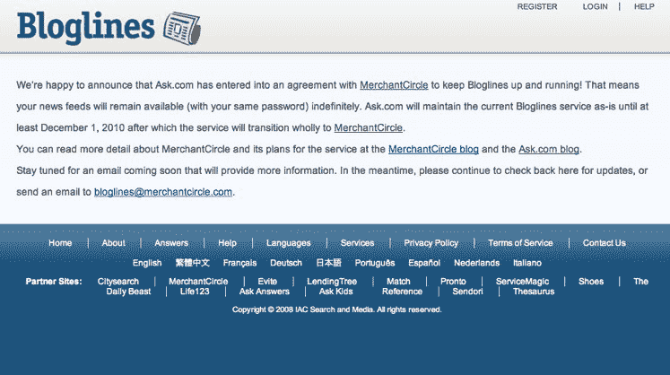

# 独家报道:Bloglines 将由 IAC 资助的 merchant circle TechCrunch 复活

> 原文：<https://web.archive.org/web/https://techcrunch.com/2010/11/04/exclusive-bloglines-will-be-resurrected-by-iac-funded-merchantcircle/>

传奇仍在继续。在 9 月份[通知我们](https://web.archive.org/web/20230203013419/https://techcrunch.com/2010/09/10/exclusive-iac-finally-kills-off-bloglines/)IAC 拥有的 [Bloglines](https://web.archive.org/web/20230203013419/http://www.bloglines.com/) 将被永久关闭后，[Ask.com](https://web.archive.org/web/20230203013419/http://www.ask.com/)(运营 Bloglines 的 IAC 财产)已经恢复了陷入困境的 RSS feeder，该公司独家告诉 TechCrunch。IAC 已经将财产所有权转让给了一个不太可能的新赞助人:一个面向小企业主的在线营销网络。交易的财务条款没有透露，但我们知道这是家族交易——IAC[在 2007 年投资了商业圈。我们被告知，Ask.com 将维持目前的 Bloglines 服务，直到今年 12 月 1 日，之后该服务将过渡到 MerchantCircle。](https://web.archive.org/web/20230203013419/http://www.crunchbase.com/company/merchantcircle)

在经历了一段混乱的历史后，IAC 和 Ask.com 让博客网站脱离了苦海。 [于 2005 年 2 月被 IAC 的 Ask.com 以大约 1000 万美元的价格收购](https://web.archive.org/web/20230203013419/http://www.bloglines.com/about/pr_02082005)，该网站已经陷入困境[，](https://web.archive.org/web/20230203013419/https://techcrunch.com/2009/08/10/bloglines-on-life-support-this-story-needs-an-ending/)面临来自[谷歌阅读器](https://web.archive.org/web/20230203013419/http://www.crunchbase.com/product/google-reader)和[将 RSS](https://web.archive.org/web/20230203013419/http://www.techcrunchit.com/2009/05/05/rest-in-peace-rss/) 转移到实时新闻流的竞争。

虽然我们听说 IAC 正在寻找翻新或出售博客的方法，但看起来他们最终还是选择了后者。但是考虑到它不是媒体财产，MerchantCircle 是一个令人惊讶的候选者。

一直在悄悄地收购公司的 MerchantCircle 为小城镇的商人提供商业指南，目前列出了 140 万家小企业。这家初创公司长期以来的目标是小地方的商家，而不是像 Yelp 和 CitySearch 这样迎合消费者。在美国 24，600 个人口超过 200 人的城镇中，95%的城镇都有当地商业会员。该公司可能会在明年[着眼于 IPO](https://web.archive.org/web/20230203013419/https://techcrunch.com/2009/12/24/top-ten-ipo-candidates-2010/) 。

MerchantCircle 的联合创始人本恩·史密斯说，他对博客有宏伟的计划。该技术将被集成到 MerchantCircle 中，允许企业主创建他们所在城镇或城市以及特定行业的本地新闻的 RSS 源(即管道、法律或建筑的 RSS 源)。史密斯表示，该平台还将能够提供当地每日交易和优惠券。

对于所有忠实的 Bloglines 用户(该网站有 270 万用户)，不要担心。MerchantCircle 将为非 MerchantCircle 用户保留以前的独立服务，位于 RSS 平台的当前 URL，Smith 保证以前的用户将无缝过渡(即相同的登录和用户界面)。一个值得注意的功能是剪辑功能，用户无法将他们保存的剪辑合并到新的平台上。MerchantCircle 还将为 Bloglines 用户提供定制的本地 RSS 订阅源，用户可以选择加入超级本地新闻和交易。史密斯补充说，Bloglines 已经做了轻微调整，以获得“更丰富、更快速的体验”

Ask.com 公司总裁道格·利兹说，许多公司都曾接触过 Ask，希望给博客网注入新的活力，但最终商业圈认为新的母公司是有意义的，因为它们是“公司的表亲”

以下是 IAC 将于明天发送给博客用户的电子邮件全文:

> 你可能已经听说了，Ask.com 已经和 MerchantCircle 达成了一项协议，后者同意继续运营 Bloglines。在接下来的几个月里，请继续关注，因为 MerchantCircle 致力于通过创建更丰富、更本地化的用户体验来改进 Bloglines 服务。
> 
> 近期内，您的新闻源和服务访问(使用相同的密码)仍然可用。你可以在 MerchantCircle 博客上阅读更多关于 MerchantCircle 及其服务计划的细节。
> 
> 现在，我们想让你知道的是:
> 
> 时间:Ask.com 将维持目前的博客服务，直到 2010 年 12 月 1 日。2010 年 12 月 1 日之后，这项服务将完全过渡到商业循环。在 12 月份，你将能够很容易地把你的 feeds 移植到 MerchantCircle-powered 服务上。这是一个简单的过程，我们会提前为您提供完整的说明。
> 
> 登录:您将保留与以前相同的密码。
> 
> 当前 Bloglines 功能:您的 Bloglines 订阅将无缝过渡到 MerchantCircle 服务，但是，Clippings 选项卡将不再可用，您将无法将保存的文章传输到新服务。对于由此带来的不便，我们深表歉意——基础设施的要求和成本太高，根本不值得维护

