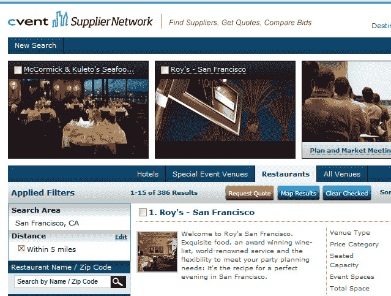

# 独家报道:网络时代幸存者 Cvent 融资 1.36 亿美元

> 原文：<https://web.archive.org/web/https://techcrunch.com/2011/07/20/exclusive-dotcom-era-survivor-cvent-raises-136-million-round/>

大型活动管理软件公司 Cvent 最近一次筹集资金大约是在上个世纪结束的时候。

今天，[公司宣布](https://web.archive.org/web/20230321153903/http://www.cvent.com/en/company/cvent-raises-136-million-funding-with-new-enterprise-associates.shtml)已经筹集到了其历史上第二次——也是最令人着迷的——的资金，这是一个巨大的投资:

Cvent 已经从新企业协会和 Insight Venture Partners 获得了[1 . 36 亿美元](https://web.archive.org/web/20230321153903/http://www.crunchbase.com/company/cvent)的风险资本融资，Greenspring Associates 也参与其中。

根据道琼斯 VentureSource 的数据，这标志着今年私营软件公司最大的投资之一。

令人惊讶的是，我们以前似乎从未写过关于 Cvent 的文章。很高兴这次能破例一次。:-)

说真的，Cvent 作为一家公司的历程非常有趣(更多信息请见 Cvent 创始人兼首席执行官 Reggie Aggarwal 的[客座博文](https://web.archive.org/web/20230321153903/https://techcrunch.com/2011/07/20/there-and-back-again-how-cvents-founder-stood-by-his-company-for-better-or-bankruptcy/))。Cvent 最初成立于 1999 年，有 1700 万美元的资金支持，这笔资金几乎在筹集的同时就花光了。如今，Cvent 扭亏为盈，自称是世界上最大的会议管理技术公司。

给你一个想法:该公司目前在全球拥有 800 多名员工。

该公司为会议地点选择、在线活动注册和管理、电子邮件营销和网络调查提供基于云的软件服务，目前帮助 40 个国家的 90，000 多名用户管理数十万个活动、调查和电子邮件活动。

Cvent imho 提供的最令人印象深刻的服务是其[供应商网络](https://web.archive.org/web/20230321153903/http://www.cvent.com/rfp/Default.aspx)，这是一个免费的在线市场，将活动策划人与全球约 150，000 家酒店、餐厅和其他类型的场所联系起来。它最容易被描述为“会议和活动规划的 Expedia”。

为了说明其庞大的规模:Cvent 称其供应商网络仅在 2011 年就能为酒店带来 40 亿美元的收入(三年前为 6000 万美元)。

难怪 Cvent 与全球大多数领先的连锁酒店有着密切的关系，包括希尔顿、凯悦、万豪、喜达屋、洲际酒店集团和雅高。

富国银行、可口可乐公司、大都会人寿、迪尔公司和宝洁公司等公司使用 Cvent 的解决方案来组织和管理活动。

Aggarwal 告诉我，这笔投资将使 Cvent 在未来 12 个月内将其员工人数增加到 1000 人，其中大多数是工程师，并巩固其在未来十年的业务地位。该公司还将投资开发其社交媒体和移动产品。

并不是说他们真的需要钱；Cvent 显然已经连续 32 个季度盈利。然而，事情并不总是这样，我们很快就会出版阿格沃尔对过去 12 年的精彩描述，以及他是如何走到这一步的(**更新:** [给你](https://web.archive.org/web/20230321153903/https://techcrunch.com/2011/07/20/there-and-back-again-how-cvents-founder-stood-by-his-company-for-better-or-bankruptcy/))。

