# 独家报道:Friendster 在亚洲购物 

> 原文：<https://web.archive.org/web/https://techcrunch.com/2009/07/27/exclusive-friendster-shopping-itself-around-in-asia/>

# 独家报道:Friendster 在亚洲四处购物

最古老的社交网络之一 Friendster 正在积极寻找买家，并已聘请投资银行摩根士丹利寻找有兴趣收购该公司或至少其部分资产的一方。

根据 TechCrunch 独家获得的文件，看起来摩根士丹利正在亚洲收购 Friendster，这是有道理的，因为[几乎其整个用户群](https://web.archive.org/web/20221007161104/http://www.beta.techcrunch.com/2009/01/20/friendster-asias-social-network/)都位于亚太地区。在主要文件中(嵌入下面)，它说其 75%的注册账户在亚洲。这些文件来源可靠，时间标记为“2009 年 7 月”,包含了许多有趣的信息，说明 Friendster 在社交网络领域仍然具有影响力，尽管主要是在亚洲。

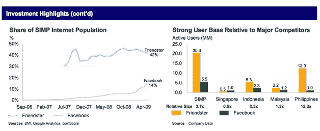

在发给多个潜在感兴趣的买家的概况介绍中，Friendster 声称其全球注册用户超过 1 亿，并吹嘘其在亚太地区的据点以及光明的未来，因为其一些关键市场(新加坡、印度尼西亚、马来西亚、菲律宾，又名 SIMP)预计将在未来几年内经历强劲的互联网用户增长。概况介绍还称，Friendster 每天吸引超过 10 万名新用户和 5 亿次页面浏览，使其成为用户流量排名前 20 的全球网站。根据这些文件，该公司目前拥有 105 名员工，分布在其全球办事处网络(澳大利亚、美国、菲律宾和新加坡)。

我们获得的资料显示，Friendster/Morgan Stanley 正在寻找一个希望快速进入亚洲社交网络领域的买家，强调鉴于与当地供应商和合作伙伴的关系，新来者很难建立自己的关系，而这是这种风险投资取得成功的必要条件。此外，它还吹捧 Friendster 在该领域的[专利组合](https://web.archive.org/web/20221007161104/http://www.wired.com/epicenter/2008/12/social-networki/)(5 项已获授权，10 项正在申请)及其经验丰富的管理团队。

更有趣的信息:Friendster 正在寻求扩大其当前的收入来源，除了在线广告之外，还包括虚拟商品、游戏、调查、约会、音乐和分类广告。

有一件事我们无法从嵌入在下面的文件中收集到，那就是 Friendster 希望得到的价格。该公司得到了 Battery Ventures、Benchmark Capital、DAG Ventures 和 Kleiner Perkins Caufield & Byers 等风险投资公司超过 4500 万美元的支持，还有一些早期天使投资人，如 LinkedIn 创始人雷德·霍夫曼和 Spinner/Grouper 创始人乔希·费尔彻。

根据脸书最近 100 亿美元的估值，我们最新的社交网络估值模型估计 Friendster 只有 2 . 1 亿美元。这主要是因为东南亚消费者的购买力较低，使得广告客户对他们的评价差异较小。不过，脸书 100 亿美元的估值是针对优先股的。如果你看看最近[出售普通股](https://web.archive.org/web/20221007161104/http://www.beta.techcrunch.com/2009/07/13/dst-to-buy-up-to-100-million-in-facebook-employee-stock/)的 65 亿美元估值，相比之下，Friendster 只值 1 . 37 亿美元。早在 2002 年，该公司拒绝了一家上市前的谷歌提出的[3000 万美元的收购要约。(有趣的是，Friendster 现任首席执行官](https://web.archive.org/web/20221007161104/http://www.nytimes.com/2006/10/15/business/yourmoney/15friend.html?_r=2)[理查德·金伯](https://web.archive.org/web/20221007161104/http://www.crunchbase.com/person/richard-kimber)，曾[负责谷歌在东南亚的销售](https://web.archive.org/web/20221007161104/http://www.beta.techcrunch.com/2008/08/04/friendster-grabs-a-google-exec-as-ceo/)。

我们还查看了 2009 年 5 月 Friendster 的 comScore 数据，与去年同期相比，全球独立访客下降了 45%，至 2100 万人(这表明活跃用户和注册用户之间存在很大差异)。

有了这样的统计数据，难怪该公司及其投资者正在寻找一种套现的方式。

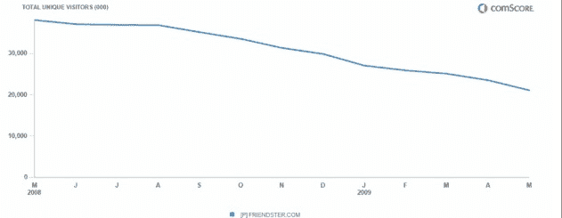

同样有趣的是，在 Twitter[上快速搜索](https://web.archive.org/web/20221007161104/http://search.twitter.com/search?q=friendster)会发现大部分来自美国用户的信息，这些信息删除了他们的 Friendster 账户。

以下是这些文件的截图:

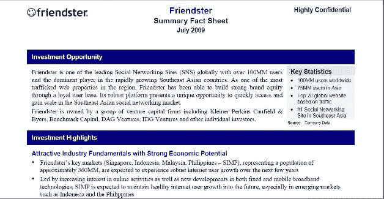
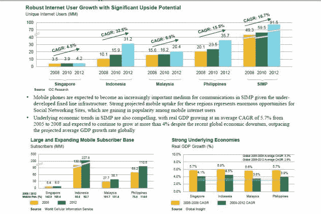
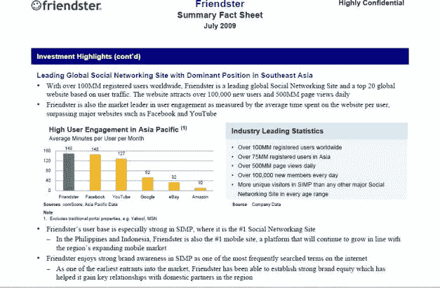
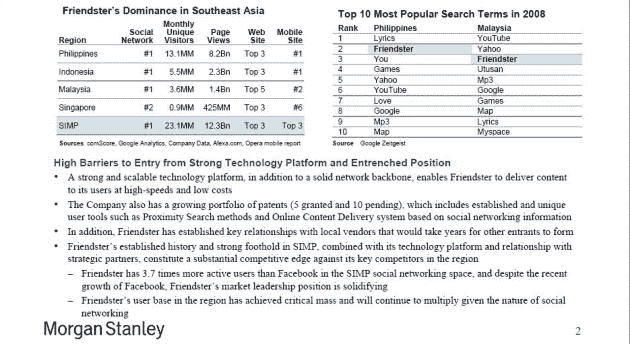
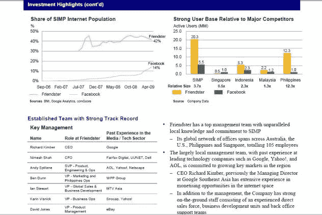
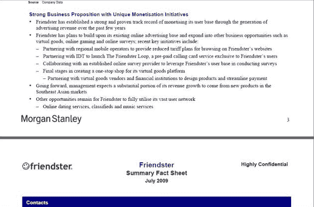
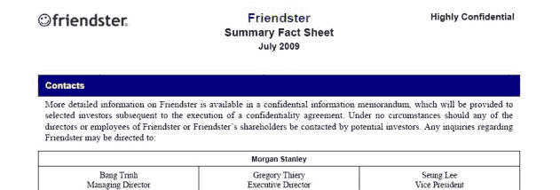
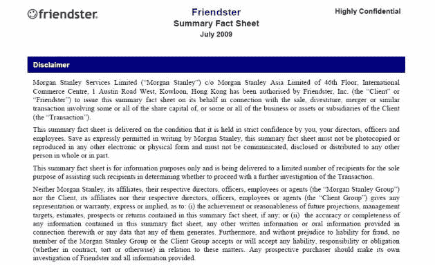

[http://viewer.docstoc.com/](https://web.archive.org/web/20221007161104/http://viewer.docstoc.com/)
[PJ 联通——潜在买家 CA](https://web.archive.org/web/20221007161104/http://www.docstoc.com/docs/8982056/PJ-Connect---Potential-Purchaser-CA)—

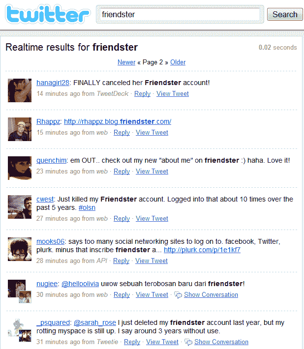