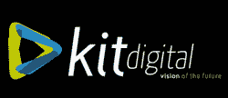

# 独家报道:KIT digital 以 7720 万美元收购 KickApps、Kewego 和 Kyte 

> 原文：<https://web.archive.org/web/http://techcrunch.com/2011/01/31/exclusive-kit-digital-acquires-kickapps-kewego-and-kyte-for-77-2-million/>

**TechCrunch 独家报道**——如果你以前从未听说过 [KIT digital](https://web.archive.org/web/20230202234225/http://www.crunchbase.com/company/kit-digital) ，今天之后你就会知道了。

基于云的视频资产管理解决方案提供商[收购了](https://web.archive.org/web/20230202234225/http://ir.kitd.com/phoenix.zhtml?c=144912&p=irol-newsArticle&ID=1521622&highlight=)不是一家、两家而是*三家*社交软件和视频公司。

该公司已经收购了总部位于纽约的 KickApps、总部位于巴黎的 Kewego 和总部位于旧金山的 Kyte，总对价约为 7720 万美元。

在收购的同时，KickApps 首席执行官 Alex Blum 被任命为 KIT digital 全球首席运营官的新职位，而 KickApps 首席财务官 David Lapter 将担任 KIT digital 的 SVP 财务和行政管理职位。

为多屏交付提供视频资产管理解决方案的 KIT digital 表示，这些收购旨在增强其现有产品，同时“增加跨地区和客户垂直市场的市场份额”。

KIT digital 董事长兼首席执行官 [Kaleil Isaza Tuzman](https://web.archive.org/web/20230202234225/http://www.crunchbase.com/person/kaleil-isaza-tuzman) 评论道:

> “我们致力于确保我们的‘VX 一号’视频管理平台具有市场领先的功能，帮助客户在整个视频分发价值链中实现价值，从保护和捕获正确的内容到通过多渠道和社交社区交付内容。
> 
> 我们致力于成为满足大中型企业视频需求的一站式商店，从拍摄视频的摄像机后面的眼睛到在任何设备上观看视频的人，从“镜头到镜头”提供 IP 视频管理服务。"

社交软件初创公司 KickApps 的首席执行官亚历克斯·布鲁姆(Alex Blum)将成为 KIT digital 的全球首席运营官。作为 AOL 的产品副总裁，Blum 是在线视频和互动电视的早期先驱，之前是 JumpTV 的总裁和首席运营官。

百隆将负责公司的整体业务运营，包括产品管理、R&D、客户运营和业务管理。他将在捷克共和国布拉格的 KIT digital 总部工作，显然还将在该公司新收购的纽约和三藩市的 R&D 中心花费大量时间。

那么，除了它们的名字都以“k”开头这一事实之外，为什么还要有 KickApps、Kewego 和 Kyte 呢？

根据 KIT digital 高管的说法，KickApps 为公司增加了重要的技术和产品协同效应，特别是其开源媒体框架(OSMF)应用工作室。

后一种产品将作为 KIT digital 产品系列中所有发布层技术的统一点，使其客户能够利用 KIT 的基础设施来交付 Flash 和 HTML5 部署，无论他们目前部署了 VX-one 平台的哪个模块。

KickApps 450+客户包括 NBC 环球、美国运通、赫斯特、Live Nation、利物浦足球、菲尼克斯太阳、斯克里普斯网络、西蒙&舒斯特和维亚康姆。据说 KickApps 的年化收入超过 1200 万美元，其中大部分来自其软件解决方案的经常性软件许可费。

KickApps 大约有 60 名员工，并筹集了 3200 万美元的风险投资。

至于 Kewego，这家法国公司成立于 2003 年，与 KIT digital 非常相似，它提供基于 IP 的多屏视频资产管理解决方案，用于管理、广播和货币化 PC、手机、iPads、联网电视、游戏机和其他互联网连接设备上的视频。

据说，Kewego 还将通过现场数字标牌部署来增强 KIT 的企业产品。

Kewego 报告 2010 财年收入为 1020 万美元，其中大部分也来自经常性软件许可费。

该公司在 16 个国家增加了 400 多个客户，包括源讯公司、队服公司、微软、Pages Jaunes 和大众汽车。

kew go 的联合创始人兼首席执行官 Michel Meyer 将担任产品管理高级副总裁，kew go 的总经理兼联合创始人 Olivier Heckman 将成为 KIT digital 的西欧和南欧销售副总裁(包括法国、比荷卢、西班牙、葡萄牙和意大利)。

巴黎、格勒诺布尔(法国)和马德里将继续作为 Kewego 约 60 名员工的家，巴黎将成为 KIT digital 现有欧洲、中东和非洲(EMEA)销售和客户管理业务不可或缺的一部分。

Kewego 筹集了[1940 万](https://web.archive.org/web/20230202234225/http://www.crunchbase.com/company/kewego)美元的资金。

至于 Kyte，这家公司自 2006 年以来一直存在，并提供基于云的发布平台，使公司能够向网站、移动设备和联网电视提供直播和点播视频体验。收购 Kyte 是因为 KIT digital 计划利用 Kyte 的专有平台和应用框架为 KIT 的全球客户群服务。

KIT digital 表示，Kyte 还为 KIT digital 的管理团队带来了关键的新成员，包括 Kyte 的首席技术官兼联合创始人埃里克·阿拜尔(Erik Abair)和 Kyte 的首席运营官甘农·霍尔(Gannon Hall)。

Abair 将加入 KIT 的产品开发团队，担任软件开发高级总监，而 Hall 将成为 KIT 的全球营销高级副总裁，负责监督公司的对外营销、沟通和需求挖掘工作。Abair 将继续留在旧金山，而 Hall 将迁至 KIT 的布拉格总部。

Kyte 报告 2010 财年的收入为 370 万美元，主要来自 SaaS 平台费。Kyte 增加了近 100 个客户，包括哥伦比亚广播公司、清晰频道、福克斯新闻、音乐电视、华特·迪士尼公司、诺基亚、阳狮、斯沃琪、奥普拉温弗瑞和 ESPN 欧洲。

凯特筹集了[2340 万美元](https://web.archive.org/web/20230202234225/http://www.crunchbase.com/company/kyte)的资金。

我们仍在消化所有的新闻，并计划很快与一些关键人物交谈，以获得更多的见解。敬请关注。

不过，有一点我想直截了当地指出:Kyte、Kewego 和 KickApps 总共筹集了超过 7400 万美元的风险资金，因此 7720 万美元的总收购价格似乎非常低。当我们了解更多信息时，我们会更新。

**更新:**关于交易条款的更多详情:

> 在无现金、无债务的基础上，收购 KickApps、Kewego 和 Kyte 的总代价约为 77.2 百万美元。这一考虑因素包括基于时间的薪酬和绩效薪酬，但不包括针对被收购公司员工的某些激励性薪酬计划，这些计划预计在几年内不会超过 400 万美元，包括现金和股权。
> 
> 约 6230 万美元将以 KIT digital 普通股支付(基于 2011 年 1 月 28 日星期五的收盘价)，约 1480 万美元以现金支付。总体而言，这些交易预计将在 2010 年收入和 EBITDA 倍数的基础上增长，同时达到或超过 KIT digital 2011 年至少 24%的 EBITDA 利润率目标。
> 
> 随着时间的推移，预计与三项收购相关的发行股份总数约为 4，611，346 股，其中 96%受到 12 至 24 个月之间的交错转售限制。
> 
> 这些收购完成后，包括支付与交易相关的费用和收费以及支付约 420 万美元的净正营运资本调整，管理层估计 KIT digital 将拥有约 3790 万股已发行普通股和约 1.15 亿美元现金。