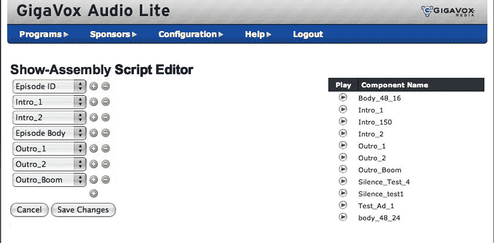

# 独家:Podango 果汁播客网络，软件来自 GigaVox Media 

> 原文：<https://web.archive.org/web/https://techcrunch.com/2007/09/25/exclusive-podango-juices-podcast-network-with-software-from-gigavox-media/>

# 独家:Podango 果汁播客网络，软件来自 GigaVox Media

 播客网络和托管服务 [Podango](https://web.archive.org/web/20230219130740/https://techcrunch.com/2006/08/29/podango-to-create-podcast-channels/) 通过从 [GigaVox Media](https://web.archive.org/web/20230219130740/http://gigavox.com/) 购买播客发布软件来加强其服务。内容管理系统名为 GigaVox Audio Lite，允许播客自动管理组成音频或视频播客的不同部分，包括广告、简介、促销和其他节目材料。

位于犹他州 Bountiful 的 Podango 拥有 250 个不同电台的 1300 名播客，包括 [*Mommycast*](https://web.archive.org/web/20230219130740/http://www.podango.com/podcast/221/MommyCast) 、 *[管道胶带营销](https://web.archive.org/web/20230219130740/http://www.podango.com/podcast/55/Duct_Tape_Marketing_Radio)* ，以及 [*苹果手机秀*](https://web.archive.org/web/20230219130740/http://www.podango.com/podcast/284/Apple_Phone_Show)(Podango 自己制作)。本周晚些时候，它将推出 *Girls Gone Geek* ，首席执行官李·吉本斯(Lee Gibbons)将其描述为“视图和摩托车维修之间的交叉”直觉告诉我一切都会好的。Gibbons 说，总的来说，Podango 主持的节目每月被下载 200 万次，而六个月前只有 2 万次。他的目标是到明年 3 月每月下载 1000 万次。你认为播客已经死了。

