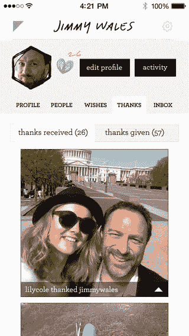

# 超级模特莉莉·科尔谈论她的送礼平台 

> 原文：<https://web.archive.org/web/https://techcrunch.com/2014/03/20/exclusive-super-model-lily-cole-talks-about-impossible-her-gift-giving-platform/>

[https://web.archive.org/web/20221007071452if_/https://www.youtube.com/embed/YIwX5UoAjVE?feature=oembed](https://web.archive.org/web/20221007071452if_/https://www.youtube.com/embed/YIwX5UoAjVE?feature=oembed)

视频

莉莉·科尔似乎给自己设定了一个不可能完成的任务。试图让世界相信它可以继续[Impossible.com](https://web.archive.org/web/20221007071452/http://impossible.com/)或其关联的 [iOS 应用](https://web.archive.org/web/20221007071452/https://itunes.apple.com/us/app/*impossible*/id638819253?ls=1&mt=8)，几乎可以许下任何愿望，从上法语课到组建乐队，并看到这个愿望实现。但是，这个已经慢慢浮出水面的项目并不像看上去那么简单。科尔——更为人所知的是一位来自英国的高调时装模特——显然对历史上社会中送礼的本质以及相关的经济学进行了长期而深入的思考，你可以从上周 SXSW 录制的我们对她的独家采访中看到这一点。

“不可能”旨在通过社交网络鼓励礼物文化，其灵感来自科尔本周发表的剑桥大学论文《不可能的乌托邦》。这试图回到乌托邦的旧观念，在那里任何人都有权力做他们想做的任何事情。

对她来说，给予的行为引发了互惠。从规模上看，这既创造了社会凝聚力，也创造了一种自我再生的经济。围绕这个想法创建一个在线平台似乎是很自然的，尤其是如果它具有病毒性质的话。

本周，Impossible 发布了其平台的许多新版本，科尔和她的团队(该项目是与夸梅公司的夸梅·费雷拉一起建立的)已经将这些版本添加到产品中，该产品试图满足世界的需求，从个人开始。

从生成的数据中产生了一个“分享最多”的提要和一个“特色”提要。一个“爱”按钮(听起来熟悉吗？)现在意味着大众的愿望可以浮出水面。科尔告诉我，“我们用它来获取更有意义的内容。”。

此外，移动应用程序上的邻近过滤器、增强的通知和标签也被引入——科尔说，现在一切都是关于“浮现和增强”愿望的分类。

作为用户，Impossble.com 的体验似乎简单得几乎不可能。

你张贴你想要的或希望的。也许愿望越现实越好。然后你坐下来等着。

不久前，我发表了我想组建一支朋克蓝调乐队的帖子。我对此毫不在意。

奇怪的是，直到我的社交圈子内外的朋友们开始建议这样做的实际方法。

最终，另一个名字出现了，一个叫莉莉·科尔的人邀请她演唱。

如果乐队组合好了，我会告诉你的。