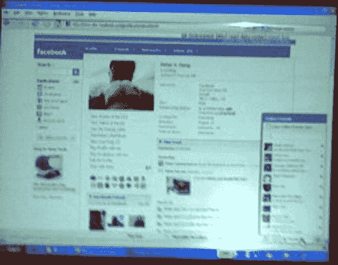

# 脸书聊天演示独家视频

> 原文：<https://web.archive.org/web/https://techcrunch.com/2008/03/18/exclusive-video-of-facebook-chat-demo/>

# 脸书聊天演示的独家视频

【YouTube http://www.youtube.com/watch?v=gWYMJWpWQhs&hl=en]

今天早些时候，脸书举行了新闻发布会，谈论新的隐私控制，并确认 T2 将在未来几周推出网络聊天产品。我们对此次活动的实时报道来自[这里](https://web.archive.org/web/20230404165158/https://techcrunch.com/2008/03/18/facebook-press-event-our-live-almost-notes/)。

上面的视频是在活动中展示的脸书聊天演示。主讲人是 Chat 的产品经理 Peter Deng，他明确表示这是该产品的初步版本。他说，在发射之前，它可能会发生重大变化。

