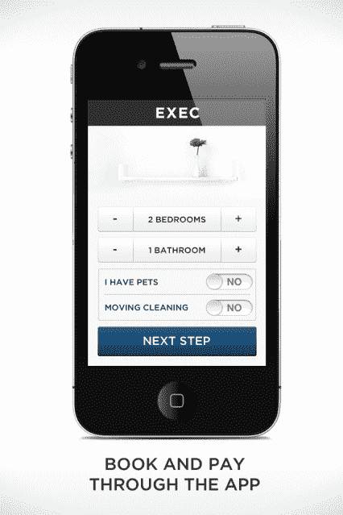
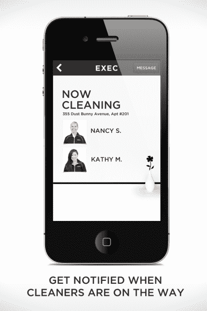

# Exec 推出仅用于清洁的应用程序，扩展到西雅图，因为家务占销售额的 50% 

> 原文：<https://web.archive.org/web/https://techcrunch.com/2013/02/12/exec-cleaning-appseattle/>

# Exec 推出了一款仅用于清洁的应用程序，并扩展到西雅图，因为家务占了销售额的 50%

Y Combinator 支持的按需为你跑腿的应用程序 Exec 刚刚推出了一款只做清洁的应用程序。这是一个合理的决定，因为家务劳动最终占到了这家初创公司总销售额的 50%左右。

[清洁在 Exec](https://web.archive.org/web/20221006012325/https://beta.techcrunch.com/2012/10/30/exec-cleaning/) 内部有着完全不同的用户体验。不像 Exec 的其他任务，你可以随时调用(像优步)，清洁往往是一项服务，人们提前计划。因此，Exec 的新清洁应用程序引导用户完成列出他们有多少卧室和浴室、安排清洁时间，然后直接在应用程序中支付服务费用的基本步骤。

该公司首席执行官贾斯汀·坎(Justin Kan)承认[他在某种程度上借鉴了脸书的剧本](https://web.archive.org/web/20221006012325/http://www.insidefacebook.com/2011/08/12/beluga-facebook-messenger/)。在尝试了构建应用程序的一体化方法后，该公司创建了一个独立应用程序组合，如 Camera、Poke 和 Messenger。

类似地，有特定任务的应用程序可以让新用户更容易理解应用程序的功能。对新用户来说，这更容易营销，也更容易让他们快速完成交易。他不愿透露该公司下一步在特定任务应用方面的探索。

“清洁很简单。人们已经熟悉了清洁服务的概念，”他说。“为我需要做的不同事情开发应用程序，可以让我更容易在不与任何人交谈的情况下完成任务。”

他补充说:“这就是未来的走向。从人口结构来看，年轻人已经不想再打电话了。他们希望能迅速找到答案，然后进行登记。”

清理也恰好是向 Exec 客户追加销售以让他们为其他任务付费的一个好方法。菅直人说，清理工作和其他高管职责大约有 20%的交叉。

### 扩张至西雅图

另一条消息是，Exec 正在向西雅图扩张。最初，菅直人创办 Y Combinator 时避免吸收风投资金，而是向 Y Combinator 的其他校友“亲友”寻求 330 万美元的资金，因为他希望确保 Y Combinator 在扩张前有合理的后勤和财务安排。(一家成熟公司的大笔 slug capital 有时意味着规模扩张过快的压力。)

他表示，自己终于认识到 Exec 是个很好的概念，不需要太多的实地工作，就可以快速向其他市场扩张。

“我们构建的很多工具都是围绕远程管理人员展开的。这就是为什么我们花了这么长时间才进入第二个领域。但现在扩展到新的城市所需要的时间要少得多，”他说。“我们的目标是能够远程管理整个体验。”

这些工具包括高管从客户那里获得持续反馈，以及确保客户评级保持在某一阈值以上的方法。

