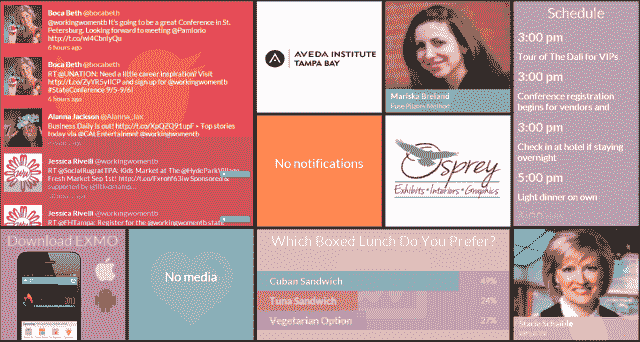
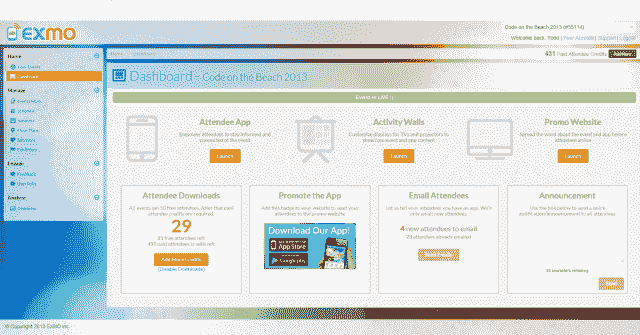

# 使会议更加社会化的移动活动平台 EXMO 退出 Beta 

> 原文：<https://web.archive.org/web/https://techcrunch.com/2013/10/09/exmo-a-mobile-events-platform-making-conferences-more-social-exits-beta/>

虽然有许多移动应用程序正在努力取代会议和活动的印刷指南，但在这一点上还没有全面的市场领导者。此外，许多开发会议应用的公司都专注于大型活动，并有与之匹配的定价计划。如今，一家名为 [EXMO](https://web.archive.org/web/20221007020729/http://www.getexmo.com/) 的初创公司正在移动活动平台上推出自己的产品，一款更加社交化的应用最初针对的是参与者不到 1000 人的活动。

这家由托德·戈德堡和卡尔·怀特创立的公司是在一次创业周末活动中诞生的——这也是一种可以使用这样一款应用的活动。在测试期间，EXMO 被 14 个创业周末活动使用，事实上，还有几十个其他小规模或草根活动，包括 Barcamp、黑客马拉松、食品和葡萄酒会议等。迄今为止，EXMO 总共举办了 100 场活动，共有数千人参加。

如今，该公司正在对这款应用进行测试，增加了许多新功能和集成。EXMO 已经提供了一些东西，使它比一些竞争对手的应用程序更有趣，这些应用程序只是反映了移动设备上的纸质活动指南。相反，EXMO 的重点是让组织者在应用程序中更好地吸引与会者，Goldberg 说，他解释说，EXMO 允许反馈、实时投票和其他社交整合等功能。

目前，EXMO 提供 Twitter 集成，随着今天的推出，在 EXMO 网站上输入信息的活动组织者可以使用“活动墙”选项，这允许他们显示社交媒体内容(如 Twitter、Instagram、Vine 等)。)、活动内容(演讲者、会议、公告)以及使用电视和投影仪的投票。活动墙是可定制的，色彩丰富，也有助于吸引尚未下载移动应用程序的与会者。

另一个有助于将该应用与该领域其他应用区分开来的功能是它对用户创建的社交活动的支持。“比方说，与会者希望在参加活动时计划他们自己的欢乐时光或聚会；他们可以通过应用程序做到这一点，”戈德堡说。"这是与会者创建他们自己的‘非正式’会议的一种方式."

当然，鉴于其早期阶段，EXMO 仍在做很多事情——该应用程序已经积极开发了大约九个月，直到最近 EXMO 还只是一个两人团队。(现在帮忙的人多了一些，但不是全职。)该公司正在努力完善体验和设计，更好地整合 Twitter 和其他社交媒体服务，改善组织者分析，等等。

与此同时，EXMO 与 EventBrite 合作，顺便提一下，EventBrite[与 Lanyrd](https://web.archive.org/web/20221007020729/https://beta.techcrunch.com/2013/09/03/eventbrite-acquires-eventioz-and-lanyrd/)一起拥有自己的活动应用程序。事实上，EXMO 的团队今天正在 EventBrite 办公室“发布”这款应用。通过这种集成，活动组织者现在可以在应用程序和他们的宣传页面上出售门票。(目前，当组织者创建他们的活动时，他们会获得一个推广页面，可以在社交媒体上或通过电子邮件分享。这些页面还可以引导用户下载应用程序。)EventBrite 的门票销售数据也被添加到活动组织者的仪表板中。

EXMO 的定价模式目前是基于免费增值的，为多达 50 名参与者的活动提供免费版本的应用程序。然后是每人 2 美元，参加人数越多价格越低。虽然戈德堡说现在讨论收入还为时过早，但迄今为止，它举办的活动中约有 25%已经付费。

[EXMO](https://web.archive.org/web/20221007020729/http://www.getexmo.com/) 目前正在启动，但可能会在一个月左右的时间里寻求筹集外部资金，以继续增长。

虽然有许多会议应用程序比 EXMO 走得更远，包括 double Dutch(T4 刚刚在 C 轮融资中筹集了 1000 万美元的资金)、guidance、Quickmobile、Cvent，加上更多的社交应用程序，如 Bizzabo、Bloodhound 和其他几个应用程序，Goldberg 说 EXMO 的产品和策略将使它们与众不同。他表示，该应用足够灵活，可以适应各种活动，而专注于中小型活动是一个机会。“这样的事件比更大的事件要多得多。到目前为止，我们在这方面找到了很好的牵引力。”