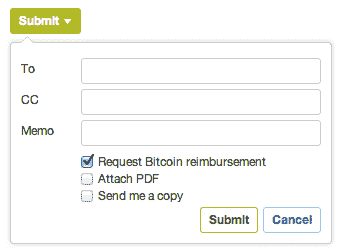
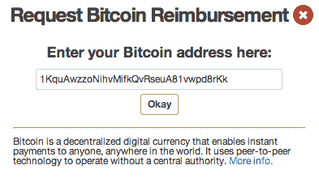
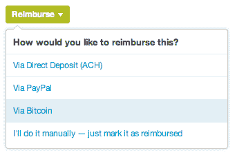
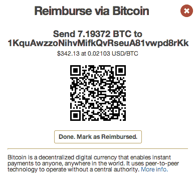

# Expensify 现在支持比特币，这是国际承包商 PayPal 的替代选择 

> 原文：<https://web.archive.org/web/https://techcrunch.com/2013/03/27/expensify-now-offers-support-for-bitcoin-an-alternative-to-paypal-for-international-contractors/>

# Expensify 现在支持比特币，这是国际承包商的一种替代 PayPal 的方式

[Expensify](https://web.archive.org/web/20230123110646/http://expensify.com/) 宣布支持[比特币](https://web.archive.org/web/20230123110646/http://bitcoin.org/en/)，为国际承包商提供了 PayPal 之外的另一种选择，以及与这项服务相关的高额费用。

比特币是一种获得国际认可的在线货币，最近硅谷银行的[通过与](https://web.archive.org/web/20230123110646/http://www.forbes.com/sites/jonmatonis/2013/03/02/bitcoin-exchange-deal-repatriates-assets-to-u-s/) [CoinLab](https://web.archive.org/web/20230123110646/http://coinlab.com/) 的合作以及与全球主要比特币交易所所有者 [Mt. Gox](https://web.archive.org/web/20230123110646/https://mtgox.com/) 的交易给予了支持。CoinLab 将成为 Mt. Gox 在美国和加拿大的独家合作伙伴。

Expensify 在其[网站](https://web.archive.org/web/20230123110646/http://help.expensify.com/bitcoin)上详细解释了比特币:

> 比特币是一种去中心化的数字货币，可以向世界上任何地方的任何人进行即时支付。它使用点对点技术在没有中央权威的情况下运行。它依靠同样的加密技术来保护网站，以确保货币和支付的有效性。

根据 Expensify 的说法，“在发送或接收比特币之前，Expensify 客户需要 [建立一个比特币钱包](https://web.archive.org/web/20230123110646/http://www.weusecoins.com/getting-started.php) 。这个钱包要么存储在承包商的本地电脑上，要么存储在一个网站上，它会被分配一个地址，你可以用这个地址来发送或接收比特币。”

首席执行官大卫·巴雷特在接受采访时表示，客户可以使用交易所转移比特币。这些交易所，如 Mt. Gox，是将比特币转换成硬通货的途径。比特币是可交易的，因此其价值可能因承包商开展业务的货币而异。Expensify 网站称，比特币的报销是由付款人直接支付给提交者的。Expensify 不是交易的一方，比特币报销一旦启动就不能取消或撤销。

Expensify 将为承包商提供一个申请比特币报销的选项:

承包商输入他们的比特币地址，或者可以选择预先填写:

要用比特币报销，付款人需要在钱包里放上比特币。当准备报销时，他们会将比特币视为一种额外的支付选择:

以下是付款人在报销时看到的内容:

巴雷特在一封电子邮件中说，随着合同越来越大，国际承包商的贝宝费用变得昂贵。相比之下，兑换比特币的费用很低。正如 Expensify 在其博客中指出的:

> 以前，我们拥有国际员工或承包商的美国公司在某些情况下会产生高达 4%的货币兑换或电汇费用。在这方面，比特币是一个很好的工具，可以最大限度地降低偿付美国以外公司的成本。此外，转账是安全和即时的——不再需要等待多个工作日才能获得 ACH 结算！

Expensify 是第一家将比特币发展到如此程度的企业公司。它的被接受是比特币成为主流的一个信号。与此同时，这一过程仍然有些繁琐，在成为真正的主流并获得承包商更大的认可之前，还需要一些简化。也可能不是——这些较低的费用可能是承包商获得比特币钱包并开始获得报销所需的全部费用。