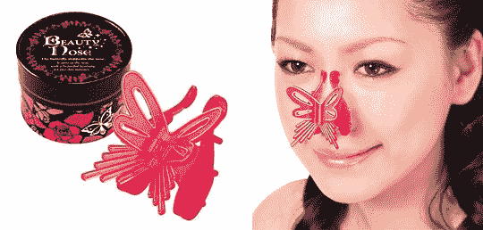

# 眼部松弛相户爱:你知道，针对眼部松弛

> 原文：<https://web.archive.org/web/http://techcrunch.com/2011/10/11/eye-slack-haruka-you-know-for-eye-slack/>

# 眼睛松弛相户爱:你知道，针对眼睛松弛

我们有刚从日本推出的眼部松弛相户爱，这是一款 131 美元的爽肤水，旨在减少你明显不满 10 岁的眼睛下面难看的眼袋。该套件由两个 CR2032 电池供电，并以“硬”和“软”两种模式运行。“硬”模式向你的眼睛发送微小的电流，确保你的眼睛获得足够的能量，而“软”模式轻轻地振动你的眼睛，听起来像是一种真正的享受。

我个人非常喜欢这位女士被电击眼睛的画面。

顺便说一句，一旦你修复了你的眼睛，为什么不试试这个疯狂的 T2 鼻子延长方案呢？它的形状像一只蝴蝶，朋友们，一只拉长你鼻子的蝴蝶。

[产品页面](https://web.archive.org/web/20230205010729/http://www.japantrendshop.com/eye-slack-haruka-p-1220.html)