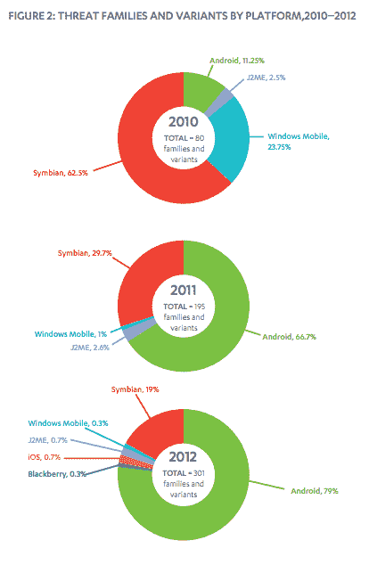
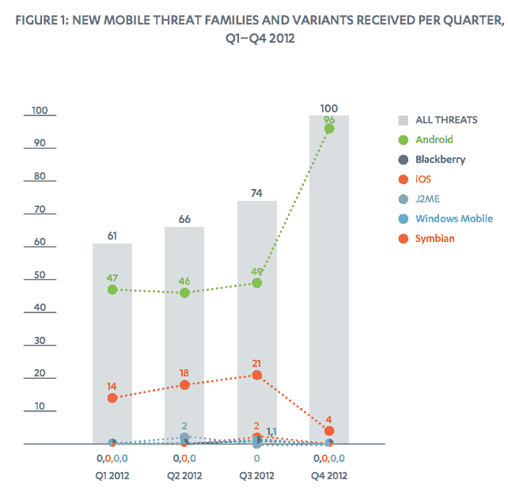
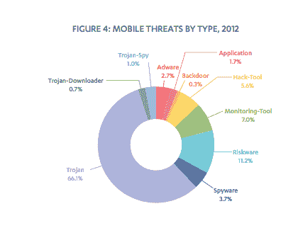
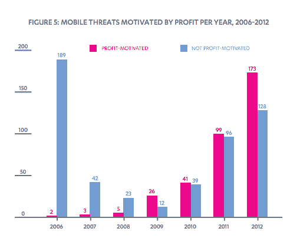

# F-Secure TechCrunch 称，2012 年，Android 占所有移动恶意软件的 79%,仅第四季度就占 96%

> 原文：<https://web.archive.org/web/https://techcrunch.com/2013/03/07/f-secure-android-accounted-for-79-of-all-mobile-malware-in-2012-96-in-q4-alone/>

是因为 Android 是目前世界上最受欢迎的智能手机平台，还是因为它更容易受到攻击？无论如何，谷歌的移动巨头 Android 仍然是世界上最大的移动恶意软件磁铁。根据安全专家 F-Secure 今天发布的[报告，2012 年，Android 占所有恶意软件的 79%,高于 2011 年的 66.7%和 2010 年的 11.25%。另一方面，按新购买量计算，苹果的 iOS 是世界上第二大最受欢迎的智能手机平台，但仍是受攻击最少的平台之一，其平台上的恶意软件占 0.7%。](https://web.archive.org/web/20221210023344/http://www.f-secure.com/static/doc/labs_global/Research/Mobile%20Threat%20Report%20Q4%202012.pdf)

Symbian 的市场份额在[迅速下滑](https://web.archive.org/web/20221210023344/https://beta.techcrunch.com/2013/02/13/gartner-huawei-takes-3rd-place-in-global-smartphone-rankings-in-q4-2012-top-two-samsung-apple-dominate-with-52-share/)，并且[被它的前母公司诺基亚抛弃](https://web.archive.org/web/20221210023344/https://beta.techcrunch.com/2013/01/24/nokia-confirms-the-pure-view-was-officially-the-last-symbian-phone/)，与两年前的 62.5%相比，它在所有恶意软件中的份额下降到了 19%。F-Secure 预测，随着用户用 Android 设备替换他们的诺基亚手机，它将像渡渡鸟一样在 2013 年灭绝。与此同时，Windows Mobile、黑莓和 J2ME 在今年的威胁家族中所占的份额都不到 1%。

分解过去一年的进展，Android 的恶意软件记录似乎在 2012 年第四季度出现了特别糟糕的激增。F-Secure 指出，在第四季度，它占了全部攻击的 96%。事实上，根据其记录，除了 Symbian(4%)之外，所有其他平台似乎根本没有收到任何恶意软件威胁家族。

在第 4 季度的市场分析中，这些数字与当前销售的市场份额不成比例，但它们在某种程度上更能反映当今流通的设备。从这个意义上说，Symbian 衰落和 Android 崛起之间的转变是因为 Android 是 Symbian 衰落的最大受益者。

F-Secure 实验室的安全顾问肖恩·沙利文写道:“一般来说，恶意软件与其宿主有寄生关系。“随着旧的塞班手机不断被其他操作系统的手机取代，特别是 Android，塞班恶意软件逐渐消失，很可能在 2013 年灭绝。”

就恶意软件采取的形式而言，F-Secure 表示，66%的检测是特洛伊木马(伪装成其他东西的恶意软件)。F-Secure 认为，谷歌在 4.2 版本(果冻豆)中增加的安全提示应该有助于降低这一数字。然而，如果你看看谷歌本周发布的最新发布数据，Android 4.2 只有 1.6%，这意味着这需要一段时间才能实现。(根据记录，姜饼 2.3.3 和更高版本仍然是最受欢迎的发行版本，占 44%，冰淇淋三明治排名第二，占 28%)。

另一个主要问题仍然是不可靠的短信:F-Secure 指出，在 96 种 Android 威胁变体中，约有 21 种来自鼓励下载的优质短信，有时会通过用户不知不觉中订阅的订阅服务重复出现问题。然后，用户不知道这些，直到费用出现在他们的账单上——如果他们愿意仔细检查账单的话。

有趣的是，F-Secure 还指出，那些发布恶意软件的人渗透设备的理由变得更加复杂。具体来说，在过去几年中，恶意软件攻击发生了重大转变，变得以经济利益为动机，经济利益现在远远超过了过去的攻击。为什么要转变？这可能是因为过去恶意黑客仍在学习如何渗透设备的诀窍。

也可能是其他原因:金融动机的增加也说明了一个事实，即我们作为一个群体正在使用我们的设备来提供更多的交易服务，这使得他们越来越成为专门针对这一事实的攻击的目标。这一点最终将不得不与当今市场上所有的[许多雄心和发展](https://web.archive.org/web/20221210023344/https://beta.techcrunch.com/tag/mobile-payments/)相一致，以将我们的手机变成我们的默认钱包。

**更新** : TC 已经联系谷歌寻求评论，但一名发言人表示该公司不对安全公司的报告发表评论。同样值得指出的是，一位读者在下面的评论中对上述数据提出了不同意见，强调被识别为恶意软件的东西听起来可能比实际情况更令人担忧。

“F-Secure 可以说任何东西都是恶意软件，甚至是不属于恶意软件定义的‘欺诈短信’…。他们说他们检测到了特洛伊木马，但他们没有解释它们对系统的影响，因为如果他们这样做了，每个人都会知道他们不是真正的特洛伊木马，那只是他们希望你认为的，”他写道。“我已经使用不同的机器人三年了，从来没有遇到过问题。顺便说一下，我是一名开发人员。”

尽管如此，发布关于恶意软件和网络安全威胁的报告和警告的不仅仅是安全厂商。智能手机仍是一个新兴领域，但非常受欢迎，因此仍是一个移动目标。