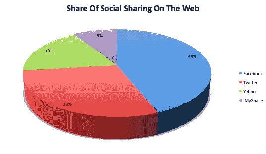

# 脸书推动了 44%的网络社交分享

> 原文：<https://web.archive.org/web/https://techcrunch.com/2010/02/16/facebook-44-percent-social-sharing/>

如果你仍然想知道为什么谷歌如此努力地推动其新产品“T2”，那是因为它想要进入社交流量。对于许多网站来说，来自脸书、Twitter 和 MySpace 的社交流量开始与搜索流量竞争，在某些情况下甚至超过搜索流量，成为最大的流量来源。这种流量来自共享链接、照片和视频。根据 T4 自己的数据，脸书每周有 50 亿条内容被分享。

不容易理解的是，这种社交分享在多大程度上与网络上不同的身份和认证平台联系在一起。如果你可以使用你的脸书或 Twitter 账户轻松登录一个网站，那么将该网站的链接传播给你的朋友就更容易了。

为了了解网络上哪些服务推动了最多的分享，我向 Gigya 询问了一些数据。Gigya powers 在包括 ABC.com 在内的 5000 多个内容网站上共享插件。NBA.com、PGA.com、Answers.com 和路透社。消费者可以点击这些网站上的分享按钮，通过包括脸书、Twitter、MySpace、雅虎邮箱、Gmail 和 AOL 在内的不同服务菜单发送文章链接、照片或视频。在过去的 30 天里，人们在 Gigya 网络上分享了近百万条信息。脸书和 Twitter 占据了大约四分之三的共享内容。下面是这些服务是如何分解的(注意，这些是相对数字) :

**分享物品分布**
脸书:44%
推特:29%
雅虎:18%
MySpace:9%

这是有道理的，人们更喜欢广播链接，而不是通过电子邮件一次分享一个。尽管雅虎表现强劲，位列第三。说到认证，只需使用你现有的用户名和密码登录到另一个网站，脸书仍然是最受欢迎的通过脸书连接，但只是勉强。Google via Gmail 和 Yahoo 几乎同样受欢迎，至少在某些类型的网站上，人们只是像新闻网站一样自己阅读。在人们更可能分享内容的娱乐网站上，脸书连接占了大多数登录。

以下是统计数据:

**平台认证份额:**

**新闻网站** :
脸书:31%
谷歌:30%
雅虎:25%
推特:11%
美国在线:3%

**娱乐网站:**
脸书:52%
谷歌:17%
雅虎:12%
推特:11%
MySpace: 7%
美国在线:1%

脸书聊天也是一个很好的选择，占 Gigya 测量的所有现场活动聊天的一半以上。

**现场活动聊天** :
脸书:56%
推特:28%
雅虎:9%
MySpace: 7%

**更新**:Gigya 的竞争对手 [AddThis](https://web.archive.org/web/20230315142308/http://www.addthis.com/services) 对网络分享有了更广泛的看法，该公司在 60 多万个网站上都有分享按钮。(Gigya 倾向于在更大的内容网站上)。补充:这也显示了脸书在网络分享方面的优势，但是份额较小，只有 33%。Twitter 占 9%，但它被 AddThis 提供的电子邮件和打印内容选项击败。即使有这些更广泛的数据，超过 40%的分享是通过脸书和推特。

**总体排名前 10 位的服务**

脸书:33%
邮箱:13%
打印:9%
推特:9%
收藏夹:8%
谷歌:6%
MySpace:6%
Digg:3%
直播:3%
美味:3%