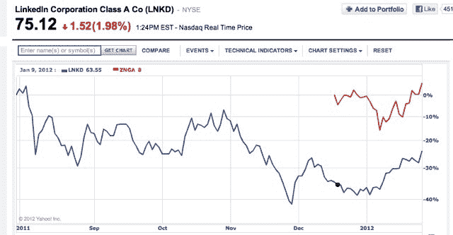

# 上市前申报，脸书私下交易估值 840 亿美元——

> 原文：<https://web.archive.org/web/http://techcrunch.com/2012/01/30/facebook-84-billion-valuation/>

# 上市前申报，脸书私下交易估值 840 亿美元

当所有人都在等待脸书本周提交 IPO 申请时，一个大问题是它的估值会是多少。会达到神奇的 1000 亿美元吗？

嗯，我们本周不会知道，因为 IPO 直到发行前才会定价，预计要到 4 月或 5 月才会定价。从现在到那时会发生很多事。(将提交的是初步的 S-1，包括脸书的所有财务和其他公司信息)。

但如果脸书今天上市，它的估值可能会达到 850 亿美元左右。我们知道这一点，因为有一个很好的代理。脸书的股票在公开市场交易，比如股票交易和二级市场。事实上，目前在 [Sharespost](https://web.archive.org/web/20220812225101/https://www.sharespost.com/) 网站上正在拍卖一批脸书股票，拍卖将于 2 月 2 日结束(预计在同一天提交申请)。上一份合约昨日的价格为 35.50 美元，这意味着脸书的隐含估值为 835 亿美元。Sharespost 上的最后一次拍卖于 1 月 20 日以 34 美元的“清算价格”结束，这意味着它的隐含估值为 800 亿美元。

Sharespost 是一个供应有限的非流动性市场，因此这是一个非常松散的代理。但它树立了一个重要的基准。

另一个值得关注的基准是其他已经公开交易的社交网络股票，最重要的是 Zynga 和 LinkedIn。两家公司在首次公开募股后都下跌了，但今年到目前为止，在盈利之前都有所回升。(Zynga 最终超过了 10 美元的发行价)。谁知道它们在 4 月或 5 月会在哪里，但这些股票的牛市将意味着脸书在 IPO 时的估值会更高。如果它们再次暴跌，那么脸书的估值也可能面临压力。

如果 850 亿美元听起来很熟悉，那是因为这是脸书大约一年前在私人市场[交易的地方。](https://web.archive.org/web/20220812225101/https://beta.techcrunch.com/2011/03/21/facebook-85-billion-valuation/)此后，估值持续上升，帮助 LinkedIn 和其他互联网公司上市。然后所有的 IPO 都沉了，现在都在爬回来。

对于相信脸书将成为下一只伟大科技股的公众投资者来说，IPO 时较低的估值会更好。无论是 850 亿美元还是 1000 亿美元，私人投资者已经获得了脸书价值的很大一部分。即使脸书最终价值超过苹果目前 4220 亿美元的市值，随着时间的推移，这也仅仅是 T2 和 5X IPO 回报率的 4 倍，这取决于它的起点。相比之下，亚马逊的 IPO 投资回报率超过了 125 倍。

