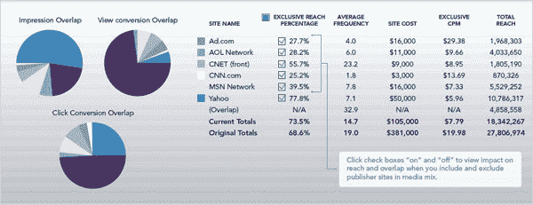

# 脸书确认将从微软收购 Atlas Advertiser Suite 以结束广告支出循环 TechCrunch

> 原文：<https://web.archive.org/web/https://techcrunch.com/2013/02/28/facebook-acquires-atlas/>

在数周的谣言之后，脸书今天宣布将从微软手中收购 T2 的广告套件。尽管有传言，脸书表示，它购买 Atlas 并不是为了推出一个广告网络，而是为了帮助广告客户“闭合回路”，了解他们的支出如何为他们赚钱。总部位于西雅图的 Atlas 团队将留在原地，但脸书计划投资后端扩展和更好的测量。

去年 12 月，[商业内幕](https://web.archive.org/web/20221012145758/http://www.businessinsider.com/facebook-and-microsoft-are-working-on-a-deal-and-it-could-change-everything-about-advertising-2012-12?op=1)首次报道了科技巨头之间的讨论。AdAge 一直在密切关注这个故事，并提供了许多泄露的细节，包括微软一直在积极寻找买家，价格将低于 1 亿美元，此前的出价在 3000 万美元至 5000 万美元之间。微软最初是通过以 62 亿美元收购母公司 aQuantive 收购 Atlas 的，该公司还拥有 Avenue A / Razorfish 和 DRIVE Performance Solutions。

现在收购是正式的，尽管没有宣布价格。我的一个消息来源说，最后，脸书支付了接近 5000 万美元，而不是 1 亿美元。这笔交易应该会让两家公司的关系保持温暖和融洽，因为他们已经在床上躺了好几年了，必应也开始在社交网络中提供网络搜索。

Atlas [允许](https://web.archive.org/web/20221012145758/http://community.bingads.microsoft.com/msa/en/atlas/b/blog/archive/2012/08/07/what-atlas-analytics-can-do-for-facebook-advertisers.aspx)广告客户策划活动，在网站上购买广告，并衡量其影响。它可以处理搜索、富媒体和流媒体视频，并显示广告，以及为大型活动的编程控制提供 API。

### “不要推出广告网络”

今天下午，我与脸书货币化产品营销主管 Brian Boland 和微软在线服务首席财务官 Dave O'Hara 进行了交谈。博兰一开始就直截了当地否认了猜测，他说“我们这样做的原因不是为了推出一个广告网络，我们这样做的原因是为了改善测量。我们从广告商那里清楚地听到，他们希望了解多点触摸的归属，而不是只关注最后一次点击。”

脸书现在拥有了基础设施，并知道如何推出自己成熟的异地广告网络，这将使它能够通过在网络上向大约 10 亿人投放广告来利用他们的个人信息。但根据博兰的说法，这不是我们的计划。

脸书将从这笔交易中获得大量客户，许多已经与该社交网络合作的广告商将对他们的营销活动有一个更全面的了解。脸书现在可以利用 Atlas 在网络上提供广告的优势，追踪异地广告如何导致购买的归因。广告商可能愿意通过脸书或阿特拉斯支付更高的广告价格来鸟瞰他们的真实表现。这种协同效应还可以帮助 Atlas 更好地与谷歌的 DoubleClick 竞争，后者在过去几年中一直领先。

那些不应该害怕的包括脸书现有的 ads API 合作伙伴，如 AdParlor、Optimal Kenshoo、Nanigans、Salesforce 和 BLiNQ Media。博兰告诉我“我们认为(Atlas)是互补的”，并指出脸书从根本上来说是一家生态系统公司，希望第三方广告技术公司继续投资为其平台开发工具和服务。Optimal 首席执行官 Rob Leathern 同意这一观点，称“我不认为(收购 Atlas)会威胁到 Ads API 合作伙伴。相反，它可能会为 optimal 这样的合作伙伴带来一系列新的机会，帮助优化添加到更大的脸书“图表”中的更多出版商库存。”

博兰还表示，这笔交易不应令需求方平台担忧，这些平台使广告商能够购买脸书交易所的实时竞价 cookie 重定向广告。Atlas 将继续在网络上购买广告，而不是在 ads API 和 FBX DSP 运营的脸书。在一个有趣的转折中，奥哈拉证实微软现在将成为脸书的客户，因为它使用 Atlas 来衡量它在 MSN 和它拥有的其他资产上运行的广告。

脸书计划使用 Atlas 来引领小屏幕广告测量的进步。Boland 告诉我“理解移动投资回报率的能力现在才刚刚起步。随着广告商增加在移动领域的投资，这是他们必须知道的事情。”他暗示，因为你在网络和手机上使用相同的脸书 ID，社交网络将能够将你在不同设备上的行为联系起来，以显示你笔记本电脑上的广告如何影响你手机或平板电脑上的购买行为，反之亦然。

总体而言，这似乎是一笔明智的交易。广告客户希望将他们的预算数字化，但担心在不了解回报的情况下烧钱。通过将 Atlas 的数据与 Nielsen 和 Datalogix 的数据结合起来，脸书可以让企业了解他们的在线广告如何推动线上和线下支出。

您可以在下面阅读交易的完整公告:

> ## 脸书将从微软收购 Atlas
> 
> 我们很高兴地宣布，我们已经同意从微软收购 Atlas Advertiser Suite。Atlas 是营销人员和代理商活动管理和测量的领导者。我们相信这次收购将有利于营销人员和用户，我们想解释为什么。
> 
> 今天的营销环境比短短几年前复杂得多。营销人员和代理商努力理解他们不同渠道的努力是如何相互补充和加强的。因此，他们被迫对每个渠道采取各自为政的营销策略，导致最终用户体验不佳且不一致。
> 
> 这一挑战也提供了一个机会。如果营销人员和代理机构能够对广告活动的表现有一个全面的了解，他们将能够更好地确保正确的信息在正确的时间出现在正确的人面前。Atlas 已经建立了允许这种测量的功能，增强这些系统将使营销人员更深入地了解有效性，并为消费者带来更好的数字广告体验。
> 
> 许多在《今日脸书》上做广告的营销人员使用 Atlas，自 6 月份以来，Atlas 已经成为一个被批准的测量合作伙伴。今天的协议使我们更加紧密地联系在一起，对脸书和阿特拉斯的代理和营销客户都有利。Atlas 客户应该看不到他们今天得到的服务有任何变化，我们将继续创新并投资于 Atlas 平台。
> 
> 我们计划通过投资扩展其后端测量系统和增强其当前的桌面和移动广告工具套件来提高 Atlas 的能力。我们还将努力改进用户界面和功能，目标是使 Atlas 成为业内最有效、最直观、最强大的广告服务、管理和衡量平台。最终，Atlas 的强大平台与 Nielsen 和 Datalogix 相结合，将帮助广告商完成闭环，并将他们的脸书广告活动与他们在桌面和移动网络上的其余广告支出进行比较。
> 
> 我们相信，衡量营销漏斗中的各种接触点将有助于广告商更全面地了解其活动的有效性。收购 Atlas 将是实现这一目标的重要一步。
> 
> Atlas 的总部设在西雅图，团队将继续在那里开展工作。我们的西雅图工程办公室已经驱动了我们广告系统的重要部分，我们计划大量投资和建立我们的西雅图工程和产品团队。我们期待着进一步构建 Atlas 平台，以帮助营销人员更好地了解他们的活动表现，并帮助他们优化他们的活动。
> 
> 我们期待着欢迎阿特拉斯团队。