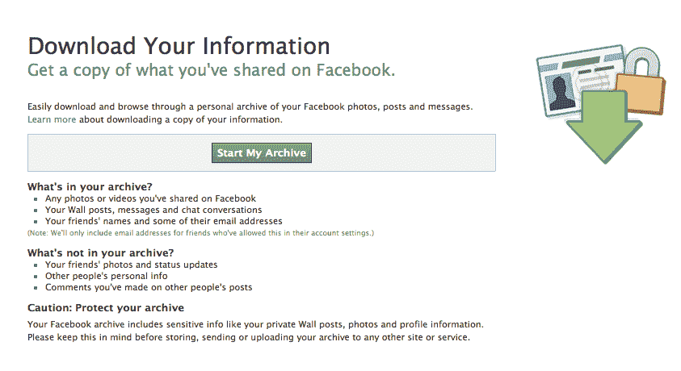

# 脸书将微格式添加到“下载你的信息”功能 

> 原文：<https://web.archive.org/web/https://techcrunch.com/2011/09/07/facebook-adds-microformats-to-download-your-info-feature/>

看来，脸书已经悄悄地在它的“[下载你的信息](https://web.archive.org/web/20230205001510/https://www.facebook.com/download/)”功能中加入了对[微格式](https://web.archive.org/web/20230205001510/http://microformats.org/)的支持。这一新增功能为开发者提供了一种解析脸书用户账户中包含的个人资料、帖子、照片和视频的方式。尽管这一变化不会对主流用户如何处理他们的脸书数据产生直接影响——例如，你仍然不能导出你的脸书联系人列表——但这是脸书在放松其之前对用户数据的严格控制方面迈出的重要一步。

如果你不熟悉的话，“下载你的信息”是一个相对较新的脸书功能，根据要求，将你的个人数据打包在一个大的 zip 文件中，并可以从脸书的“[账户设置](https://web.archive.org/web/20230205001510/https://www.facebook.com/settings?ref=mb)”页面下载。

然而，作为用户，除了浏览下载中包含的 HTML 网页之外，您对这些数据无能为力。如果有什么不同的话，这个功能更多的是作为数据的备份，而不是将数据导入到其他程序中。例如，zip 文件不包括你在脸书的朋友和电子邮件地址的列表，也不包括你可以导入到另一个照片共享网站的照片集合。

是数据，但本质上没什么用。

现在，这种情况正在改变。

虽然术语“微格式”让普通消费者摸不着头脑，但它极大地扩展了开发者以新的方式利用脸书数据的可能性。

微格式提供了一种轻量级的方式来为 HTML 文档提供可互操作的含义，现在正被用来标记导出的数据。具体来说，脸书使用的是格式 [hAtom](https://web.archive.org/web/20230205001510/http://microformats.org/wiki/hatom) 、 [hMedia](https://web.archive.org/web/20230205001510/http://microformats.org/wiki/hmedia) 和 [hCard](https://web.archive.org/web/20230205001510/http://microformats.org/wiki/hcard) 。

hAtom 用于标记墙贴和评论，hMedia 指定照片和视频，hCard 用于标记您的个人资料和朋友列表。

我们请[Microformats.org](https://web.archive.org/web/20230205001510/http://microformats.org/)联合创始人[凯文·马克斯](https://web.archive.org/web/20230205001510/http://twitter.com/#!/kevinmarks)来看看脸书是如何利用微格式的。

不幸的是，这不全是好消息。他说, [hCards](https://web.archive.org/web/20230205001510/http://microformats.org/wiki/hcard) 几乎没用，只提供你的名字(例如“Sarah Perez”)，没有网址(例如 facebook.com/sarahperez)，更不用说电话号码或电子邮件地址了。

相比之下，在[谷歌外卖](https://web.archive.org/web/20230205001510/https://www.google.com/takeout/)上，搜索巨头自己的数据导出功能(顺便提一下[昨天刚刚扩大了它的服务范围](https://web.archive.org/web/20230205001510/https://techcrunch.com/2011/09/06/google-now-lets-you-export-google-voice-data/))，hCards 提供你的名字、你的个人资料网址和你的电子邮件。此外，Google 还提供 vCards，可以直接导入到另一个电子邮件程序或联系人管理器中。

脸书对 hAtom 的实现稍微好一点——墙上的帖子现在包括永久链接和发表日期，以及帖子作者的电子名片。但是，如上所述，谷歌的 hCards 要丰富得多。

马克斯说，谷歌在区分文章标题和内容方面也做得更好，而脸书只是说内容*就是标题*。

最终的微格式， [hMedia](https://web.archive.org/web/20230205001510/http://microformats.org/wiki/hmedia) ，标记你的照片和视频，提供标题、时间戳、评论和相册名称。它还会标记每个相册，这样你就可以提取照片、发布时间和评论。

至于这一变化对开发者意味着什么，很简单:现在在脸书及其 API(应用程序编程接口)之外，访问用户的脸书数据要容易得多。这意味着应用程序开发人员，特别是那些专注于个人数据的开发人员，如 lockerproject.com 和 status.net，将有更容易的方式来访问数据，这种方式与网络的其他部分和服务更加一致。例如，Twitter、Blogger 和 WordPress 都使用微格式。

现在脸书也这样做了。

至于马克斯，他对变化的重要性更有哲理，并引用伊恩·希克森(2007)的话来解释他的观点:

> “我决定，为了我们的后代，我们应该准确地记录如何处理今天的文档，这样当他们回头看时，他们仍然可以重新实现 HTML 浏览器并取回我们的数据。”

脸书说它上个月实现了微格式，但是还没有公开宣布。