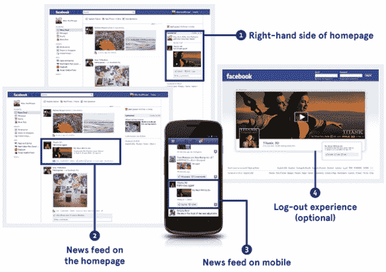

# 脸书修订版 S-1 的主要变化:移动广告、Zynga、雅虎专利、信贷 

> 原文：<https://web.archive.org/web/https://techcrunch.com/2012/03/07/facebook-amended-s-1/>

# 脸书修订版 S-1 的主要变化:移动广告、Zynga、雅虎专利、信贷

脸书今天提交了一份修正的 S-1 上市申请,描述了基于其为 Zynga 的独立游戏平台 mobile 发布广告以及与雅虎的专利纠纷的新风险。它还解释了其集中投票结构将如何影响投资者，并列出了更多的承销商。

以下是 S-1 与二月初提交的[原版脸书相比的主要修改。引号可以解释为严格的添加:](https://web.archive.org/web/20221205224250/https://beta.techcrunch.com/2012/02/01/facebook-files-for-5-billion-ipo/)

### 风险

#### 移动的

*   脸书宣布，它现在将开始利用赞助故事广告来赚钱。它现在声称自己有能力在“未经证实的”手机上赚钱，而不是说它没有在手机上做广告。

#### 违反服务条款

*   违反其服务条款，如创建重复账户，现在被列为可能损害其声誉和业务的风险。脸书品牌可能会受到“被认为对其他用户有敌意或不适当的用户行为，或使用虚假或不真实身份的用户行为”的负面影响解决这些问题的投资可能不会成功。
*   例如，另一个[长时间的黑客攻击](https://web.archive.org/web/20221205224250/http://www.huffingtonpost.com/2011/11/15/facebook-spam-attack-photo_n_1095938.html)，比如 11 月份在新闻提要中传播色情或血腥的攻击，可能会减少访问量。

#### Zynga

*   Zynga 最近推出了一个脸书以外的游戏平台。如果与 Zynga 的关系恶化，它试图将其用户转移到其托管的游戏平台，或者停止投资其脸书游戏，脸书的业务可能会受到损害。
*   脸书证实，尽管有流量保证方面的协议，但它对用户购买 Zynga 游戏征收 30%的税。

#### 专利

*   雅虎最近指控脸书侵犯了它的 13 项专利。雅虎尚未开始对脸书采取法律行动，但未来可能会这样做。此外，“我们面临的竞争越来越激烈，知名度也越来越高，包括我们的首次公开募股，我们预计针对我们的专利和其他知识产权索赔的数量将会增加。”

#### 不准确的用户计数测量

*   衡量用户基础的固有挑战可能会损害脸书的声誉和业务。如果广告商或开发商认为其用户数量不准确，他们可能不太愿意向脸书分配预算和资源。
*   例如，“尽管我们努力检测和制止此类行为，但仍可能有人违反我们的服务条款，拥有多个脸书帐户。我们估计，截至 2011 年 12 月 31 日，虚假或重复账户可能约占我们 mau 的 5-6%。”这一估计是基于一个不具有代表性的样本，因此可能不准确。
*   移动指标可能会被夸大，因为设备会自动 ping 脸书的服务器，而无需用户采取行动。“我们估计，截至 2011 年 12 月 31 日和 2010 年 12 月 31 日，不到 5%的全球 dau 来自这种类型的自动移动活动，并且这种类型的活动对我们估计的全球 mau 和移动 mau 的影响非常小。”

### 

### 投票结构

*   脸书现在将自己列为“受控公司”，其董事会没有独立的提名职能。
*   它指出，通过与主要股东的投票协议，马克·扎克伯格拥有很大比例的投票权。因此:
*   “扎克伯格先生有能力控制提交给我们股东批准的事项的结果，包括董事的选举以及任何合并、整合或出售我们的全部或大部分资产。这种集中控制可能会延迟、推迟或阻止控制权变更、合并、整合或出售我们所有或几乎所有的资产，而我们的其他股东支持这些资产，或者相反，这种集中控制可能会导致我们的其他股东不支持的交易的完成。这种集中控制也可能阻止潜在投资者收购我们的 A 类普通股，因为这种股票相对于 B 类普通股的投票权有限，并可能损害我们 A 类普通股的市场价格。”
*   脸书普通股的双层结构和某些股东之间的投票协议将投票控制权集中在扎克伯格和其他董事手中，这可能会限制或阻止股东影响公司事务。
*   首席执行官马克·扎克伯格和首席运营官·雪莉·桑德伯格随意为脸书工作，没有具体的时间承诺。

### 资产

*   上个月，脸书终止了之前的信贷便利，将其便利从 25 亿美元提高到 50 亿美元，并将每日未提取余额的 0.15%承诺费改为每年 0.10%承诺费。
*   脸书达成了一项过渡性信贷安排，允许其借入高达 30 亿美元的资金，“以支付与我们首次公开募股相关的 rsu 结算相关的预扣税和汇款义务。”
*   当 IPO 后的锁定期结束时，大量出售股票可能会导致股价下跌。
*   主要的额外承销商现在包括花旗集团、瑞士瑞信银行、德意志银行证券、加拿大皇家银行资本市场和富国证券。
*   进一步增加的承销商包括 Blaylock Robert Van LLC、BMO Capital Markets Corp .、C.L. King & Associates，Inc .、Cabrera Capital Markets，LLC、CastleOak Securities，L.P .、Cowen and Company，LLC。、Lazard Capital Markets LLC、Lebenthal & co . LLC、Loop Capital Markets LLC、M.R. Beal & Company、Macquarie Capital (USA) Inc .、Muriel Siebert & co . Inc .、Oppenheimer & Co. Inc .、Pacific Crest Securities LLC、Piper Jaffray & Co .、Raymond James & Associates，Inc .、Samuel A. Ramirez & Company，Inc .、Stifel、Nicolaus & Company，Incorporated、Williams Capital Group，L.P .、William Blair & Company，L.C

### 用户增长统计

*   据估计，巴西和德国现在的渗透率为 30-40%，而不是之前列出的 20-30%。
*   截至 2011 年底，美国用户数量增长至 1.61 亿，比 2010 年底增长了 16%。
*   “dau 占 mau 的比例从 2010 年 12 月的 54%上升至 2011 年 12 月的 57%,我们认为这完全是由于脸书的移动使用量增加所致。我们认为，dau 和 dau 占 mau 的百分比的增加通常会对我们的收入产生积极影响。”
*   “全球移动 mau 增长了 76%，从 2010 年 12 月 31 日的 2.45 亿增加到 2011 年 12 月 31 日的 4.32 亿”，而不是之前列出的 4.25 亿。
*   “我们估计，在截至 2011 年 12 月 31 日的一个月中，约有 5800 万移动用户仅通过移动应用或我们的移动网站访问脸书，其余 3.74 亿移动用户在该月通过个人电脑和移动设备访问脸书。”这只是通过移动设备访问的用户中很小的一部分，脸书的盈利潜力尚未得到证实——这是修订后的 S-1 中的一个亮点

### 销售增长

*   “截至 2011 年 12 月 31 日，我们一半以上的收入来自美国和加拿大的用户。然而，由于用户数量和参与度的增长，以及我们在巴西和印度等市场销售力度的加大，我们在这些市场的收入正在快速增长。”
*   脸书相信，包括移动广告在内的新广告举措将增加广告商的投资回报，从而增加广告需求和支出。
*   营销人员现在可以通过[实时了解他们的表现。这可能会增加赞助故事广告的支出，因为广告商将立即知道一个页面帖子是否得到足够积极的接受，从而值得为其付费以变成一个赞助故事。](https://web.archive.org/web/20221205224250/https://beta.techcrunch.com/2012/02/29/insights-in-minutes-not-days/)