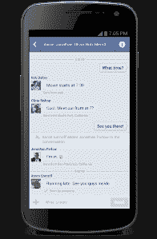

# 脸书安卓更新:你现在可以用 Facebook Messenger 发短信了；重新设计的消息部分 

> 原文：<https://web.archive.org/web/https://techcrunch.com/2012/09/20/facebook-android-update-you-can-now-text-using-facebook-messenger-messages-section-redesigned/>

# 脸书安卓更新:你现在可以用 Facebook Messenger 发短信了；消息部分已重新设计

今天，似乎有很多来自脸书的[新闻](https://web.archive.org/web/20221206060150/https://beta.techcrunch.com/2012/09/20/an-offer-you-cant-refuse-facebook-adds-barcodes-new-ad-buying-requirement-to-its-offers-coupon-product/)。今天下午，这家社交网络公司还[宣布](https://web.archive.org/web/20221206060150/http://newsroom.fb.com/News/A-New-Design-for-Messenger-1bb.aspx)一系列面向安卓用户的更新，其中包括对安卓脸书[和 Facebook Messenger](https://web.archive.org/web/20221206060150/https://play.google.com/store/apps/details?id=com.facebook.katana) 应用的改进。这一消息是在 iOS 版本的[重大改进后大约一个月发布的，iOS 版本](https://web.archive.org/web/20221206060150/https://beta.techcrunch.com/2012/08/23/facebook-for-ios-faster/)在一些关键领域将应用程序的整体速度提高了一倍。

更新后的 [Facebook Messenger 应用](https://web.archive.org/web/20221206060150/https://play.google.com/store/apps/details?id=com.facebook.orca) (Messenger 2.0)将包括一个新的对话设计，在应用中滑动以查看谁有空的能力，以及总体速度和可靠性的改进。与此同时，更新后的脸书安卓应用将包含许多相同的功能。这两个更新都将很快登陆 Google Play 商店。

具体来说，在 Messenger 中，用户现在可以在应用程序的任何位置向左滑动手指，以查看他们的哪些朋友在线并可以聊天。您还可以将那些您交流最多的朋友添加到您的收藏夹顶部。

 在主信息部分，设计已经改变，因此它看起来像一个短信应用程序，而不是过去更像收件箱的感觉([，iOS 版仍然支持](https://web.archive.org/web/20221206060150/http://itunes.apple.com/us/app/facebook-messenger/id454638411?mt=8))。在特定的 Android 设备上，用户甚至可以在 Messenger 中与他们的联系人发送短信，让短信和脸书对话集中在一个应用程序中。这可能有助于将该应用植入用户的日常生活。

该功能目前在 HTC EVO 3D、HTC One X、LG Optimus Black、LG Optimus Hub、三星 Galaxy Ace、三星 Galaxy Nexus、三星 Galaxy S3 和三星 Galaxy Y 上得到支持。脸书表示，未来几周将支持更多设备。

**安卓版脸书也有所改进**

虽然今天的大多数更新都集中在 Facebook Messenger 上，但主要的 Android 应用程序也在更新，以便在自己的界面中反映消息组件的相同变化。例如，它也将采用新的类似 SMS 的信息设计。在新闻提要的右上角还有一个新按钮，它会显示谁可以聊天，当发送消息时，应用程序会显示谁是活跃的，这样你就可以知道你的朋友是否可能很快回复。

脸书表示，该应用程序也变得更加安全和稳定，解决了各种问题，如一些用户在多张照片上传期间收到的错误，以及设备启动和推送通知。

两个 app 更新都应该是 Google Play 中的[现在的 T4。很快？截至太平洋时间下午 12:30，他们还没有上线。敬请关注。iOS 更新将稍后到达。](https://web.archive.org/web/20221206060150/https://play.google.com/store/apps/developer?id=Facebook)

太平洋时间下午 1:10 他们正在直播。