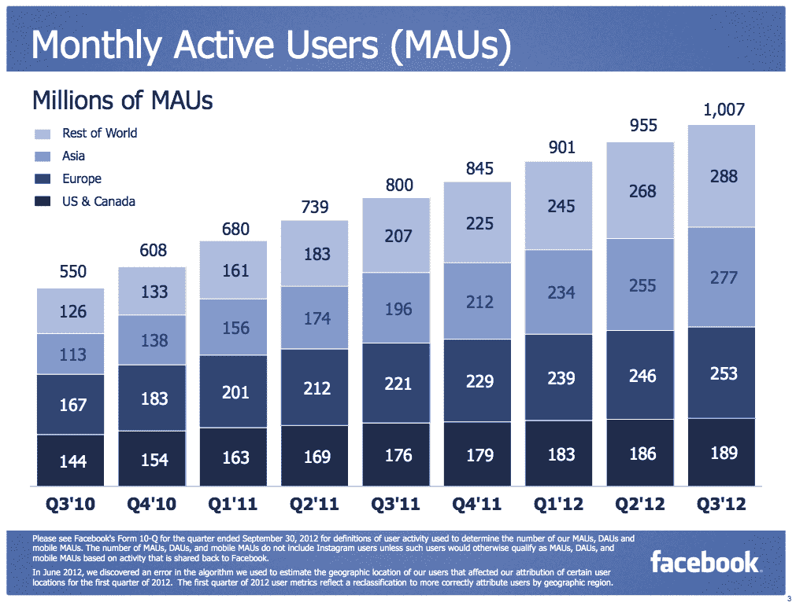
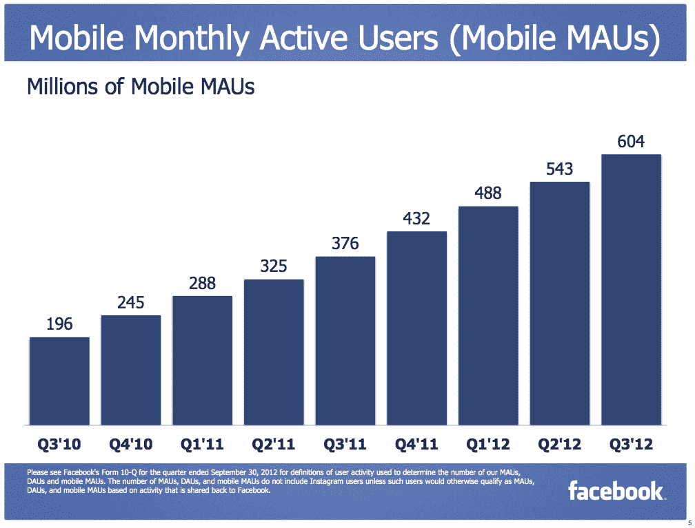

# 脸书宣布，截至 9 月 30 日，月活跃用户达到 10.1 亿，同比增长 26%

> 原文：<https://web.archive.org/web/https://techcrunch.com/2012/10/23/facebook-announces-monthly-active-users-were-at-1-01-billion-as-of-september-30th/>

# 脸书宣布，截至 9 月 30 日，月活跃用户达到 10.1 亿，同比增长 26%

今天，脸书介绍了其 2012 年第三季度收益，并分享了一些关于社交网络表现的最新数据。最近，马克·扎克伯格分享说，脸书的[用户已经超过了 10 亿大关](https://web.archive.org/web/20230222113243/https://techcrunch.com/2012/10/04/facebook-tops-1-billion-monthly-users-ceo-mark-zuckerberg-shares-a-personal-note/)，而且这一趋势还在继续，正如我们自己的乔希·康斯坦因[所预测的](https://web.archive.org/web/20230222113243/https://techcrunch.com/2012/10/04/facebook-forever/)。

该公司自 9 月 14 日以来增加了 1000 万用户，这大约是 16 天。

以下是首席执行官马克·扎克伯格在财报发布会上的发言:

> 我为每个月有 10 亿人使用脸书感到自豪，同时我也很高兴现在每个月有超过 6 亿人使用移动设备在脸书上分享和联系。使用我们移动产品的人参与度更高，我们相信，随着我们不断推出新产品和改进我们的平台，我们可以进一步提高参与度。与此同时，我们正在将货币化深入整合到我们的产品团队中，以便建立一个更强大、更有价值的公司。

至于其余的数据，脸书分享如下:

**–截至 2012 年 9 月 30 日，月活跃用户数(mau)为 10.1 亿，同比增长 26%
–截至 2012 年 9 月，日活跃用户数(dau)平均为 5.84 亿，同比增长 28%
–截至 2012 年 9 月 30 日，移动 mau 为 6.04 亿，同比增长 61%**

有趣的统计数据是在移动领域，这是脸书最近特别关注的领域。我们今天了解到[脸书第三季度 14%的收入来自移动设备](https://web.archive.org/web/20230222113243/https://techcrunch.com/2012/10/23/facebook-advertising/)。随着移动用户的大幅增长，只要脸书推出一些新的广告单元和举措，我们可以预计这一广告比例将随之增长:

脸书的股票在盘后交易中上涨，这肯定让门洛帕克的人们松了一口气。